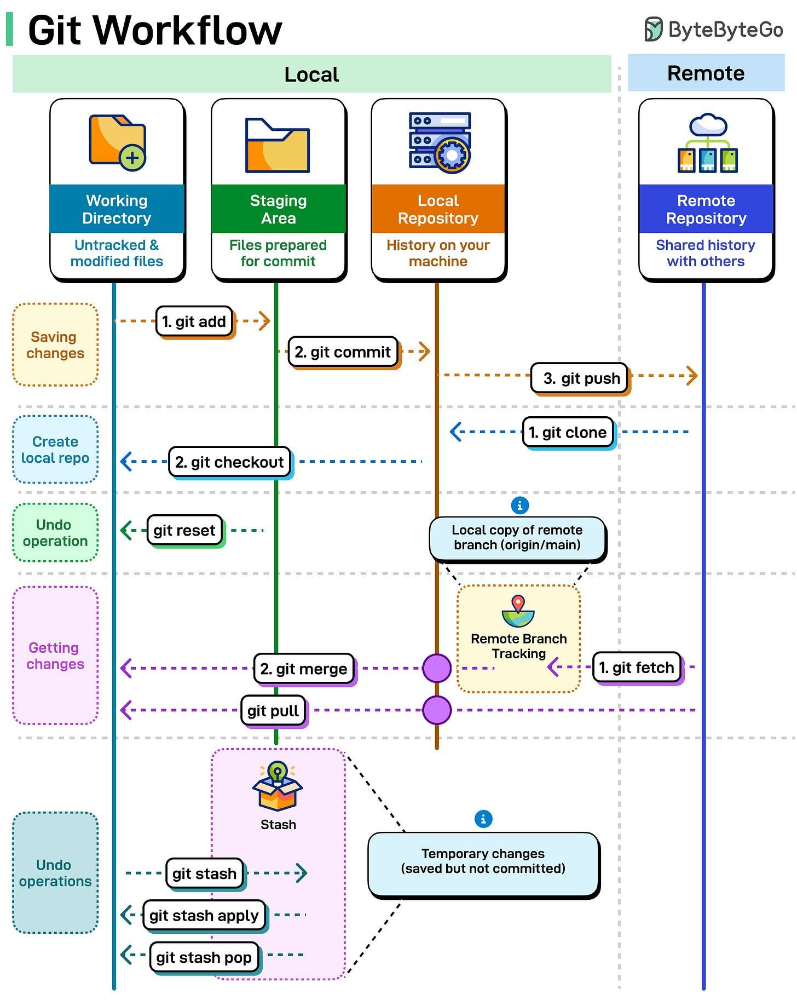

This appendix collects team recommendations and tutorials for `git` and
GitHub. It complements the short setup notes in the
[software chapter](../fresh-installation/software.html#sec-git-config).

## Git and GitHub setup {#sec-git-setup}

{#fig-git-workflow-appendix}

{#fig-github-best-practices-appendix}

### Accounts, authentication, and remotes

Git works **locally**; GitHub (or GitLab, etc.) is a **remote** you sync
with. For day-to-day work on this team:

1.  Enable **two-factor authentication** on GitHub
    (<https://github.com/settings/security>). Prefer a passkey or an
    authenticator app; avoid SMS as the only second factor (@fig-github-best-practices-appendix).

2.  Choose **SSH** (recommended) or **HTTPS**:
    -   **SSH:** `ssh-keygen`, add the **public** key under GitHub →
        Settings → SSH and GPG keys, then clone with a `git@github.com:…`
        URI.
    -   **HTTPS:** create a **personal access token** per machine
        (<https://github.com/settings/tokens>) with at least `repo`
        scope. Store it once; GitHub will not show it again.

3.  Set your **identity** (required for every commit):

    ```{#lst-git-identity-appendix .bash lst-cap="Global Git identity"}
    git config --global user.name "<your-github-username>"
    git config --global user.email "<your.email@example.org>"
    ```

4.  Recommended **global** options (edit `~/.gitconfig` or use
    `git config --global`):

    ```{#lst-gitconfig-appendix .gitconfig lst-cap="Example ~/.gitconfig"}
    [user]
      name = <your-github-username>
      email = <your.email@example.org>
    [init]
      defaultBranch = main
    [merge]
      conflictstyle = zdiff3
    [rerere]
      enabled = true
    [core]
      autocrlf = input
    [tag]
      sort = version:refname
    [branch]
      sort = -committerdate
    [pull]
      rebase = true
    [push]
      autoSetupRemote = true
    ```

    `conflictstyle = zdiff3` and `rerere` make conflict resolution
    easier; `defaultBranch = main` matches current forges; `pull.rebase`
    keeps history linear when you prefer rebase over merge commits.

5.  **Credentials:** for HTTPS, `credential.helper store` (persistent) or
    `credential.helper 'cache --timeout=3600'` (one hour). For SSH, use
    the SSH remote URL and an agent if you protect your key with a
    passphrase.

6.  Optional **aliases** (examples): `st = status`, `co = checkout`,
    `br = branch`, `lg = log --oneline --graph`.

Fuller background (configuration levels, aliases, environmental impact of
large blobs) is in the formation notes:
.

### Starting a project

| Situation | Steps |
|-----------|--------|
| Existing GitHub repo | `git clone git@github.com:ORG/REPO.git` |
| Local folder, new remote | `git init` → create empty repo on GitHub → `git remote add origin …` → `git branch -M main` → `git add` → `git commit` → `git push -u origin main` |

After cloning, `git pull` / `git push` keep you aligned with
`origin/main` (or your tracked branch).

## Essential Git commands {#sec-git-commands}

### Repository basics

Git tracks **snapshots** of files. A repository is a folder containing a
hidden `.git` directory.

```{#lst-git-init .bash lst-cap="Create a repository"}
mkdir my-project && cd my-project
git init
git status
```

### The three states

```text
Working tree  →  staging (index)  →  repository (commits)
  modified          staged              committed
```

| Goal | Command |
|------|---------|
| Stage changes | `git add <file>` or `git add .` |
| Commit | `git commit -m "Short, informative message"` |
| Inspect | `git status`, `git diff`, `git log --oneline --graph` |
| Sync remote | `git pull` then `git push` (same branch name when possible) |

### Branches

Use branches for features, fixes, and experiments so `main` stays
stable.

```{#lst-git-branch .bash lst-cap="Branch workflow"}
git branch feature-x
git switch feature-x    # or: git checkout -b feature-x
# … edit, add, commit …
git switch main
git merge feature-x
```

**Rebase** replays your branch on top of another tip (linear history);
**merge** joins histories (may create a merge commit). After
`git rebase main` on a feature branch, fast-forward `main` with
`git merge feature-x` when appropriate.

### Undoing work

| Situation | Safe approach |
|-----------|----------------|
| Not committed, discard file changes | `git restore <file>` |
| Staged, unstage | `git restore --staged <file>` |
| Last commit, keep changes | `git reset --soft HEAD~1` |
| Last commit, discard locally (unpushed) | `git reset --hard HEAD~1` (destructive) |
| Undo on a **shared** branch | `git revert <commit>` (new commit) |

Stash uncommitted work before risky operations:
`git stash` → … → `git stash pop`.

### Quick reference (cheat sheet)

::: {.column-page}

:::

Command tables and workflows (stash, interactive rebase, bare backup
repos) are summarised in:
.

## GitHub resources {#sec-github-resources}

Benjamin Loire’s user guide covers the forge UI and daily Git commands
in one place:
.

### Repository page

- **Branches** — switch the tree you browse on the website.
- **Code** — SSH clone URL (prefer SSH over HTTPS when using keys).
- **Commits** — full history of the current branch.
- **Issues** — bugs, questions, tasks; use labels (`bug`, `enhancement`,
  `question`) and assignees to coordinate.
- **Pull requests** — propose merging a branch; reviewers comment on
  **Files changed**; merge via merge commit, squash, or rebase.
- **Actions** — CI/CD (tests, site builds); see this book’s workflow as
  an example.
- **Projects / Settings** — planning boards and repository configuration.

### Pull requests and issues

Link issues with `#123`. Closing keywords in a PR description (`fixes
#42`, `closes #42`, …) can auto-close issues when the PR merges.

### Troubleshooting

| Problem | What to try |
|---------|-------------|
| `push` rejected | `git pull --rebase` (or merge), resolve conflicts, push again |
| Cannot switch branch | Commit, stash, or discard local changes first |
| Lost commit after reset | `git reflog`, then `git reset --hard HEAD@{n}` to recover |

## Advanced topics {#sec-git-advanced}

### Formation slides

Slides from the team Git training (French):


### Exercise solutions

Work through the exercises in the slides, then open each solution below
(commands assume a GitLab training repo; on GitHub, replace the host in
clone URLs).

::: {.details summary="Exercise 1 — Clone the training repository"}
Clone `Rumengol/formation_M4DI_2024` (GitLab) with SSH or HTTPS. This
creates `formation_M4DI_2024` on `main`, downloads files at the latest
commit, and keeps full history. Explore commits and remote branches
(`git branch -r`). Compare `feature_1` and `feat_revcomp`: one branch
history is cleaner than the other.

```bash
git clone git@gitlab.com:Rumengol/formation_M4DI_2024.git
cd formation_M4DI_2024
git log --oneline --graph --all
```
:::

::: {.details summary="Exercise 2 — Rebase `feat_revcomp` onto `main`"}
Check out the feature branch, rebase onto `main`, then fast-forward
`main` (linear history).

```bash
git checkout feat_revcomp
git rebase main
git checkout main
git merge feat_revcomp   # fast-forward
```

After rebase, commit hashes on the feature branch change; use branch
names or `HEAD~n`, not old SHAs.
:::

::: {.details summary="Exercise 3 — Merge `feature_1` into `main`"}
Check out `feature_1` locally, return to `main`, merge (creates a merge
commit with two parents).

```bash
git checkout feature_1
git checkout main
git merge feature_1
```

Use `git log --graph` and `git diff` to compare branch quality. Parent
operators: `HEAD^1` / `HEAD^2` for merge parents; `HEAD~n` walks the
first-parent line only.
:::

::: {.details summary="Exercise 4 — Revert the commit that renamed the file to `file_v3.txt`"}
Identify the commit (message may not mention the rename — write
exhaustive commit messages). Revert that commit; Git opens an editor for
the revert message.

```bash
git revert 50db10d
```

For a **merge** commit, use `-m 1` to choose which parent to keep, e.g.
`git revert 6e9f520 -m 1`.
:::

::: {.details summary="Exercise 5 — Reset two commits back (`--hard`)"}
To drop the last two commits **and** uncommitted work on tracked files,
stash or commit first, then:

```bash
git reset --hard HEAD~2
```

`--hard` is destructive for the working tree; only use when you are sure
nothing important is unstaged.
:::

::: {.details summary="Exercise 6 — Recover using `git reflog`"}
If a reset was a mistake, find the old tip in the reflog and reset back:

```bash
git reflog
git reset --hard HEAD@{1}
```

Commits that left `git log` may still appear in `reflog` for a while.
:::

Full walkthrough (French):
.

### Rewriting history and `git revert` {#sec-git-revert}

`git reset` moves branch pointers and can rewrite local history;
`git revert` is the safe choice on **shared** branches because it adds a
new commit that undoes an earlier one.

{#fig-git-revert width="90%"}

**What `git revert` does:** unlike `reset`, revert does not rewrite
history. It creates a new commit that undoes the changes from an earlier
one. History stays traceable and safe for shared branches.

**Why revert conflicts happen:** a later commit changed the **same lines**
as the commit you are undoing.

**Example (@fig-git-revert):**

- Commit C2 added a feature.
- Commit C3 changed those same lines.
- Reverting C2 collides with C3; Git cannot guess the correct text, so
  you get a **revert conflict**.

**How to resolve:**

1.  Run `git revert C2`.
2.  Git pauses at the conflict.
3.  Edit the file, remove conflict markers.
4.  `git add` the file.
5.  `git revert --continue`.

Git then records a new commit that undoes C2 while keeping C3 intact.

Further reading: internal model (`git add` / objects), `git reset`
soft/mixed/hard, fetch vs pull, and team practices — see
 and the embedded guides
above.
