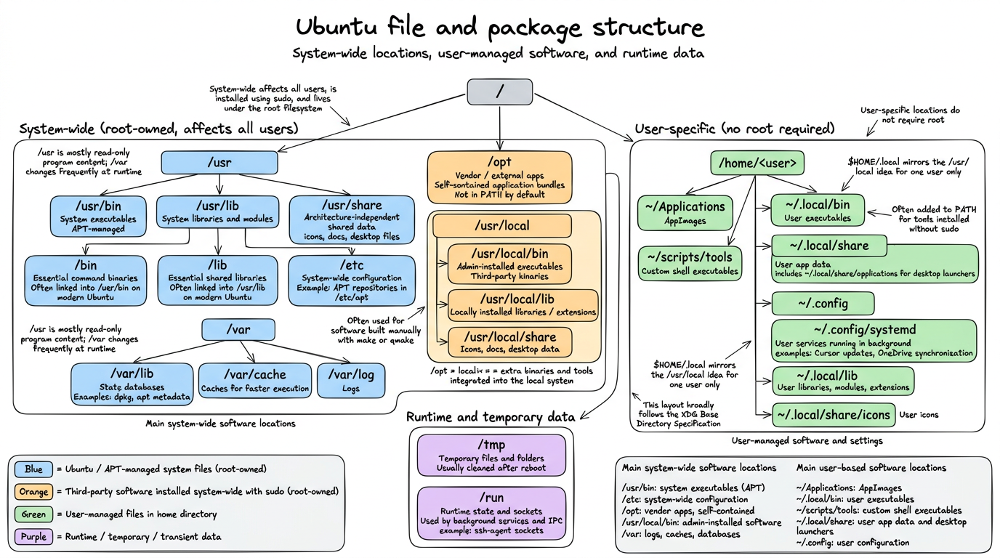
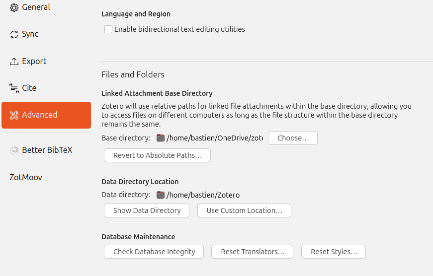
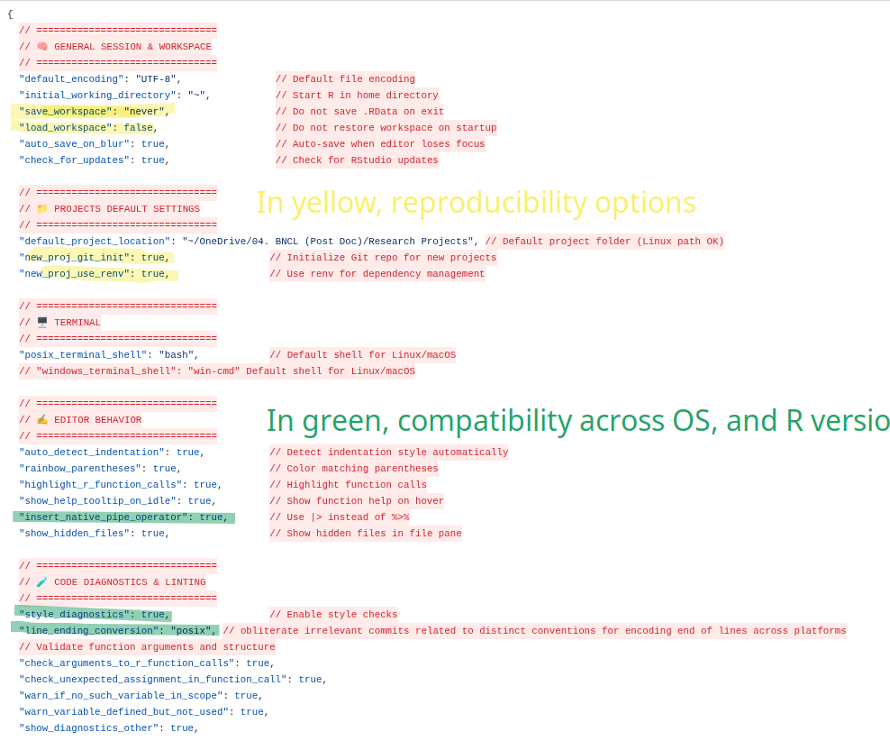
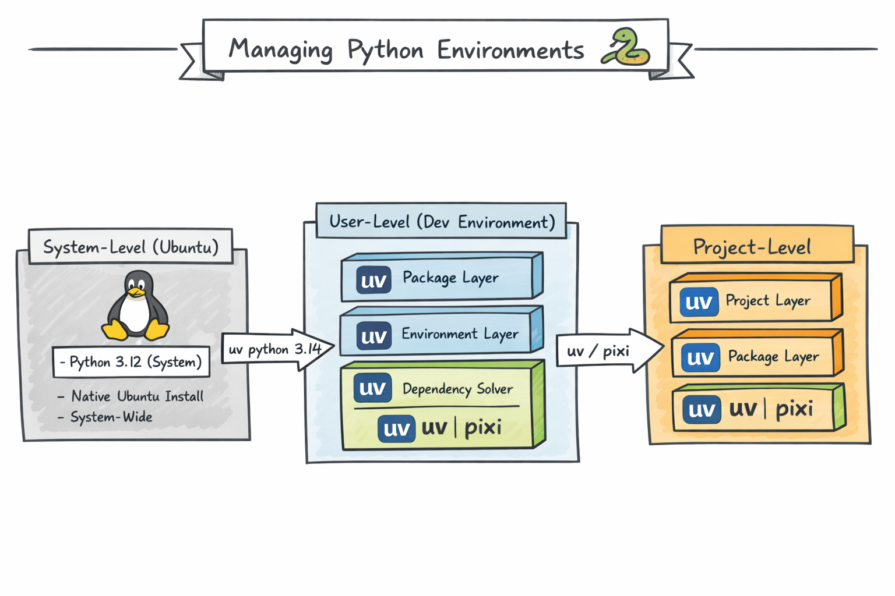
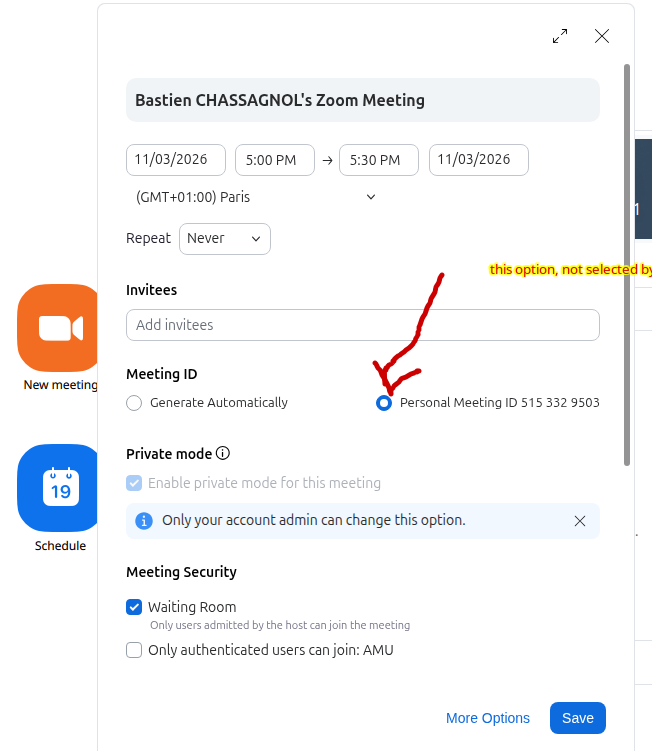
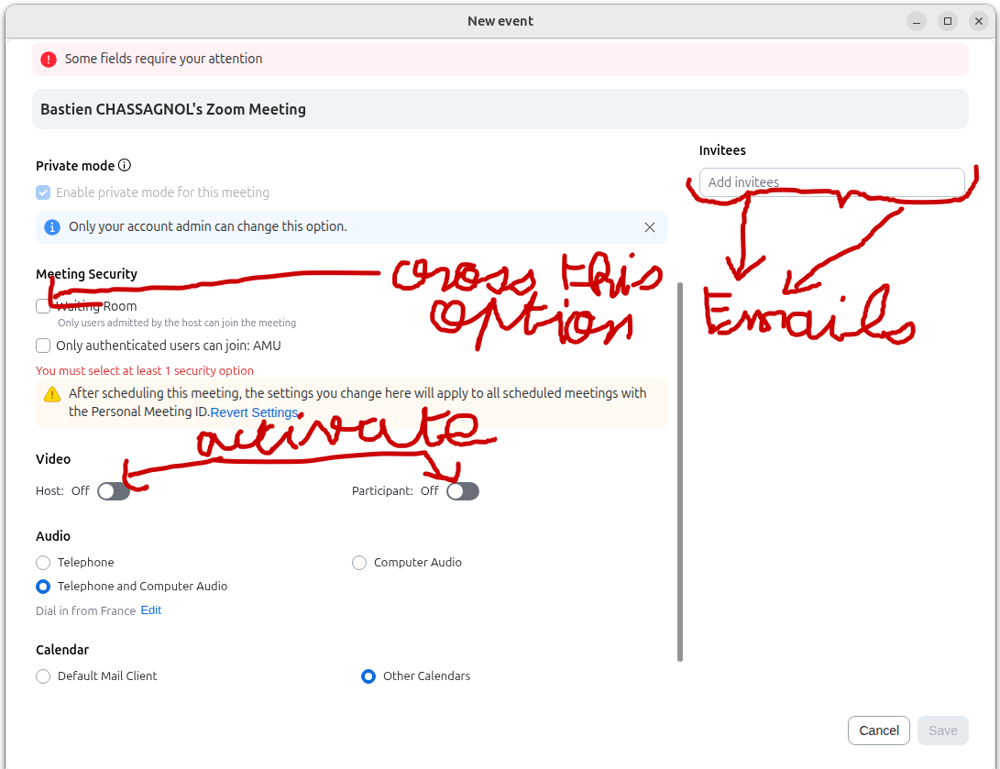
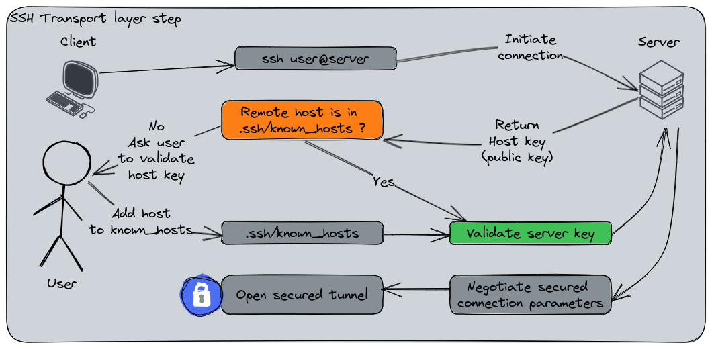

- `dpkg --print-architecture`: retrieve architecture, for package installation^[Returns `amd64` in my case].
-   in **Gnome**, aka File Management, to list hidden files

## Ubuntu general guidelines

### Ubuntu file, and package structure

#### System-wide location (for core programs)

System-wide affects all users, are installed using `sudo`, on the root of the system. 

| Location         | Purpose                  |
| ---------------- | ------------------------ |
| `/usr/bin`       | System executables (APT) |
| `/etc`           | System-wide configuration (example: define repositories for `apt`) |
| `/opt`           | Vendor (external) apps   |
| `/usr/local/bin` | Admin-installed software |
| `/var`           | Logs, caches, databases |

: Main system-wide software locations {#tbl-system-wide-locations}

- `/opt` for third-party application bundles, **self-contained** while `/usr/local` is for third-party **binaries**. Besides, `/opt` is not in the path by default.  

#### User-specific locations

User does not require root

| Location         | Purpose                  |
| ---------------- | ------------------------ |
| `~/Applications` | AppImages                |
| `~/.local/bin`   | User executables         |
| `~/scripts/tools`| Custom bash executables  |
| `~/.local/share` | User app data, notably `~/.local/share/applications` storing desktop icons  |
| `~/.config`      | User configuration       |

: Main user-based software locations, to be compared with @tbl-system-wide-locations {#tbl-user-based-locations}

---



::: {.callout-note collapse="true" title="Specific folders"}

- `usr` folder stores *read-only* executables, while `/var` is regularly written upon changes:
  - `/var/lib`: apt and dpkg databases, for instance, respectively stored under `dpkg`, and `/apt`
  - `/var/cache`: metadata caches for faster execution
  
- `/usr/local/`, or `$HOME/.local` stores executables that require custom compilation with `make`, or `qmake`, rendered from manual archives:
  - `bin`, `sbin` for executables
  - `share` for icons (under subfolder `icons`) and desktop configuration, document ion under `/doc`
  - `lib` for extensions of a given executable (such as packages in R, or modules in Python)
  - This folder hierarchy follows [`XGD`Base Directory Npecification](https://specifications.freedesktop.org/basedir/latest/)

- `/tmp` for temporary folders, cleaned after `reboot`

- `/run` for sockets, namely used for controlling all the protocols running in the background for connecting to a server, such as the `ssh-agent`

- `~/.config/systemd`: lists all processes that keep on running in the background, such as Cursor updates, or One drive synchronisations.

:::


### Recommended Updating policy of Ubuntu

1. Create file `update_os.sh` with:

```bash

#!/bin/bash
rm -rf /var/lib/dpkg/lock-frontend
rm -rf /var/lib/dpkg/lock
apt-get update
apt-get upgrade -y
apt-get dist-upgrade -y
apt-get autoremove -y
apt-get autoclean -y

```

2. Run having `sudo`rights
  i. `chmod +x update_os.sh` to provide executive rights
  ii. `sudo ./update_os.sh` to run the update file with **admin** rights
3. Reboot the system with `reboot`

::: {.callout-caution collapse="true" title="Ubuntu partial updates"}

> Partial updates breaking key driver components occur more often with Ubuntu compared to Microsoft, since Linux tends to provide lots of separate, modular packages while Windows ships large and standalone bundles -> **Consequence: more issues with updates, especially if the network connection dropped, and the newest versions of the packages were not fully installed.**

---

> General recommendations:

```bash
# to be run daily
sudo apt update
sudo apt upgrade

# to be run monthly
sudo apt full-upgrade

## clean deprecated dependencies
sudo apt autoremove
sudo apt autoclean
```

---

> Deal driver issues

```bash
## Check for Broken Packages
sudo dpkg --configure -a
## Install missing dependencies
sudo apt -f install

## List all Hardware Driver Errors
dmesg -l err,crit,alert,emerg

```
:::

### Network protocols, and connexion troubleshoots

- Two IP protocols for Wi-FI: `IPv4` versus `IPv6`. 

  ::: {.callout-tip title="The two Internet protocols, namely IPv4 vs IPv6"}
  
  IPv4 is older, but still prevailing in many websites, such as Github, or OneDrive:

    * Uses 32-bit addresses (e.g. `192.168.1.10`)
    * Used by **most websites**, CDNs, VPNs, corporate services
    * But the 32-limitation hinders the number of avalaible IP addresses. 
    
  IPv6 is newer, but not universally supported:

    * Uses 128-bit addresses (e.g. `2a01:cb14:86a7::1`)
    * Supported by modern ISPs and operating systems
    * Some networks provide **IPv6-only**, with no IPv4 fallback. Espaically the case with Microsoft services, governmental or academic websites. 
  :::
  
- You can test if this is the issue to connect to some websites with `curl <webdomain>`, such as `curl https://onedrive.live.com`, returning *Cannot connect*

- Recent modern routers return only IPv6 -> while Windows is able to able to auto-fall back to IPv4, this is not the case of IPv6. 
  - *Temporary fix*: by running the following instructions, you solve this issue by automatically configuring a IPv4 upon failure. *Recommended only for short-term debugging*.

  ```bash
  install dhclient commands
  sudo dhclient -4 wlp2s0f0 <Wifi-name> ## in my case, wlp2s0f0  
  ```
  - *Permanent fix*^[Alternatively, you can rely on the GNOME Interface, `Wifi` section]: 
  
    ```bash
    nmcli connection modify "Routeur/Livebox-FC77" ipv4.method auto 
    nmcli connection modify "Routeur/Livebox-FC77" ipv6.method auto ## connect automatically to IPv4 or IPv6, depending on the availitbity of the protocol
    ## re-start the connection, applying the new configuration parameters
    nmcli connection down "Routeur/Livebox-FC77"
    nmcli connection up "Routeur/Livebox-FC77"
    ```
    
#### Eduroam connexion

0. **Ensure to delete beforehand any pre-existing installation: `rm -rf $HOME/.config/cat_installer`**.
1. Go to <https://cat.eduroam.org/>, the website usually provides with the version fitting your OS distribution. 
2. On Linux, download the Python script, choosing AMU university.
3. Run Python script with `python 3 eduroam-linux-AUA.py`
4. As `userid`, provide your academic mail address, and as password, your `ENT password`. 

### Shell-customisation (including `$PATH`)

#### Zsh (advanced bash configuration)

```bash
sudo apt update
sudo apt install zsh

## define this shell shebang by default
chsh -s $(which zsh) ## modify /etc/passwd repository
``` 

#### Add executables 

- System-wide: 
  - `/usr`, and manual installs under `/usr/local` are in the `$PATH` by default
  - For third-party GUI, *self-contained* apps stored under `/opt`, add a symlink: `sudo ln -s /opt/<appName> /usr/local/bin/<appName>`, requires **`sudo` rights**.

- User-level: 
  - Customise `.bashrc` (or `.zshrc`) configuration files to modify the `$PATH` -> **Only affects the user, and interactive shell**. Examples:
  
  ```bash
  export PATH="$PATH:$HOME/scripts/tools"
  alias ll='ls -lah'
  ```
  - AppImages may be integrated using AppImageLauncher, or `.desktop` configuration. 

- Deal with multiple versions of the same program (for instance, `Java`): use `update-alternatives --list <AppName>` to list executables. 


## Synchronise files across devices with OneDrive 

### OneDrive open-source installation for Ubuntu

1. Install dependencies: 

```bash
sudo apt install build-essential libcurl4-openssl-dev pkg-config git -y
```

2. Add the `OpenSuSE` Build Service repository release key

```bash
wget -qO - https://download.opensuse.org/repositories/home:/npreining:/debian-ubuntu-onedrive/xUbuntu_24.04/Release.key | gpg --dearmor | sudo tee /usr/share/keyrings/obs-onedrive.gpg > /dev/null

echo "deb [arch=$(dpkg --print-architecture) signed-by=/usr/share/keyrings/obs-onedrive.gpg] https://download.opensuse.org/repositories/home:/npreining:/debian-ubuntu-onedrive/xUbuntu_24.04/ ./" | sudo tee /etc/apt/sources.list.d/onedrive.list

## update cache
sudo apt-get update
``` 

3. Install `OneDrive`:

```bash
sudo apt install --no-install-recommends --no-install-suggests onedrive
```

4. Sync OneDrive:

  i. Exclude large folders, and directories that are complex and are not recommended for syncing, `nano ~/.config/onedrive/config`. You can see the actual content of my config file under [onedrive-custom-config](../Config/onedrive-config).^[Note that **Comments must be placed in separated lines, not inline**.]
  
  ii. Authenticate, and run OneDrive once
  
  ```bash
  onedrive --sync --dry-run ## optional, list folders that will be synchronsied
  onedrive --sync --verbose ## first initialisation, usually time-consuming, one-shot
  ```

4. Permanent synchronization using `systemtcl` facilities. **Highly recommended to remove folders at the local level, rather than on the server**. 

```bash
systemctl --user enable onedrive
systemctl --user start onedrive ## in the back end, use onedrive --monitor
```

5. Monitor currently uploaded files: 

```bash
journalctl --user-unit onedrive -f (continous) ## equivalent to systemctl --user status onedrive (single-shot)

onedrive --display-config
onedrive --version
```

6. Other useful OneDrive instructions:

  - `onedrive --create-share-link <path/to/file>` for read-only shareable links, and `onedrive --create-share-link <path/to/file> --with-editing-perms` to add writing rights. 

7. (Optional) Visual interaction of OneDrive synchronization:
  i. [OneDrive system tray program](https://github.com/DanielBorgesOliveira/onedrive_tray) adds a simple icon returning the status of synchronization for OneDrive, that can be controlled with by clicking with the right button of the mouse. **If you decide to use this process, do not run `systemctl --user enable onedrive
systemctl --user start onedrive`, as it will generate otherwise concurrent processes**.
    - You'll need to install, and run `qmake` version 5 (by default, on recent Ubuntu configurations, it's the 6th that is used, which does not compile successfully the program). 
    
    ```bash
    ## install the 5th version of qmake
    sudo apt install qt5-qmake qtbase5-dev
    
    ## explicity use the qmake version 5, by calling the entire absolute path
    ## usually located under folder /usr/lib/qt5/bin
    ## avoid switching from qmake version 6 to qmake version 5 as default
    ## using symbolic links, as most recent projects use version 6 of qmake
    ```
    
  - Run following bash file:
  
    ```bash
    ## create the runnable executive file
    git clone https://github.com/DanielBorgesOliveira/onedrive_tray.git
    cd onedrive_tray
    mkdir build
    cd build
    /usr/lib/qt5/bin/qmake ../systray.pro ## prepare the configuration, such as Makefile
    make ## build the software
    
    ## execute it, such that it runs whenever log in
    sudo make install ## deploy the software, such as copying files -> here's the sudo incentive
    systemctl enable --user onedrive_tray.service
    ```
    
    ```scss
    Source code
       ↓
    qmake (.pro → Makefile)
       ↓
    make (Makefile → binary)
       ↓
    make install (binary → system)
       ↓
    systemctl enable (autostart)
    ``` 
    
   
    
  ii. Customise the logs output reported on the terminal, with the following script that reports in *real-time* a colourised OneDrive activity of the logs:
    a. Install dependencies: `sudo apt install silversearcher-ag ccze`
    b. Add [`onedrive_log`](https://github.com/zzzdeb/dotfiles/blob/master/scripts/tools/onedrive_log) bash file into folder `~/scripts/tools`. This script is a coloured wrapper of `journalctl` command. 
    c. Add to the `$PATH` using local `.bashrc` the folder `~/scripts/tools`


### Troubleshoots for OneDrive

- **Call `systemctl --user restart onedrive` after modifying the `.config` file to account for changes within it**. For retro-application of configuration changes, use `onedrive --resync --sync --verbose` with parsimony. **The synchornisation halts without warning, when the config file is modified, so you need to restart it**. 

- Warning "onedrive application is already running, please check process list" means that several concurrent onedrive are running in the background:
  - List existing processes using onedrive: `ps aux | grep onedrive`
  - Force kill processes that do no not use `systemtcl`: kill -9 <pid> 
  
- Git and OneDrive do not interfere well for 3 reasons at least, especially when synchronising files on multiple platforms. Linux (and Mac) machines end lines with `LF (Line Feed): \n`, while Windows uses `CRLF (Carriage Return + Lien Feed): \r\n`, Linux tracks file permissions for executables while Windows doesn't (only problematic for shell scripts), finally, `.git` and `.Rproj` folders are complex binary repositories with challenging access and encoding. Three heuristic approaches to solve most issues:

  i. Exclude `.git` folders^[Adding argument `skip_dir = ".git"` to OneDrive config file] (or even completely code folders) from the synchronisation. **Note that in this case, the folder will no longer be tracked as a `Git` processes.**
  
  ii. Configure globally the `.gitconfig` configuration file to allow both end of lines indicators, using `git config --global core.autocrlf input` on Linux and Mac machines collaborating with Windows machines^[Accept as EOL CRLF, but always commit as LF], and `git config --global core.autocrlf true` on Windows machines^[on Windows machines, checked out as `CRLF`, but committed as `LF`]. The argument tolerates `CRLF` as it appears, otherwise use by default Linux-like `LF` endings. **This approach solves most of my synchronisation conflicts**. 
  
  iii. **Best practice**: per project, create a `.gitattributes` defining explicitly the encoding of EOL, removing the dependency to the machine OS^[Detailled information is avalaible [here](https://docs.github.com/en/get-started/git-basics/configuring-git-to-handle-line-endings?platform=windows)]. By default, you should opt in ofr the `LF` EOL:
  
  ```gitattributes
  ## 3 columns: file extension, file type (text, or binary), eol definition for text documents
  * text=auto eol=lf ## modify EOL both globally, as the default behaviour, if `core.autocrlf` is not set
  ## AND custom configuration, per file extension
  *.sh   text eol=lf
  *.py   text eol=lf
  *.js   text eol=lf
  *.ts   text eol=lf
  *.java text eol=lf
  ```
  
  Apply changes with the following commands:
  
  ```bash
  git add --renormalize .
  git status ## display files being impacted by the change of EOL encoding
  git commit -m "Normalize line endings"
  ```
  
  iv. **Discard local changes**, induced by degenerate EOL diffs, with:

  ```bash
  git status ## Review of existing changes
  git clean -fd ## Optional, remove untracked files and directories as well
  git reset --hard HEAD
  ```
  to discard all local modifications to **tracked, but unstaged files**, practically bringing the working tree back to the last commit. 
  
  v. Configure the editor:
   
   i. VS Code → `Settings > Text Editor > Files > Eol`, go for the `\n`, or `auto` option. To apply it on pre-existing files, use *Change End Of Line Sequence command*. 
   ii. RStudio: `Tools → Global Options → Code → Saving -> Line ending Conversion → (Posix) LF`. 


::: {.callout-warning title="Graphical Interaces for OneDrive"}

Avoid using graphical interfaces, such as [OneDriveGUI](https://github.com/bpozdena/OneDriveGUI), they poorly concur with local installation of `onedrive` on my personal experiment. 

Instead, rely on the terminal, as it usually provides the user with better customisation, and control on OneDrive configuration. 

:::

::: {.callout-warning title="Compatibility with Applications Using Atomic Save Operations"}

Many modern editors, such as `LibreOffice` and `Rstudio` use [**atomic save strategies**](https://github.com/abraunegg/onedrive/blob/eb029bbe2ff5ba54844ae66667dce4dcb5eb78cf/docs/usage.md#compatibility-with-editors-and-applications-using-atomic-save-operations) to preserve data integrity when writing files. 

```bash
file.qmd
↓ edit
file.qmd.tmp ## If OneDrive synchronises in the meantime, it believes that the file had been discarded
↓ rename
file.qmd


## Architecture causing this problem
RStudio
   │
   │ save
   ▼
Local file (.qmd)
   │
   │ filesystem event
   ▼
onedrive client
   │
   │ sync
   ▼
OneDrive cloud
   │
   │ sync back
   ▼
local overwrite
```


This process is likely to interfere with the regular synchronisation protocol of the `onedrive` client relying on **inotify**, triggering editor warnings, or even temporary removal of files contents.

Three complementary solutions to address these issues, and reduce conflicts between editor saves and sync detection.

1. Do not put active projects inside `OneDrive`, setting apart large documents storage synchronised with OneDrive, from source code version by Git. 
2. Pause sync while coding. **But you need to think about restarting the synchronisation afterwards**. 
3. Twist the configuration file, helping with editors using atomic saves:

```bash
force_session_upload = "true" ## avoid overwriting by older cloud versions, when RStudio is on its way of saving
delay_inotify_processing = "true" ## wait for RStudio to finalise the saving of tmp files before synchronising to OneDrive
```

:::


> [Webhooks, for immediate synchornisation](https://github.com/abraunegg/onedrive/blob/master/docs/webhooks.md), if you want *real-time* synchronisation with the server, `server -> local`. **Not recommended generally, as complex to configure, and usually irrelevant for daily use cases**. Instead, reduce the latency for synchronisation. 


### Monitor synchronisation processes in the long run

- `systemctl list-unit-files --type=service --state=running --user` to list all processes running in the background, even after rebooting, restrained to the user-level.
  - Alternatively, processes at the system-level are stored under `/lib/systemd/system/`

- `systemctl status <service>` retrieves current status


## Software to install

> **General recommendation*: avoid using `ChatGPT`, as the instructions for installing software are often deprecated and/or not following Ubuntu best guidelines.

::: {#nte-sofware-installation .callout-note title="Install software on Ubuntu, some guidelines" collapse="true"}

Three recommended methods, depending on Ubuntu's support:

1. If supported by Ubuntu, go for `apt install` for system software^[`apt-get` works similarly, but is now deprecated]:
  - *automatic updates* and security patches -> **it's the only method allowing it in a systematic way**. 
  - easiest method for installation
  - signed and verified packages 
  - recommended for *core system*, long-term software
  - If **not directly available on Ubuntu’s native package manager, or using in the back-end `snap` commands**, switch to pre-built tarball installation^[Fetch the latest stable archive, extract it, and add executables to your `PATH`, see example under @sec-Zotero], or add the repository (only if **trusted**) to `apt allowed keys` folder. Example for `Docker`, @sec-Docker, or [custom Zotero installation file](https://github.com/retorquere/zotero-deb/blob/master/install.sh).
  
  
- **.deb files** are intended for Linux distributions derived from Debian (such as Ubuntu, Linux Mint, etc.), while **.rpm files** are mainly used by distributions derived from Red Hat–based systems (such as Fedora, CentOS, and RHEL) + `openSUSE` distribution:

  - No auto-updates
  - Potential dependency issues
  - **Always install with `sudo apt install`, rather than `sudo dpkg -i`, to better solve dependencies, fix broken installs, and ensures system consistency.** 

---
  
2. `AppImages` are standalone executable files, bundling the application and most of its dependencies: 
  - Recommended for *desktop applications* to be installed only on the user account -> does not require `sudo` rights in most cases
  - Portable
  - Works across many distributions
  - `AppImageLauncher` can help in organising all AppImages within the same folder + integrate them into the system menus:
    - Relevant if using multiple AppImages
    - Using menu integrations and icons
    - Avoid `Snap`

---

3. Pre-built tarball (`.tar(gz|xz)`) archives: 
  - Stronger customisation
  - Works without distribution packages
  - May fail when built / requires manual handling/no automatic updates
  - **Only recommended for developers, or if nothing else exists**. 

---  
  
- And now, the least recommended installations: 
  - `snap` stores pre-compiled versions of tools, but are less recommended compared to standard installation with `sudo apt install`
  - `FlatPak+Flathub`
  
---

*Conclusion*: APT first (if not directly available, add the repository to the trusted keys of `apt`) -> AppImage second -> `.deb` if AppImage is not available -> source build in the worst case. 

---

| Feature                   | AppImage      | tar/build    | apt install | .deb    |
| ------------------------- | ------------- | ------------ | ----------- | ------- |
| Root required             | no            | sometimes |yes          |yes      |
| Dependency handling       | Bundled       | Manual       | Automatic   | Partial |
| Auto-updates              | no            | no           |yes          | no      |
| System integration        | Low           | Medium       | High        | High    |
| Portability               | Excellent     | Low          | None        | Low     |
| Stability                 | App-dependent | Variable     | Excellent   | Good    |
| Recommended for beginners |yes            | no           |  yes        |        |

: Pros and Cons of Package installations for `Ubuntu` users {#tbl-installation-comparison}

---

- Other choices of importance:
  - `portable`, or not. Portable installation is not managed by `apt`, easier to remove (does not leave leftovers/footprints, as only installed locally, in the home directory), but does easily enable desktop integration (with icons, for instance), nor allows for automatic updates
  - Non-portable applications are usually better for daily/intensive use, but not *sandboxed*, and harder to remove (configuration files installed in root directories)

:::

### Git and GitHub configuration {#sec-git-config}

1. Github often requires double authentication, that you can set on https://github.com/settings/security. Recommended to use *passkey* if supported by your device (unfortunately, Linux OS usually do not support it), or use authenticator app, such as Microsoft Authentificator. **Deterred against the use of SMS + mobile phones**.

2. Configure your access to Github:
  i. Choose either SSH, or HTTPs. 
  ii. For HTTPS, configure one token per device, under <https://github.com/settings/tokens>. Give the token the name of your laptop, its configuration and originals owner. Assign it at least the repo and read scopes. Copy it once -> **it won't be available afterwards!!**. 
  
3. General options to configure: 
  i. Use either the command line (create also automatically the file `~/.gitconfig`):
  ```bash
  git config --global user.name "bastienchassagnol"
  git config --global user.email "bastien.chassagnol@univ-amu.fr"
  ```
  ii. Or directly, using text editor, file `~/.gitconfig` (more error-prone to indentation errors). Find my default git config file here (for comprehensive description of options, report to [Formation Git 2024, a tutorial by Benjamin](../Git/formation_git_2024.pdf)): 
  
  ```.gitconfig
  [user]
  	name = bastienchassagnol
  	email = bastien.chassagnol@univ-amu.fr
  ## modern default git options
  [init]
    defaultBranch = main
  
  ## simplifying solving git conflicts + troubleshoot solving
  [merge]
    conflictstyle = zdiff3
  [rerere]
    enabled = true
  
  ## tolerate distinct end of lines  
  [core]
  	autocrlf = input
  
  ## visualisation
  [tag]
    sort = version:refname
  [branch]
    sort = -committerdate
  [credential]
  	helper = store
  ```

4. Avoid typing your password for every login: 

  i. For HTTPS + PAT token protocol, use `git config --global credential.helper store` for **permanent** registration of the password (should we not encrypt the file??), or `git config --global credential.helper 'cache --timeout=3600'` for temporary access^[Time-out units are reported in seconds, accordingly, this amounts to one hour]. 
  ii. Define SSH key. 


### AppImageLauncher

```bash

## download the .deb archive, with the proper architecture configuration
## https://github.com/TheAssassin/AppImageLauncher/releases/tag/v3.0.0-beta-3
 
sudo apt install appimagelauncher_3.0.0-beta-2-gha287.96cb937_amd64.deb  

## update dependencies
sudo apt update
sudo apt install -f
```

- For deleting apps installed with AppImage Launcher, you'll need to delete both *Applications* folder, and `~/.local/share/applications/` that stores executables.

### PDF management

#### Sioyek as PDF Viewer

[`Sioyek`](https://sioyek.info/) is an open-source PDF viewer focusing on technical papers with mathematical formulas. Major uses cases are coloured *highlights* of text sections with `h` shortcut, smart jump to figures by clicking on them, and bookmark text sections with shortcut `b`. 

1. Choose between portable (for isolated environment), or standard distribution under [Sioyek releases](https://github.com/ahrm/sioyek/releases)
2. Unzip the archive, within it, make it executable with `chmod +x`. 
3. Run it

::: {.callout-note collapse="true" title="A step-bystep tutorial for the installation from source an Ubuntu application, from downloading the archive to adding it to the Path, and to the Start program"}

To turn any exec into a **desktop application** on Ubuntu-GNOME, follow this steps:

1. Relocate everything under **`/opt/sioyek`**^[default repo for third-party apps, preventing conflicts with distributed, native packages]. **Note that the structure of a package may not follow exactly this of `sioyek`!!

```bash
## create required folders

sudo mkdir -p /opt/sioyek
sudo mkdir -p /etc/sioyek
sudo mkdir -p /usr/share/sioyek

## relocate, if not already done, the sioyek builds

### core executables
sudo cp ~/sioyek/build/sioyek /opt/sioyek/
sudo chmod +x /opt/sioyek/sioyek

### confgiuration files
sudo cp ~/sioyek/build/prefs.config /etc/sioyek/
sudo cp ~/sioyek/build/keys.config  /etc/sioyek/
sudo cp -r ~/sioyek/build/shaders /usr/share/sioyek/
sudo cp ~/sioyek/build/tutorial.pdf /usr/share/sioyek/
```

3. Add a distinctive icon, and customise the native Ubuntu launcher 'Gnome' 

```bash
sudo mkdir -p /usr/share/icons/hicolor/256x256/apps ## folder to store the siokey.png, downloaded from the web

sudo tee /usr/share/applications/sioyek.desktop > /dev/null <<'EOF'
[Desktop Entry]
Version=1.0
Type=Application
Name=Sioyek
GenericName=PDF Viewer
Comment=Fast keyboard-driven PDF viewer
Exec=/opt/sioyek/sioyek %path to the sioyek exe
Icon=sioyek
Terminal=false
Categories=Office;Viewer;
MimeType=application/pdf;
StartupNotify=true
EOF

## Refresh desktop database
sudo update-desktop-database
```

4. (Optional) Make Sioyek the default **PDF viewer**, using either:
   a. GUI method:
      1. Right-click any PDF
      2. **Properties → Open With**
      3. Select **Sioyek**
      4. Click **Set as default**
    b. or the command line: 

    ```bash
    xdg-mime default sioyek.desktop application/pdf
    
    ## to check default
    xdg-mime query default application/pdf
    ```
    
5. add to the Path, creating a symbolic link

  ```bash
  sudo ln -s /opt/sioyek/sioyek /usr/local/bin/sioyek
  ```
:::

#### Sejda for editing PDFs in an interactive way

- [Web version](https://www.sejda.com/pdf-editor)
- [Sedja *add-on* for Chrome](https://workspace.google.com/marketplace/app/sejda_pdf_editor/8721525582)

#### PDFtk

- To edit PDFs, if you prefer the command line. 

### Image Editors (to replace Paint on Windows)

Sorted from closest experience to Paint, to most generalist:

1. [`Drawing`](https://en.ubunlog.com/drawing-alternative-microsoft-paint-ubuntu/)
  i. Add Drawing to the `apt` repository of allowed PPAs: `sudo add-apt-repository ppa:cartes/drawing
`
  ii. Install running `sudo apt install drawing`
2. `Libre Office Draw`
3. `Gimp` (closer equivalent to `Photoshop`):

```bash
sudo apt install gimp
sudo apt install gimp-plugin-registry ## add extensions
```

4. `Inkscape` for generating **vectorial**, and fully deformable icons

```bash
sudo apt update
sudo apt install inkscape
```


### LibreOffice

1. Install main software (such as Libre Office Write, or Calc) with `sudo apt install libreoffice libreoffice-gtk3`

2. Relevant extensions, that you can add using `Tools -> Extensions`

  i. Rotate Images in free text documents with [*Rotate* extension](https://extensions.libreoffice.org/en/extensions/show/writerrotationtool)
  ii. Install dictionaries + extension [Grammalecte and LanguageTool](https://doc.ubuntu-fr.org/correction_grammaticale)^[You may configure the Java version used by default under `Tools -> Options -> Advanced`]. *needs to check if LanguageTool is truly relevant, is AI-based, but also resource-consuming*.
  
  ```bash
  ## French dictionary
  sudo apt update
  sudo apt install libreoffice-l10n-fr ## add French hyphenation

  ```
  iii. Install [Latex extension](https://extensions.libreoffice.org/en/extensions/show/texmaths-1)
  
3. Fonts customisation:
  i. Install core Windows fonts: 
  ```bash
  sudo apt update
  sudo apt install ttf-mscorefonts-installer ## Install Microsoft core fonts
  fc-cache -f -v ## rebuild font cache, such that the fonts now appear In Libre Office
  ```
  ii. Extra fonts installation^[Alternatively, you also have the native Fonts manager tool under GNOME launch start]. Most popular fonts can be found under [Every-Font GH repository](https://github.com/serendipious/every-font/):
  ```bash
  mkdir -p ~/.local/share/fonts ## ensure personal fonts folder is created
  wget -P ~/.local/share/fonts "https://raw.githubusercontent.com/serendipious/every-font/master/CenturyGothic-Italic%20-%20Century%20Gothic%20-%20Italic.ttf" ## download the original TFF files
  fc-cache -f -v ## update font cache
  ```
  
::: {.callout-caution collapse="true" title="Core typographic options"}

The main stylistic variants of fonts you can play with are:

1. Weight (Light, Regular, Bold, ...)
2. Angle or shape of the letters (regular versus italic) 
3. Width
4. Serif vs Sans-Serif. This property is structural to a font, for instance, `Times New Roman`is Serif, and 	
	`Century Gothic` is `Sans-serif`. **For data visualizations, or presentations, `Sans-serif` typefaces are favoured, while it's the reverse for printed documents.**
5. Advanced font options and customisations, such as controlling for *ligatures* connecting two letters, can be accessed in `LibreOffice → Format → Character → Features` (see @fig-typographic-options):


> Make sure, if avalaible, to download for each font, the regular, bold, italic-bold, and italic versions at the very least.
---

{#fig-typographic-options}
:::


### Docker {#sec-Docker}

1. Download dependencies, configuration files and add repository to apt for automatic updates:

```bash

sudo apt update
sudo apt install ca-certificates curl ## dependencies for downloading packages, and verifying HTTPS protocols

## Part I: create, download and make Docker apt key readable for verifying its integrity
sudo install -m 0755 -d /etc/apt/keyrings
sudo curl -fsSL https://download.docker.com/linux/ubuntu/gpg -o /etc/apt/keyrings/docker.asc
sudo chmod a+r /etc/apt/keyrings/docker.asc

## Part II: define where, and which version of Docker, should be donwloaded + how to verify its integrity
sudo tee /etc/apt/sources.list.d/docker.sources <<EOF
Types: deb
URIs: https://download.docker.com/linux/ubuntu
Suites: $(. /etc/os-release && echo "${UBUNTU_CODENAME:-$VERSION_CODENAME}")
Components: stable
Signed-By: /etc/apt/keyrings/docker.asc ## folder previously defined
EOF

## Part III: update with newer configuration
sudo apt update

```

2. Install Docker toolkit with `sudo apt install docker-ce docker-ce-cli containerd.io docker-buildx-plugin docker-compose-plugin`

3. Check installation with `sudo docker run hello-world`. If not running by default upon login, enable automated start with `sudo systemctl start docker`. More details [here](https://docs.docker.com/engine/install/ubuntu/#upgrade-docker-engine).

### Teams

- **Use the web version, as Microsoft no longer supports .deb versions for Linux.** 


### Web browsers

#### Firefox

> **Avoid running directly `sudo apt install firefox` -> it installs by default `snapd`, and will use not stable, beta `Snap` version of Firefox.**

1. Import, and add Mozilla APT signing key:

```bash
## Download APT key
wget -q https://packages.mozilla.org/apt/repo-signing-key.gpg -O- | sudo tee /etc/apt/keyrings/packages.mozilla.org.asc > /dev/null

## Add it to the Apt registry
cat <<EOF | sudo tee /etc/apt/sources.list.d/mozilla.sources
Types: deb
URIs: https://packages.mozilla.org/apt
Suites: mozilla
Components: main
Signed-By: /etc/apt/keyrings/packages.mozilla.org.asc
EOF

## Provide higher priority to Mozilla Firefox

echo '
Package: *
Pin: origin packages.mozilla.org
Pin-Priority: 1000
' | sudo tee /etc/apt/preferences.d/mozilla
```

2. Install Firefox using Mozilla provider:

```bash
sudo apt update
sudo apt install firefox

which firefox ## should not report `snapd` folder
apt policy firefox

```

#### Google Chrome

1. Install Google Chrome, by downloading [the .deb archive](https://www.google.com/chrome/), then run it:

```bash
sudo apt install google-chrome-stable_current_amd64.deb`
```

2. Download, and add Google Chrome APT signing key, for automatic updates:

```bash
## Download APT key
wget -q -O - https://dl.google.com/linux/linux_signing_key.pub | sudo gpg --dearmor -o /usr/share/keyrings/google-linux-signing-key.gpg

## Add it to the Apt registry
echo "deb [arch=amd64 signed-by=/usr/share/keyrings/google-linux-signing-key.gpg] http://dl.google.com/linux/chrome/deb/ stable main" | sudo tee /etc/apt/sources.list.d/google-chrome.list

## Update to the most recent version
sudo apt update
```

### Slack

1. Download [Slack application](https://slack.com/downloads/instructions/linux?ddl=1&build=deb)
2. Run it with `sudo apt install slack-desktop-4.47.69-amd64.deb`
3. Update with:

```bash

sudo apt-get update
sudo apt-get upgrade slack-desktop

```


### Zulip 

1. Run following instructions: 

  ```bash
  
  sudo apt install curl ## if not already installed
  sudo curl -fL -o /etc/apt/trusted.gpg.d/zulip-desktop.asc \
      https://download.zulip.com/desktop/apt/zulip-desktop.asc
  echo "deb https://download.zulip.com/desktop/apt stable main" | \
      sudo tee /etc/apt/sources.list.d/zulip-desktop.list
  sudo apt update
  sudo apt install zulip
  
  ```
  
2. Log-in (recommended with your Github profile) on each of the channels you want to connect, to keep notified about newest posts. 

### Cytoscape

> Major default: only supported by Java version 17 (and not by more recent, and stable Java versions!!)

1. Install Java version 17 with `sudo apt install openjdk-17-jdk`^[On Ubuntu, a more modern version of Java, the 21, was installed]
2. Follow this [tutorial](https://docs.docker.com/engine/install/ubuntu/#install-using-the-repository)
  i. Retrieve the [latest version](http://www.cytoscape.org/download.html)
  ii. Make it executable with `chmod u+x <filename.sh>`
  iii. Execute with `sh`, or simply `./ ` (avoid using `sudo` if irrelevant for other users of the computer)
  iv. Launch with `Cytoscape &`.

### Zotero {#sec-Zotero}

1. `sudo apt install libreoffice-java-common -y` adds Java dependencies to seamlessly integrate Zotero with Libre Office *plug-in* (for instance, automated retrieval of bibliographic references).

2. Retrieve the latest stable version on <https://www.zotero.org/download/>^[Alternatively, download with `curl`]. 

3. Run following instructions + Synchronise by installing Zotero Connector on your website:

```bash

#!/bin/bash

## part I: extract archive
sudo tar -xjf zotero.tar.bz2 -C /opt
sudo mv /opt/Zotero_linux-x86_64 /opt/zotero

## Part II: add the executable
sudo ln -s /opt/zotero/zotero /usr/local/bin/zotero

```

4. (Optional: add a custom Desktop, and launcher icon for an executable) Create file `~/.local/share/applications/zotero.desktop`, with the following content. Make the launcher executable with `chmod +x ~/.local/share/applications/zotero.desktop`

```bash
[Desktop Entry]
Name=Zotero
Exec=/usr/local/bin/zotero
Icon=/opt/zotero/icons/icon128.png
StartupWMClass=Zotero
Type=Application
Terminal=false
Categories=Office;
MimeType=text/plain;x-scheme-handler/zotero;application/x-research-info-systems;text/x-research-info-systems;text/ris;application/x-endnote-refer;application/x-inst-for-Scientific-info;application/mods+xml;application/rdf+xml;application/x-bibtex;text/x-bibtex;application/marc;application/vnd.citationstyles.style+xml
X-GNOME-SingleWindow=true
```

5. Inspired from [Zotero hacks tutorial](https://habr.com/en/articles/443798/), enable unlimited synced storage for articles on multiple machines.  
  i. Add required plug-ins, `Better BibTeX` (mandatory for custom expert as a plain .bib file) + `Zotmoov`, which replaces previous extension `Zotfile` for classifying articles per author's name. 
  ii. Edit Zotero preferences^[What matters the most here is uniformity across platforms]: 
    - Uncheck the option to create automatic web page snapshots (increases cluttering with lots of small files added)
    - Uncheck full-text sync
    - Set apart in `Edit->Settings->Advanced` the 
      - Base directory (should be the folder synced by your File sharing software), with
      - Custom Data directory location. This local folder should be located in a different position, and will be managed by Zotero itself
      
    
    
  iii. Edit `Better BixTex` *plug-in*: 
    - Personally, use `[auth:lower][year][journal:lower:abbr]`
    - Should be the same across machines. 
      
  
    

 
### Quarto, R and RStudio

1. To get the latest R Versions, add the signing key, along with the repository:

```bash
sudo mkdir -p /etc/apt/keyrings
sudo wget -O /etc/apt/keyrings/cran.gpg https://cloud.r-project.org/bin/linux/ubuntu/marutter_pubkey.asc
echo "deb [signed-by=/etc/apt/keyrings/cran.gpg] https://cloud.r-project.org/bin/linux/ubuntu jammy-cran40/" | sudo tee /etc/apt/sources.list.d/cran.list
```

2. Install R:
  
  i. Install basic dependencies
  ```bash
  sudo apt update
  sudo apt install r-base r-base-dev -y
  R --version
  ```
  
  ii. Install recommended Ubuntu system libraries for scientific computing and/or connection:
  
  ```bash
  ## Compilation tool
  sudo apt install cmake 
  
  Network, imaging, and plotting libraries
  sudo apt install \
  build-essential \
  libpng-dev \
  libjpeg-dev \
  libtiff-dev \
  libcairo2-dev \
  libcurl4-openssl-dev \
  libssl-dev \
  libxml2-dev \
  zlib1g-dev

  ## scientificic libraries
  sudo apt install \
    build-essential \
    gfortran \
    libblas-dev \
    liblapack-dev \
    libgsl-dev
    
  
  ```
  

3. Install RStudio (Desktop IDE)

  i. Go to: [https://www.rstudio.com/products/rstudio/download/#download](https://www.rstudio.com/products/rstudio/download/#download)/ Choose the **Ubuntu/Debian `.deb` package** for your architecture (amd64).
  ii. Step 2 — Install the `.deb` package:

```bash
sudo apt install ./rstudio-2025.09.0-422-amd64.deb
```

4. Install Air, as the recommended, fast and modern formatter for R code. Then, customise your RStudio settings, explicitly reporting the path location of Air formatter, see @tip-Rstudio-settings. 

```bash
uv tool install air-formatter
```


::: {#tip-Rstudio-settings .callout-tip title="Sync RStudio options across platforms"}

1. **Locate the repository on your system that stores RStudio settings**. There's no direct means for exporting RStudio parameters that have been modified by the user. Instead, the key directory storing core RStudio settings is located under `~/.config/rstudio/` for Linux, and `%AppData%\RStudio` for Windows^[`%AppData%` is a shortened alias for this expanded path on Windows: `C:\Users\<YourUser>\AppData\Roaming\RStudio`]. The key files in this repository are: 

| File                 | Purpose                                            |
| -------------------- | -------------------------------------------------- |
| `rstudio-prefs.json` | Global preferences modified by the user            |
| `keybindings/`       | Custom keyboard shortcuts                          |
| `themes/`            | Custom themes (if any)                             |
| `snippets/`          | Code snippets                                      |
| `dictionaries/`      | Custom dictionaries beyond English, and French     |

2. **Identify what it's worth relevant for syncing**: indeed, while you could export all the RStudio settings for a complete backup, most of them are optional, or barely modified by regular users. Instead, I would identify, and retrieve only the settings explicitly changed by the user. 
  > Would use local, or online diff editors, such as [diffcheckers](https://www.diffchecker.com/) to quickly identify what changed between personal configurations. 
  > Specifically, all external tools that complement the functionalities of RStudio, such as pdf previewer, or external formatters such as Air, are hard-coded as absolute paths, and are accordingly highly specific to a personal laptop. 

3. **Homogenise settings across machines**: once you've finalised the customisation of the RStudio settings to your specific OS configuration, simply overwrite pre-existing *user-specific* settings file `rstudio-prefs.json`.  **Restart RStudio** to check if changes were properly integrated into the graphical interface^[If some of the setting changes were not applied, you can usually access them from the Menu options with `Tools > Global Options...`]. 

> To simplify the syncing across machines (especially for teams with shared computing environment), use either: 
  1. Git-based sync, storing your dotfiles. This is the recommended approach. You can find my settings files under [`rstudio-prefs.json`](../Config/RStudio/rstudio-prefs.json). See also @fig-Rstudio-options for a more comprehensive explantion of core changes brought to a default, native RStudio configuration. 
  2. use symbolic links, or cloud sync (but you have fewer options to adjust for changes)
  
---

::: {#fig-Rstudio-options layout-ncol=2}



, and integration with AI helpers.](Rstudio-config-2.png)

Core options to change the default behaviour of RStudio, enabling enhanced compatibility across projects, R Versions, and OS platforms. 
:::

:::

4. Install Quarto, Go to [https://quarto.org/docs/get-started/](https://quarto.org/docs/get-started/)

```bash
sudo apt install ./quarto-1.3.496-linux-amd64.deb
quarto check
```

### Python

> From **PEP 668**. guidelines, applied to modern Debian/Ubuntu distributions with native Python installed above the `3.11/3.12` version,  `pip` is prevented from modifying the **system Python** as it could interfere with te core installation program `apt`.

> **This section is certainly the most controversial of this whole Ubuntu tutorial, as guidelines for a modern programmatic use of Python evolve rapidly, without reaching a full agreement**

#### Python tools

::: {.callout-tip collapse="false" title="Modern Python development guidelines"}

1. The latest versions of Ubuntu, including `Noble`, strongly deter from installing system-wide versions of recent Python packages. In other words, avoid running `sudo apt install python3.14-full`, and updating Deadsnakes PPA. 
2. `uv` fully replaces the functionalities and features brought by a variety of slower, standalone Python tools (`pip`, `poetry`, `virtualenv`, `pipx`, ...), providing a faster, versatile and unified framework, see @fig-uv-development. **The features provided by `poetry` for package development may still not be fully covered by `uv`, and `pip`remains the legacy solution in older HPC systems:** 

```bash
/usr/bin ### Pre-installed Ubuntu system
 └── system Python (used by OS)

uv
 ├── managed Python versions
 ├── CLI tools (black, ruff, jupyterlab)
 └── project environments

~/.local/share/uv/python/
   ├── python3.14
```

3. `conda`, and even `mamba` have been outdated by `pixi` for multi-language projects. **`uv` is definitely the go-to solution for Python-centric projects, but does not support yet cross-language project managements**. Of note, `uv` natively enforces the use of virtual environments when running Python scripts, see @tbl-python-tools. 
4. The field renews fast -> stay alert, and up-to-date to the latest trends in this tech world. 


| Feature                | uv     | Poetry | Pixi |
|------------------------|--------|--------|------|
| Speed                  | ⭐⭐⭐⭐ | ⭐⭐ | ⭐⭐⭐ |
| Dependency management  | ✓ | ✓ | ✓ |
| Virtual environments   | ✓ | ✓ | ✓ |
| Python version install | ✓ | ✗ | ✓ |
| Package publishing     | ⚠ Acceptable | ⭐ Best | ⚠ Limited |
| Non-Python dependencies| ✗ | ✗ | ✓ |
| CI performance         | ⭐⭐⭐⭐ | ⭐⭐ | ⭐⭐⭐ |
| Maturity               | Medium | High | Medium |

: Comparison of Python environment and dependency management tools {#tbl-python-tools}

:::


::: {#fig-python-layers layout="[[1,1], [1]]"}

{#fig-python-layers-a}

{#fig-python-layers-b}

{#fig-python-layers-c}

Comparison of Python managers.

:::


::: {#fig-uv-development layout-ncol=3}


:::


#### One Tool to bring them all and in the jungle of Python tool, bind them all: a `uv` story plot {#sec-uv}

> I now describe the core steps to use the latest stable Python version (currently, 3.14), without breaking core Linux dependencies using pre-installed Python version. 

1. Install `uv` with the following command: `curl -LsSf https://astral.sh/uv/install.sh | sh`. 
2. Install latest Python version with `uv`: `uv python install 3.14`. 
3. Two configuration levels for setting up the Python version
  i. At the project level, run `uv python pin 3.14`. 
  ii. At the user level: 
    ```bash
    cd ~
    echo "3.14" > ~/.python-version
    ```
4. Use `uv` instead of `pipx` to install core Python tools for package dependency, web IDEs, modern Python formatting and styling, .... As `pipx`, all these tools are automatically added to the user's `PATH`:
  ```bash
  uv tool install ruff ## ~ equivalent to pipx install ruff
  uv tool install black
  uv tool install jupyterlab ## `JupyterLab` outdates previous `JupterNotebook` as a web-based, and user-friendly interface
  uv tool install ipython
  uv tool install pre-commit
  uv tool install poetry
  uv tool install cookiecutter `Cookiecutter` generates Python templates for modern packaging.  
  ```

::: {.callout-tip collapse="false" title="Python version management: core checks"}

- Check integrity of system Python:

```bash
ls /usr/bin/python* ## -> ## only one version expected, Python 3.12 with modern Linux
/usr/bin/python3.12
```

- Check version used by `uv`: 

```bash
ls -la ~/.local/share/uv/python* ## path returned should be located within the HOME directory
```

---

> Checking current Python version used:

- From the terminal (system-wide), `ls -d /usr/lib/python3.*`, or `which -a python` should only return a unique version of Python, the one used by Ubuntu. 

- From a Python shell (including Jupyter Lab): 

  ```python
  import sys
  print(sys.version)
  print(sys.executable)
  print(sys.path)
  ```

---
  
> Relevant sources for Python tools

- [From Pip to Lightning: How `uv` Opened My Eyes to Better Python Workflows](https://viveksinghpathania.medium.com/from-pip-to-lightning-how-uv-opened-my-eyes-to-better-python-workflows-dfa50e8a5893)
- [LinkedIn portfolio on Python dependencies management tools](https://www.linkedin.com/posts/basilemarchand_pythongestionnaire-activity-7432314684441047040-u53A)

:::


<!-- #### Python IDE (PyCharm) -->

<!-- ::: {.callout-note title="PyCharm versus Spyder" collapse="true"} -->

<!-- Historically, the two main IDEs for developing in Python are `Sypder` and `PyCharm`. -->


<!-- Spyder is recommended for individual and temporary projects, such as running short-term data analysis scripts, and was commonly used in the research community.  -->


<!-- However, `PyCharm`, while having a steeper learning curve, is much more scalable to larger, and collaborative projects. If you plan to use Git, or connect to databases, or develop tools addressed to the wide research community, or work in remote sessions, or within containerised environments, it's definitely the tool to pick up. Besides, it now supports native integration with AI-coding agents.  -->

<!-- > In conclusion, `PyCharm` is far more common in modern professional programming for Python-centric projects, an dhas mostly superseded Spyder.  -->
<!-- > Again, if you need multi-language to run your analyses, switch to VS Code for smoother and integrated development process.  -->

<!-- ::: -->


<!-- ::: {.callout-info title="PyCharm Installation" collapse="false"} -->

<!-- 1. [Ask for a complete PyCharm pro installation, providing your own academic mail](https://www.jetbrains.com/academy/student-pack/).  -->
<!-- 2. Extract, and install PyCharm:  -->

<!-- ```bash -->
<!-- tar -xzf pycharm-*.tar.gz -->
<!-- sudo mv pycharm-* /opt/pycharm ## recommended folder in Ubuntu for external applications -->
<!-- bash /opt/pycharm/bin/pycharm.sh ## installation script -->
<!-- sudo ln -s /opt/pycharm/bin/pycharm.sh /usr/local/bin/pycharm ## add PyCharm to the PATH for direct CLI launching -->
<!-- ``` -->

<!-- 3. (Optional) Use `Tools → Create Desktop Entry` to add PyCharm to the GNOM Application Menu.  -->

<!-- ::: -->

<!-- > Recommended mondern setup of Python projects within `PyCharm`, when using `uv` as dependency manager (see @sec-uv), and following modern programming framework: -->

<!-- 1. Create a virtual environment, and project with `uv venv`.  -->
<!-- 2. Under `File → Settings → Project → Python Interpreter` (also available as shortcut ), ensure that `Add Interpreter → Existing` explicitly points to the `python` version stored with the `venv project`: `<project path>/.venv/bin/python` -> that way, you ensure the project is fully isolated, and does not conflict with pre-existing dependencies.  -->
<!-- 3. The project structure should look like as (seel also @fig-uv-pycharm):  -->

<!-- ```bash -->
<!-- project/ -->
<!--  ├── .venv/ ## stores Python dependencies -->
<!--  ├── pyproject.toml ## stores Python module versions -->
<!--  └── src/ ## stores Python scripts for running the application -->
<!-- ``` -->


<!-- {#fig-uv-pycharm} -->

### Latex

```bash
sudo apt install texlive-full -y
## other commonly used packages
sudo apt install texlive-latex-extra texlive-fonts-recommended texlive-science biber latexmk -y

```

### WhatsApp

- No supported local Linux installation
- Instead, recommended to use the [Web version of WhatsApp](https://web.whatsapp.com/), then pair it with your mobile device.

### Cursor

1. Download [DEB extension](https://cursor.com/download). 
2. Run it:

```bash
sudo apt install ./cursor_2.0.77_amd64.deb
```


### Password Manager for Linux -> BitWarden

> `BitWarden is the recommended password manager for Linux systems for a variety of reasons: it's mostly free, compliant with most web browsers (Firefox, Chrome, Opera, ...), including native Google password manager, and can sync your password database over an endless number of devices. There's even a lightweight application for Iphone, and Android mobile phones. Besides, the storage expends beyond raw passwords, ranging from passkeys, to SSH secrets, or credit card information. Finally, it's compatible with most OS, including Windows and Linux. 

> Accordingly, all these features fax expand the facilities delivered by native Ubuntu Gnome `Passwords and Keys` application manager, which besides can only be installed locally. 

> One major drawback, though, is that it does not check for duplicated values in an automated way. 

> Follow the following steps for its installation^[Contrary to best guidelines suggested in @nte-sofware-installation, only the `flatpak` and `snap` installation are supported for Ubuntu devices -> no automatic updates with native `apt` Ubuntu dependency manager]

```bash
## Install Flatpak, and Gnome Flatpak plugin
sudo apt install flatpak
sudo apt install gnome-software-plugin-flatpak

## Add Flatbu repository for software storage
flatpak remote-add --if-not-exists flathub https://dl.flathub.org/repo/flathub.flatpakrepo

## Install and run BitWarden locally
flatpak install flathub com.bitwarden.desktop
flatpak run com.bitwarden.desktop

## Install Web Add-on, going to https://chromewebstore.google.com/detail/bitwarden-password-manage/nngceckbapebfimnlniiiahkandclblb?hl=en, then pin in your Booktabs

## Export, then import your password database from other web browsers
```

> In the `Auto-fill` tab of the Parameters configuration, leave unticked the option `Do not auto-fill on page load` + choose `Default URI detection` option as `Exact` to avoid ambiguities. 
> Counterintuitively, go to [Web Vault BitWarden](https://vault.bitwarden.com/) to bulk remove passwords. This option is not proposed by default in the regular BitWarden. 


## Core numerical tools provided by AMU

> List of [numerical tools used in Amu](https://www.univ-amu.fr/fr/public/les-outils-numeriques-damu)

### AMUZoom

1. Retrieve latest version, choosing proper Linux distributions and OS architecture under [Zoom downloads](https://zoom.us/download?os=linux). Also avalaible [online](https://univ-amu-fr.zoom.us/). Strongly recommended to install Zoom locally. 
2. Run `sudo apt install ./zoom_amd64.deb`
3. **Log-in using your university email address, using `SSO`.** The account is provided with unlimited meetings available by default, use following domain: `univ-amu-fr`. ^[Alternatively, use the web version available [here](https://univ-amu-fr.zoom.us/meeting#/upcoming)]

> 2 elements, listed below, to keep in in mind, when creating a Zoom meeting to enable any external user, with the password, to ling-in, and share its screen, see @fig-zoom:

::: {#fig-zoom layout-ncol=2}





Be careful about selecting the second, non-default option, if you want to allow external suers without any Amu mail address to connect on your Zoom session. 
:::


To go further, check the following online resources: 

- [Guidelines for Zoom Meeting creation, and management](https://dud.univ-amu.fr/fr/amuzoom-animer-reunion-classe-virtuelle#section-1.1)
- [Video tutorial](https://amupod.univ-amu.fr/video/6375-expresso-cipe-016-webinaire-que-pouvez-vous-faire-avec-zoom/)
- [Guidelines for students](https://dud.univ-amu.fr/se-connecter-classe-virtuelle-amu-zoom-etudiants?check_logged_in=1)

### WooClap for QCMs

Go to [Wooclap](https://drive.google.com/uc?export=download&id=123po0Fa9jxYq5rzOMnwzDuIZCfUJnEuO), and use your **instutional mail adress** for single sign-on across platforms. 

## Working with a remote server

::: {.callout-note collapse="true" title="Retrive its identity on the server"}

``` bash
id ${USER}
uid=1001(bastien) gid=1001(bastien) groups=1001(bastien),4(adm),24(cdrom),27(sudo),30(dip),46(plugdev),122(lpadmin),135(lxd),136(sambashare)
```

- list of groups on the server, identify is defined by the combination of an username, `UID` (user ID), and `GID` (group ID) on both servers.

``` bash
id ${USER}
uid=1007(bastienc) gid=1007(bastienc) groupes=1007(bastienc),1043(dtoo_project)
```

> More information avalaible under [Server Management tutorial](../Server Management/Server_Management.pdf).

:::

### SSH configuration

> Objective is dual: avoid typing your password each time you're connecting to a remote cluster, and keep a safe storage of all registered remote hosts:

1. 🔐 Set up SSH remote access (with key-based auth)

  ```bash
  ## remote server must have openssh-server installed
  sudo apt install openssh-server
  ```

2. Generate a pair of public-private SSH key on your local machine^[Using a passphrase is not compuslory, but safer]

  ```bash
  ssh-keygen -t ed25519 -C "your_email@example.com"
  ```
  This creates:
  
    - `~/.ssh/id_ed25519` (private key)
    - `~/.ssh/id_ed25519.pub` (public key)

3. Copy your key to the server with `ssh-copy-id username@server_ip`. You'll no longer need typing your password once typed once. 

4. (Optional) Keep under `~/.ssh/config` file the key features describing each remote cluster. For instance, my configuration for the IFB is the following, and to connect to it, I only need typing now `ssh ifb-core`. A second advantage of using this format for storing hosts is that it can be readily used by `VS Code SSH Remote` connection extensions.  

  ```bash
## 🎯 alias for the host connection, either "ifb-core" or "ifb"
Host ifb-core ifb

    ## 🌍 The real hostname (or IP) of the remote server
    HostName core.cluster.france-bioinformatique.fr

    ## 👤 Username used on the remote machine
    User bchassagnol

    ## 🔑 Path to your private SSH key
    IdentityFile ~/.ssh/id_ed25519

    ## 🚫 Force SSH to use ONLY the specified key above, avoiding complex managing of key version
    IdentitiesOnly yes

    ## 🔄 Order of authentication methods: SSH key, then keyboard-interactive, then fallback to password
    PreferredAuthentications publickey,keyboard-interactive,password

    ## 🤖 Automatically add this key to ssh-agent when used
    AddKeysToAgent yes
    
# Host configuration for the new server
Host mmg-sb-05 new-mmg-cluster
  HostName 139.124.156.52
  Port 22218 # is the port, avoiding, unlike the popular 22, to be hacked.
  User bastienc
  IdentityFile ~/.ssh/id_ed25519
  IdentitiesOnly yes
  PubkeyAuthentication yes
  PreferredAuthentications publickey,keyboard-interactive,password
  AddKeysToAgent yes
  ForwardX11 yes
  ForwardX11Trusted yes
  
```

> My host configuration, enabling by default graphical interfaces to run on the remote server, is avalaible under [config-ssh](../Config/ssh-hosts/.ssh/config)

---

::: {.callout-tip collapse="true" title="Ssh configuration recommendations"}

> On older Ubuntu configurations, the `shh-agent`, and `shh-add` processes are not activated by default on startup. Check this by running `systemctl --user enable ssh-agent`.

> Report to @tbl-ssh-guidelines, and @fig-ssh-connection for further details

---

| Practice                         | Why                                                  |
|----------------------------------|------------------------------------------------------|
| **Prefer Ed25519 keys**          | Small, fast, modern default.                         |
| **Use a pass phrase on the key**  | Protects the key if the disk is copied or stolen.    |
| **`~/.ssh/config` per host**     | Aliases, and login recommendations                   |
| **Never commit private keys**    | Keep `id_*` out of git and cloud-synced folders.     |
| **`ssh-copy-id` once per host**  | Standard way to populate `authorized_keys`.          |

: SSH recommended practices {#tbl-ssh-guidelines}

---

{#fig-ssh-connection}

---

| Option | Purpose                    | Effect on X11                                                    |
| ------ | -------------------------- | ---------------------------------------------------------------- |
| `-X`   | X11 forwarding (untrusted) | Runs GUI apps remotely                                           |
| `-Y`   | X11 forwarding (trusted)   | Runs all GUI apps remotely                                       |
| `-C`   | Compression                | Reduces network usage and can speed up GUI over slow connections |

: Comparison side-by-side of the main options for customised `ssh`connexion {#tbl-ssh-connexion}

:::


<!-- ### Run RStudio remotely -->

<!-- > In @tbl-remote-graphical, we compare side-by-side approaches for using `RStudio` with files stored remotely on the server: -->

<!-- | Method                        | Where RStudio runs | Speed       | Setup difficulty | Pros                     | Cons                               | -->
<!-- | ----------------------------- | ------------------ | ----------- | ---------------- | ------------------------ | ---------------------------------- | -->
<!-- | **SSH + X11 (`ssh -YC`)**     | Server             | Slow        | Very easy        | No setup required        | Laggy UI, slow plots               | -->
<!-- | **SSHFS + local RStudio**     | Local machine      | Fast UI     | Easy             | Edit remote files easily | Local computation                  | -->
<!-- | **RStudio Server (web)**      | Server             | Fast        | Medium           | Best remote workflow     | Requires installation              | -->
<!-- | **Terminal + Rscript**        | Server             | Fast        | Very easy        | Simple, reliable         | No IDE                             | -->
<!-- | **Git + Github**              | Custom choice      | Fast        | Medium           | File versioning          | Code sharing mostly                | -->

<!-- : Remote connexion to distant server, a comprehensive review {#tbl-remote-graphical} -->


<!-- ::: {#tip-sshfs .callout-tip title="Configure, and use `SSHFS` in practice" collapse="true"} -->

<!-- > `SSHFS` protocol uses a combination of the following operators: SSH, SFTP (for file opeartations) and FUSE (Filesystem in Userspace).  -->

<!-- 1. Install `sshfs` with  -->

<!-- ```bash -->

<!-- sudo apt install sshfs -->

<!-- ``` -->

<!-- 2. Create the *mounting point*:  -->

<!--    ```bash -->
<!--    sshfs -p 22218 bastienc@139.124.156.52:<"remote-URL-absolute-path"> <"local-url-path"> -o reconect -->
<!--    ``` -->

<!--    will create the following virtual filesystem connection^[the `-o`option guarantees that the connection is re-established if interrupted]:  -->

<!--    ```bash -->
<!--     Remote server                     Your computer -->
<!--     ------------------                --------------------- -->
<!--     /home/bastienc/project  <--SSH--> ~/remote_project -->
<!--     ## 3-layered structure mounting -->
<!--     Application (RStudio, editor) -->
<!--             │ -->
<!--             ▼ -->
<!--     FUSE filesystem -->
<!--             │ -->
<!--             ▼ -->
<!--     SSHFS driver -->
<!--             │ -->
<!--             ▼ -->
<!--     SSH connection -->
<!--             │ -->
<!--             ▼ -->
<!--     Remote filesystem (server) -->
<!--    ``` -->

<!-- 3. Open the project you want to edit with `RStudio` (if `RStudio` is already opened, reload your session to have the latest version fo the files). Every change is reported back with the *remote server*, without syncing delay. Same if the file is modified remotely. **Refresh regularly to witness any remote change**.  -->


<!-- 4. Once done, unmount the project:  -->

<!--   ```bash -->
<!--   fusermount -u <"local-url-path"> ## OR -->
<!--   umount "<"local-url-path"> -->
<!--   ``` -->
<!--   If the folder was not empty, it returns back to the stage previous mounting.  -->

<!-- 4. List all currently mounted file systems with:  -->

<!-- ```bash -->
<!-- findmnt -t  #OR  -->
<!-- mount | grep sshfs -->

<!-- ``` -->

<!-- > Optionally, on startup, you can mount remote files, editing the `/etc/fstab` file, but this requires `root` rights, and SSH automated key authentication (no prompting of the password is allowed). It can also be done on-demand (when the folder is actually accessed) -->

<!-- ```bash -->
<!-- ## startup mounting  -->
<!-- sshfs#bastienc@139.124.156.52:/home/bastienc/project /mnt/cluster_project fuse.sshfs _netdev,port=22218,users,idmap=user,IdentityFile=/home/bastien/.ssh/id_rsa,allow_other,reconnect 0 0 -->

<!-- ## on-demand mounting  -->
<!-- sshfs#bastienc@139.124.156.52:/home/bastienc/project /mnt/cluster_project fuse.sshfs _netdev,port=22218,x-systemd.automount,_reconnect,users,IdentityFile=/home/bastien/.ssh/id_rsa 0 0 -->

<!-- ## test the automated mounting -->
<!-- sudo mount -a -->
<!-- ``` -->

<!-- ::: -->

<!-- > We report under @wrn-sshfs-dos the key guidelines to enable a smooth edition workflow: -->

<!-- ::: {#wrn-sshfs-dos .callout-caution collapse="true" title="DO and DON'ts of using `sshfs`"} -->

<!-- - It's not a synchronisation, nor a duplication of the files. Once unmounted, the local system returns to its initial state.  -->
<!-- - There is no automatic conflict management (last wins), hence, it's recommended to combine it with `Git`in collaborative projects.  -->
<!-- - Do not forget to unmount the files to close the SSH remote connexion -->
<!-- - It's fast for editing small text files, such as code snippets. But consumes a lost of resources for large datasets.  -->
<!-- - Favour absolute paths, as `sshfs` does not expand well HOME path alais `~` on a remote machine. -->

<!-- ::: -->


