```{r setup, eval = TRUE, echo = FALSE}
workDir <- "."
knitr::opts_knit$set(root.dir = workDir) ## = setwd()
knitr::opts_chunk$set(cache = TRUE)
options(knitr.table.format = "html")
load(file = "ETBII_2024_SNF.RData")
```

# Libraries and environment

## Load environment

Libraries used to create and generate this report: 

```{r lib-env, echo = FALSE, message = FALSE, warning = FALSE}
library("rmarkdown")
library("knitr")
library("rmdformats")
library("bookdown")
library("kableExtra")
```

- R : ``r R.version$version.string``
- rmarkdown : ``r packageVersion("rmarkdown")``
- knitr : ``r packageVersion("knitr")``
- rmdformats : ``r packageVersion("rmdformats")``
- bookdown : ``r packageVersion("bookdown")``
- kableExtra : ``r packageVersion("kableExtra")``

## Load libraries

Libraries used to **analyse data**: 

```{r lib-analysis, echo = TRUE, message = FALSE, warning = FALSE}
library("SNFtool")
library("pheatmap")
library("igraph")
```

- SNFtool: ``r packageVersion("SNFtool")``
- pheatmap: ``r packageVersion("pheatmap")``
- igraph: ``r packageVersion("igraph")``

Libraries used to **load data**:

```{r lib-data, echo = TRUE, message = FALSE, warning = FALSE}
library("MOFAdata")
library("data.table")
library("mixOmics")
library("WallomicsData")
```

- MOFAdata: ``r packageVersion("MOFAdata")``
- data.table: ``r packageVersion("data.table")``
- mixOmics: ``r packageVersion("mixOmics")``
- WallomicsData: ``r packageVersion("WallomicsData")``

## Visualization using Cytoscape

Cytoscape is used for visualization. Figures were generated using the `Cytoscape v3.9.1` and several Cytoscape apps: 

- yFiles Layout Algorithm: `1.1.3`
- LegendCreator: `1.1.6`

# General principle of the SNF method

Similarity Network Fusion (SNF) builds **networks of samples** for each data type. Then, it **fuses** them into one network, which represents the full spectrum of underlying data.

In other words, SNF integrates several types of data (e.g. omics data) into **one network** which represents the relationships between samples. 

The SNF methods can be decomposed into **three main** steps, displayed in the Figure \@ref(fig:principle-SNF) (*note that patient=samples in the description below*):

1. First, for each data type given as input **(a)**, it calculates the patient similarity matrix **(b)** 
2. Then, from each similarity matrix **(b)**, it creates the patient similarity network **(c)** 
3. Finally, it fuses the different patient similarity networks **(d)** into one fused similarity network **(e)**

```{r principle-SNF, echo = FALSE, fig.align = "center", out.width = "150%", fig.cap = "Similarity Network Fusion method overview. The figure is comming from Wang et al., 2014."}
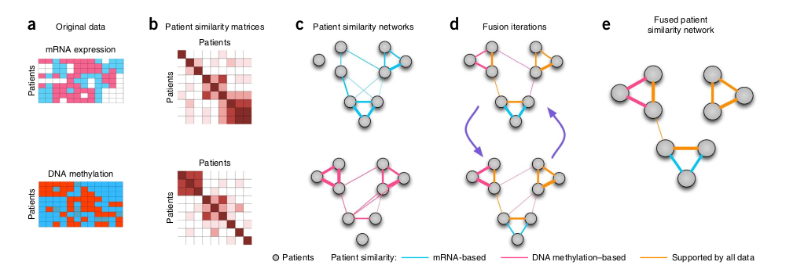
```

In the final fused similarity network **(e)**, you can identify which data type contributes to which edge: 

- the **<span style="color: DodgerBlue;">blue</span>** edge information are supported by the mRNA data
- the **<span style="color: Violet;">pink</span>** edge information are supported by the methylation data
- the **<span style="color: Orange;">orange</span>** edge information are supported by both data type: mRNA and methylation. 

You can retreive more information in:

- GitHub page: https://github.com/maxconway/SNFtool
- Publication: [PMID: 24464287](https://pubmed.ncbi.nlm.nih.gov/24464287/)

# Choose your datasets

:::: {.blackbox data-latex=""}
::: {.center data-latex=""}
**Choose the dataset on which you want to apply SNF!!**
:::
::::

<br>

Different datasets are available. Note that each dataset has its specificity and some analysis steps should be adapted. 

```{r data-plot, echo = FALSE, fig.align = "center", out.width = "80%", fig.cap = "Four datasets are available: **Metagenomic** dataset from Tara Ocean (image from Sunagawa et al., 2015), **Breast cancer** dataset from TCGA (image from TCGA [website](https://portal.gdc.cancer.gov/)), **CLL** dataset (Dietrich et al., 2018) and **tomato plant** dataset (figure from google image).", fig.show = "hold"}
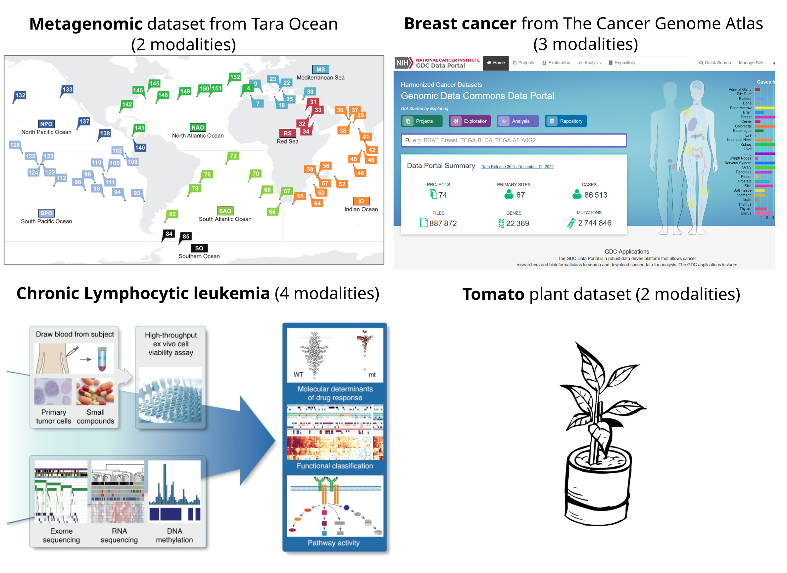
```

## Metagenomic dataset from Tara Ocean project {#tara}

The data files are available on Ametice.

- dataset: 
    - `TARAoceans_proNOGS.cvs`
    - `TARAoceans_proPhylo.csv`
    
- metadata:

    - `TARAoceans_metadata.csv`

Samples come from **eight oceans** around the world (SPO: South Pacific Ocean, NAO: North Atlantic Ocean, IO: Indian Ocean, RS: Red Sea, MS: Mediterranean Sea, NPO: North Pacific Ocean, SO: Southern Ocean, SAO: South Atlantic Ocean). 

Samples can come from **different layers** with different temperatures:

- SRF: Surface Water Layer (0-5 meters)
- DCM: Deep Chlorophyll Maximum (peak of chlorophyll, 0-600 meters)
- MIX: Subsurface epipelagic Mixed Layer
- MES(O): Mesopelagic zone (from 500/1000 meters)

In a previous analysis (Sunagawa *et al.*, 2015), they identified a stratification mostly driven by the temperature rather than geography or other environmental factors. 

We have two types of data: 

- **orthologous genes**: the relative abundance of groups of orthologous genes (OGs)
- **phylogenetic profil**: counts of S16 rRNA

Does an integrative analysis of these two data types retrieve the stratification driver by the layers? Does it also find a geographical clustering? 

Data are coming from: [MiBiOmics gitlab](https://gitlab.univ-nantes.fr/combi-ls2n/mibiomics).

## Breast cancer dataset from The Cancer Genome Atlas

To retrieve data: 

- dataset: using `data("breast.TCGA")` from the `mixOmics` R package

    - `breast.TCGA$data.train$mirna`
    - `breast.TCGA$data.train$mrna`
    - `breast.TCGA$data.train$protein`
    
- metadata: using `data("breast.TCGA")` from the `mixOmics` R package

    - `breast.TCGA$data.train$subtype`

Human breast cancer is a heterogeneous disease. Breast tumors can be classified into several subtypes (PAM50 classification), according to the mRNA expression level (Sorlie *et al.,* 2001). In this dataset, we have **three subtypes**:

- Basal: considered more aggressive than LumA
- Her2: tend to grow faster than LumA and can have a worse prognosis, but are usually successfully treated
- LumA: tend to grow more slowly than other cancers, be lower grade, and have a good prognosis

We have three types of data:

- **mRNA**: mRNA expression level
- **miRNA**: microRNA expression level
- **protein**: protein abundance

Does an integrative analysis of these three data types retrieve the classification of the breast cancer? Or find another classification? 

Data are coming from the `mixOmics` R package. The full data can be downloaded [here](http://mixomics.org/wp-content/uploads/2016/08/TCGA.normalised.mixDIABLO.RData_.zip).

## Chronic Lymphocytic Leukaemia (CLL) dataset

To retrieve data: 

- dataset: using `data("CLL_data")` from the `MOFAdata` R package

    - `CLL_data_t$Drugs`
    - `CLL_data_t$Methylation`
    - `CLL_data_t$mRNA`
    - `CLL_data_t$Mutations`
    
- metadata: file is available in `/shared/projects/tp_etbii_2024_165650/Networks/CLL` directory path in the IFB server. 

    - `sample_metadata.txt`
    
The Chronic Lymphocytic Leukaemia (CLL) is type of blood and bone marrow cancer. The full data are explained in Dietrich *et al.*, 2018 and available [here](http://bioconductor.org/packages/release/data/experiment/html/BloodCancerMultiOmics2017.html).

We have four types of data:

- **mRNA**: transcriptom expression level
- **methylation**: DNA methylation assays
- **drug**: drug response measurements
- **mutation**: sommatic mutation status

## Tomato plant dataset

To retrieve data: files are available in `/shared/projects/tp_etbii_2024_165650/Networks/Tomato` directory path in the IFB server. 

- dataset: 

    - `mrna.tsv`
    - `prots.tsv`
    
- metadata: 

    - `samples_metadata.tsv`

In order to study the protein turnover in developing tomato fruit (*Solanum lycopersicum*) in Belouah *et al.*, two omics data types were collected:

- **transcript** data: gene abundance
- **protein** data: protein abundance

Each data type was collected in **nine** different developmental stages: GR1, GR2, GR3, GR4, GR5, GR6, GR7, GR8 and GR9. For each developmental stages, we have three replicates. 

Does an integrative analysis of these data types retrieve the different developmental stages? 

Data are coming from Belouah *et al.*, 2019.

## Arabidopsis thaliana

To retrieve data: 

- dataset: using `data("X")` from the `WallomicsData` R package

    - `Phenomics_Rosettes`
    - `Transcriptomics_Rosettes_CW`
    - `Proteomics_Rosettes_CW`
    - ...
    
- metadata: using `data("X")` from the `WallomicsData` R package also

    - `Altitude_Cluster`
    - `Ecotype`
    - ...
    
In order to study the cell wall plasticity of *Arabidopsis thaliana* plants, exposed to different temperature growth conditions, four omics data types were collected : 

- **phenomics** data: 5 phenotype variables measured
- **metabolomics**: identification and quantification of the seven cell wall monosaccharides
- **cell wall proteomics**: counts of cell wall proteins
- **transcriptomics**: counts of transcripts

Each data type was collected for 

- **2 organs**, rosettes and stems with three replicates. 
- **2 temperatures**, 15°C an d 22°C
- **5 ecotypes**, Roch, Grip, Hern and Hosp growing at different altitudes in the Pyrénées and Col from low altitude in Poland
- **3 genetic clusters**

To see all the available data, have a look to the [manual](https://cran.r-project.org/web/packages/WallomicsData/WallomicsData.pdf).

Data are explained in Duruflé *et al.*, 2019, 2020 and 2021.

# Input data

## In summary 

The **preprocessing** step is the **most important** part of the analysis. Data need to be prepared correctly in order to extract relevant information and produce a correct and pertinent interpretation of the results. 

Data preprocessing could be summarized by four main steps:

1. **Prepare** the data (e.g. remove outliers, correct bacth effect etc...). We assume this has already been done for the SNF dataset.
2. Remove and/or impute **missing data**
    - remove features/samples if more than 20% of missing data
    - impute missing data  (e.g. using K-nearest neighbor method (KNN))
3. **Normalize** the data according to the data type
4. **Scale** (mean = 0 and standard deviation = 1)

```{r input-histExamples, echo = FALSE, fig.align = "center", out.width = "30%", fig.cap = "Distribution examples expected after preprocessing", fig.show = "hold"}
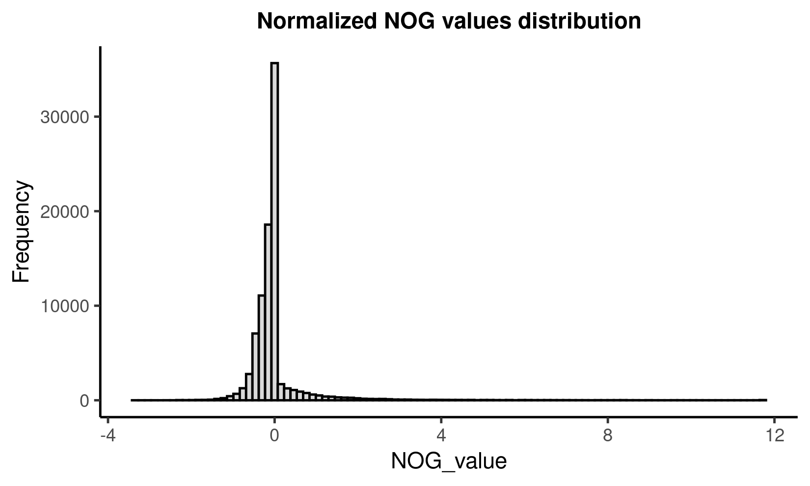
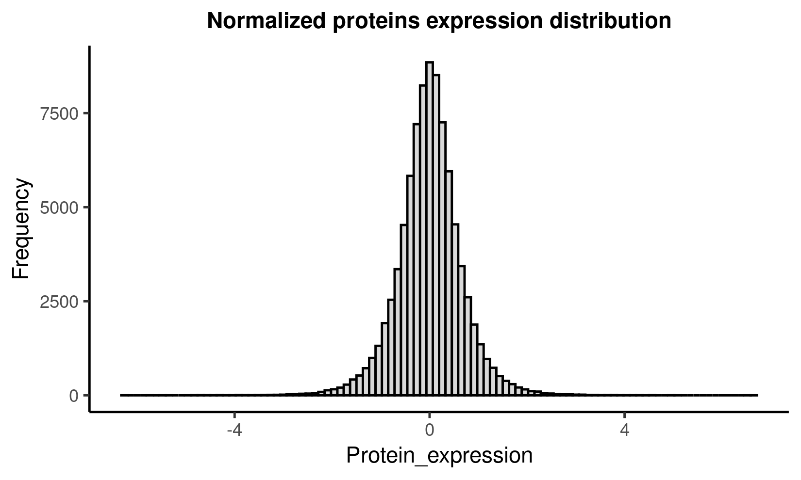
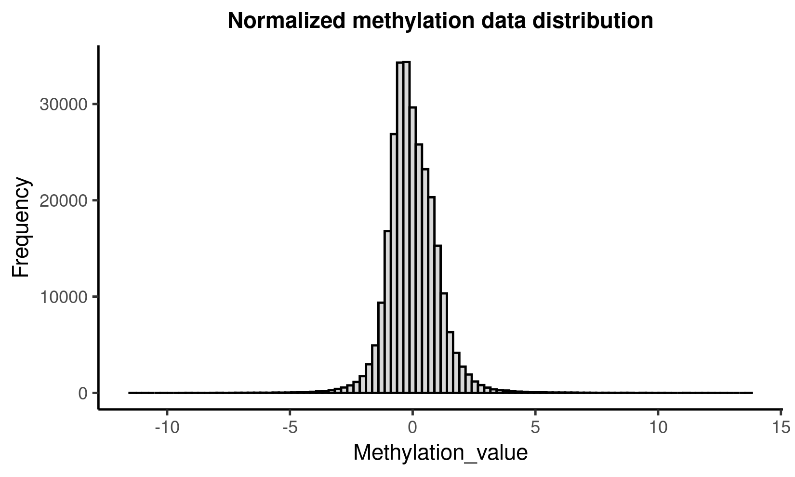
```

The data must conform to a **specific matrix shape**:

  - **samples** (e.g. samples, organisms …) in **rows**
  - **features** (e.g. genes, proteins …) in **columns**

## Read and prepare the data

:::: {.blackbox data-latex=""}
::: {.center data-latex=""}
**HELP!**
::: 
:::{.center data-latex=""}
| To access the **documentation** for a function within R, you can use the command ``?functionName()``. 
| **Take advantage** of this command, it will be your best friend ! ;) 
:::
::::

<br>

For this tutorial, we assume that the **data have been already prepared**: outliers are already removed and there is no batch effect. 

### Load dataset {#load}

#### Load from file

To load data from a **file**, you can use ``read.table()`` and specify the ``file`` name, the ``sep`` character and others parameters if it's necessary.

#### Load from package

To load data from a **package**, you can use ``data(dataName)``. Don't forget to load the corresponding package before with ``library(packageName)``. 

#### Load from website

To load data from a **website**, you can use ``fread(url)`` from the ``data.table`` package. 

### Load metadata

The metadata contains complementary information about samples. You can load the metadata from package or file. See the section \@ref(load) about data loading.

We use mainly the metadata for **visualization**. So we suggest to follow these recommendations:

- metadata should be a data frame (use `data.frame()` or `as.data.Frame()` functions)
- row names of the data frame should be the sample names (from ``read.table()`` use the ``row.names = 1`` parameter)
- the data frame needs to contain only `character` or `numerical` (check using ``str()`` function)
- select the columns that are the most useful to describe/characterize your samples

### Practice

For instance, to load the ortologous gene data from Tara Ocean, the command could be:

```{r input-loadTara}
tara_nog <- read.table(file = "../00_Data/TaraOcean_mibiomics/TARAoceans_proNOGS.csv", sep = ",", head = TRUE, row.names = 1)
tara_nog[c(1:5), c(1:5)]
```

<br>
Don't hesitate to look the first rows of your data regularly using ``head()``. It could be more convenient to display only the first 5 rows and columns when the data are big (``tara_nog[c(1:5), c(1:5)]``). 

<br>
<div class="boxed">
**Practice and questions:**

  1. How many different data type do you have? 
  2. How many samples do you have? 
  3. How many features do you have? 
  4. Make sure the samples are in rows and the features in columns.
  5. Check the type of the metadata object.
  6. Change it into data frame if it is necessary.
  7. Check the column type of the metadata and make sure they are factors.
  8. How many type of variables (e.g. type of information) does the metadata contain?
</div>

<br>
*These functions could help you: ``nrow()``, ``ncol()``, ``lapply()``, ``dim()``, ``t()``, ``names()``, ``typeof()``, ``as.factor()`` and ``levels()``*.

## Missing data

In the SNF paper, authors recommend to **filter out samples** with more than 20% of missing data in a certain data type. They also recommend to **filter out features** with more than 20% of missing data across samples. Then, they impute the remaining missing data using K nearest neighbors (KNN) imputation. 

In this tutorial, we decide to remove samples with at least one missing data. To remove samples with missing data, we propose the following ``NARemoving()`` function. Input parameters are:

- `data`: the data type
- `margin`: a vector giving the subscripts which the function will be applied over (e.g. 1 indicates rows and 2 indicates columns)
- `threshold`: threshold above which samples/features are deleted

```{r input-NAfunction}
NARemoving <- function(data, margin, threshold){
    #' NA removing
    #'
    #' Calculate percentage of na
    #' Remove na from rows (margin = 1) or column (margin = 2)
    #' 
    #' @param data data.frame.
    #' @param margin int. 1 = row and 2 = column
    #' @param threshold int. Number of missing data accepted
    #'  
    #' @return Return data.frame with a specific number of na by row/column

  data_na <- apply(data, MARGIN = margin, FUN = function(v){sum(is.na(v)) / length(v) * 100})
  # print(table(data_na))
  toRemove <- split(names(data_na[data_na > threshold]), " ")[[1]]
  if(margin == 1){
    data_withoutNa <- data[!(row.names(data) %in% toRemove),]
    print(paste0("Remove ", as.character(length(toRemove)), " samples."))
  }
  if(margin == 2){
    data_withoutNa <- data[,!(colnames(data) %in% toRemove)]
    print(paste0("Remove ", as.character(length(toRemove)), " features"))
  }
  return(data_withoutNa)
}
```

For instance, the CLL drug data contain missing data (sample `H024`). 
```{r input-loadCLL, echo = FALSE}
data("CLL_data")
CLL_data_t <- lapply(CLL_data, t)
```

```{r input-displayCLL}
CLL_data_t$Drugs[c(1:5), c(1:5)]
```

To remove samples with missing data in drug data, we use the following command line:

- `data = CLL_data_t$Drugs`: remove the samples with missing data in the drug data
- `margin = 1`: samples are in rows, so we want to apply the function on the rows
- `threshold = 0`: we remove samples with at least one missing data

```{r input-removeNAex}
CLL_drug <- NARemoving(data = CLL_data_t$Drugs, margin = 1, threshold = 0)
```

The `H024` sample is not anymore in the CLL drug data.

```{r input-removeNAexHead}
CLL_drug[c(1:5), c(1:5)]
```

We repeat this step for each data type. Then, we filter out samples that are not present in all data type. 

```{r input-filterSamples, eval = FALSE}
sampleNames <- Reduce(intersect, list(rownames(CLL_drug), rownames(CLL_mrna)))
CLL_drug <- CLL_drug[rownames(CLL_drug) %in% sampleNames,]
CLL_mrna <- CLL_mrna[rownames(CLL_mrna) %in% sampleNames,]
```

<div class="boxed">
**Practice and questions:**

  1. Do you have missing data in your data?
  2. Remove samples with at least one missing data. 
  3. Are you going to use all the data type available?  
</div>

<br>
*These functions could help you: ``is.na()``, ``lapply()``, ``table()`` and ``view()``*.

## Normalization and scaling

### Normalization

The **normalization** should be adapted according the data type. For the data used here, we assumed that data have been already normalized, according their type. This step **is really important**, and should be correctly done before every type of data integration. 

### Scaling

Each feature (column) needs to have the mean equals to zero and the standard deviation equals to one. For that, the SNF package provides the function ``standardNormalization()``. 

In the Figure \@ref(fig:input-histTCGA), you can see the data distribution for the breast cancer miRNA data before (on the left) and after (on the right) scaling. After scaling, the data distribution should be normal. 

```{r input-loadTCGA, echo = FALSE}
data(breast.TCGA)
tcga_mirna = breast.TCGA$data.train$mirna
tcga_mirna_scaled <- standardNormalization(x = tcga_mirna)
```

```{r input-histTCGA, fig.show = "hold", fig.align = "center", out.width = "50%", fig.cap = "Breast cancer miRNA data distribution before (left) and after (right) scaling."}
hist(as.matrix(tcga_mirna), nclass = 100, main = "Breast cancer miRNA data", xlab = "values")
hist(as.matrix(tcga_mirna_scaled), nclass = 100, main = "Breast cancer miRNA scaled data", xlab = "values")
```

<div class="boxed">
**Practice and questions:**

  1. Scale your data with ``standardNormalization()``.
  2. Plot the data distribution before and after scaling for each data type. 
  3. What can you say about these distribution plots?
</div>
  
<br>
*These functions could help you: ``hist()``, ``as.matrix()``.*

# Similarity network

## In summary

In this section, we create a **sample network** for each type of data, based on the **similarity** between samples. The main steps are (Figure \@ref(fig:simNet-principle)):

1. Compute the **distance** between each pair of samples (distance matrix **D**).
2. Transform distances (from distance matrix D) into **weights** (into similarity matrix **W**) using distance with nearest neighbors. 
3. Create the corresponding similarity network (**G**).

```{r simNet-principle, echo = FALSE, fig.align = "center", out.width = "150%", fig.cap = "Similarity network creation overview. Data type 1 is in the first row, represented with the green matrices. Data type 2 is in the last row, represented with the purple matrices."}
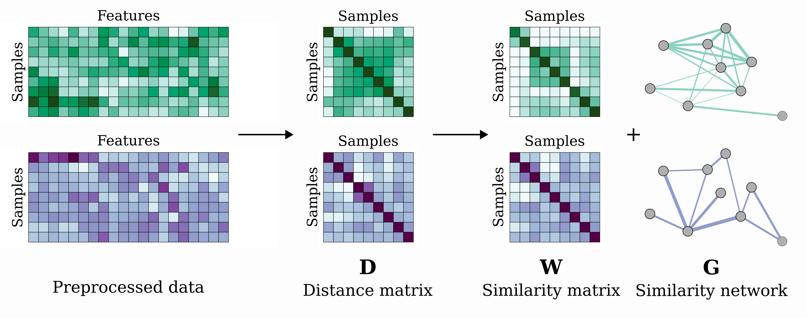
```

The similarity network is a **sample network**. It is defined as a network **G** with nodes (or vertices) called **V** and connections (or edges) called **E**. The connections between samples are **weighted**. Weights come from the similarity matrix.

We can define the similarity network **G** like this:

<center> $G = (V, E, W)$ </center>

- V: **Nodes** are samples
- E: **Edges** are connections between samples
- W: **Edge weights** are the similarity (or weight) between samples

## Distance calculation

First, we calculate **the distance** between each pair of samples for each data type using the preprocessed data. The **distance method** used needs to be adapted to the feature type (e.g. continuous, discrete).

In the SNF paper (Wang *et al.*), authors suggest to use:

- distance (e.g. euclidean) or correlation (e.g. pearson) for **continuous** features
- chi-squared distance for **discrete** features
- agreement based measure for **binary** features

In the SNF R package, the `dist2()` function performs a squared Euclidean distances between samples.

<div class="boxed">
**Practice and questions:**

  1. Calculate the Euclidean distance between samples for each data type.
  2. What are the dimensions of the created distance matrices?
  3. Why is the diagonal close to zero?
  4. What does a high distance between two samples mean?
  5. What does a small distance mean?
  6. Could you apply another distance calculation? Which ones?
</div>

<br>
*These functions could help you: ``as.matrix()``, ``dim()``, ``nrow()`` and ``ncol()``.*
  
## Similarity calculation

The **distance matrix D** is then transformed into the **similarity matrix W**. Distances are converted to weights using the scaled exponential similarity kernel (**µ**) and average distances between samples and their nearest neighbors (**ε**):

$$ W = exp(-\frac{D^2}{µ\varepsilon})$$
In other words, distances are converted to weights according the distance with the nearest neighbors of each sample pair.  

The SNF R package proposes the `affinityMatrix()` to calculate this similarity matrix. In this case, `affinity` and `similarity` are equivalent. This function needs three parameters:

- `diff`: distance matrix D
- `K`: number of nearest neighbors (between 10 and 30)
- `sigma`: hyperparameter or variance (between 0.3 and 0.8)

The **K neighbors** is used to set the similarities outside of the neighborhood to zero. The **sigma** parameter allows scaling exponential similarity kernel, which is used to calculated the similarity.

Then, you can **visualized the similarity matrix** using the `pheatmap()` function. This function creates an heatmap of samples. By default samples are clustered using hierarchical clustering. For a better visualization, we recommend to:

- remove labels with `show_rownames = FALSE` and `show_colnames = FALSE`
- give metadata to the parameter `annotation`
- apply a log 10 transformation to the similarity matrix (``log(x, 10)``)

<div class="boxed">
**Practice and questions:**

  1. Calculate the similarity matrix using `K = 20` and `sigma = 0.5` for each data type.
  2. Visualize the heatmap of the corresponding similarity matrices. 
  3. What does the red color mean? What does the blue color mean?
  4. Are heatmaps similar between data types?
  5. What can you say about these heatmaps? 
  6. How are samples relative to each other in the heatmap (e.g, close, group)? 
  7. Try with different parameters and visualize heatmaps. Can you explain what is happening?
</div>

# Fusion

## In summary

Previously, we created a **similarity matrix W** and its corresponding similarity network G for each data type (Figure \@ref(fig:fusion1)). 

```{r fusion1, echo = FALSE, out.width = "70%", fig.align = "center", fig.cap = "In the previous step, we create a similarity matrix that contains weights for each data type. We also created the corresponding similarity network."}
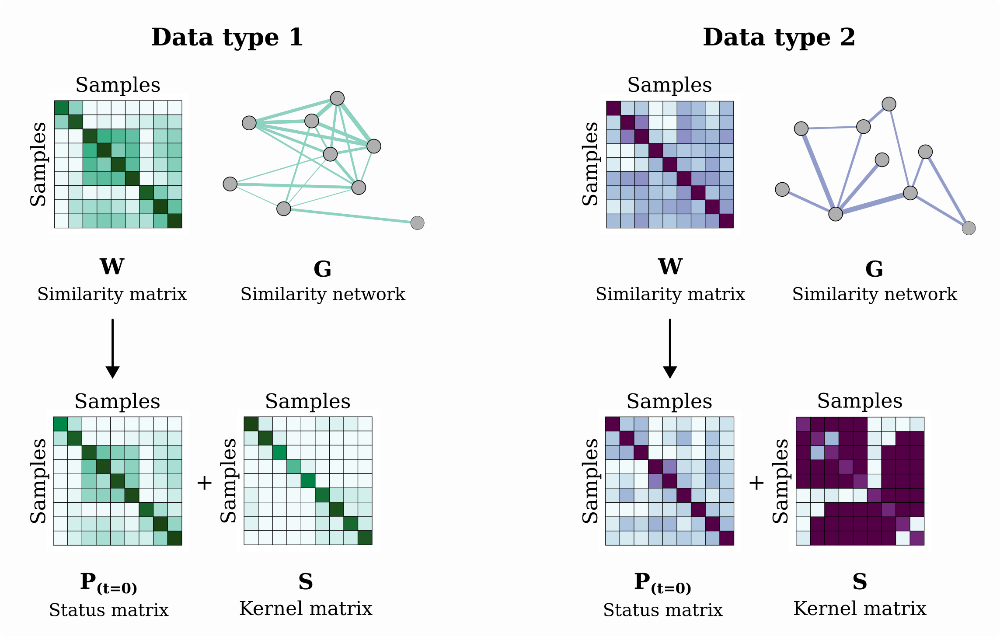
```

Now, we **integrate** these similarity matrices (in the Figure \@ref(fig:fusion1) there are two data types). For that, we use an **iterative fusion** method. The **number of iteration** T, needs to be defined. 

First, two matrices are created from the similarity matrix of each data type:

- the **P matrix**: this matrix, also called **status matrix**, contains normalized weights (come from the similarity matrix W).
- the **S matrix**: this matrix is the kernel matrix. It contains information about the nearest neighbors. 

The **P matrix** carries the full information about the **similarity** of each samples to all others.

The **S matrix** carries the similarity to the **K most similar** samples for each sample (i.e. topology). The similarities between non-neighboring nodes are set to zero because authors assume that local similarities (high weights) are more reliable than the remote ones.

Then, the **P matrix** of each data type is iteratively updated with information from P matrices of the other data type, making them more similar at each step. In the Figure \@ref(fig:fusion-principle), you have an example with two data type. It's a bit more complex with more data type (see the paper if you are interested in). 

```{r fusion-principle, echo = FALSE, fig.align = "center", out.width = "85%", fig.cap = "Example of the fusion method applied to two data types. Each data type is represented using a color: data type 1 in green and data type 2 in purple."}
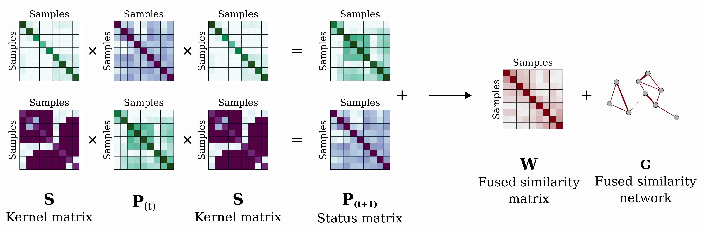
```

Finally after T iterations, the **P matrices** of each data type are merged together to create the final **fused similarity matrix**, and the corresponding fused similarity network. 

Then, you can **visualize** the fused similarity network using Cytoscape. 

## Create the fused similarity matrix 

First, we have to define the **number of iteration** called T. It should be between 10 and 20 (recommended by the authors). 

Then, to perform the fusion, SNF R package proposes the `SNF()` function. You have to provide:

- the list of **similarity matrices** of each data type
- the number of nearest neighbors **K** (same as previously)
- the number of iteration **T** 

<div class="boxed">
**Practice and questions:**

  1. Create the fused similarity matrix with 10 iterations (``T = 10``).
  2. What are the dimensions of the fused similarity matrix?
  3. What are values inside the fused similarity matrix?
  4. How many values do you have in the fused similarity matrix?
  5. How many values equal to zero do you have in the fused similarity matrix?
  6. Visualize the corresponding heatmap. 
  7. What does the red color mean? What does the blue color mean?
  8. Compare the fused similarity matrix heatmap and the data type heatmaps. What can you say?
  9. How are samples relative to each other in the fused similarity matrix?
  10. Try with another number of iteration. What's happening?
</div>

<br>
*These functions could help you: ``list()``, ``length()``.*

## Visualize the fused similarity network

### Create the fused similarity network {#net}

You can **visualize** the fused similarity network using Cytoscape. 

First, you need to **convert** the fused similarity matrix into the corresponding fused similarity network. The `igraph` R package allows to create and manage networks. 

You can create a the fused similarity network using the `graph_from_adjacency_matrix()` function. This function uses a similarity matrix to create the corresponding similarity network.

We don't want duplicate information about connections between samples, neither connections between samples themselves (self loops). But we want to keep the connection weight values. You can use these parameters:

- don't take the diagonal: `diag = FALSE`
- use only one part of the matrix: `mode = "upper"`
- use the edge weights: `weighted = TRUE`

Then, you can save the fused similarity network into a edge file using `write.table()` function. 

This is an example of the saving command line:

```{r fusion-writeOutput, eval = FALSE}
write.table(as_data_frame(W_net), "CLL_W_edgeList.txt", quote = FALSE, col.names = TRUE, row.names = FALSE, sep = "\t")
```

### Visualize using Cytoscape {#cytoscape1}

To create a network using Cytoscape, use the following steps:

#### Import files

```{r, echo = FALSE, fig.align = "center", out.width = "40%", fig.cap = "Step 1 - Import files"}
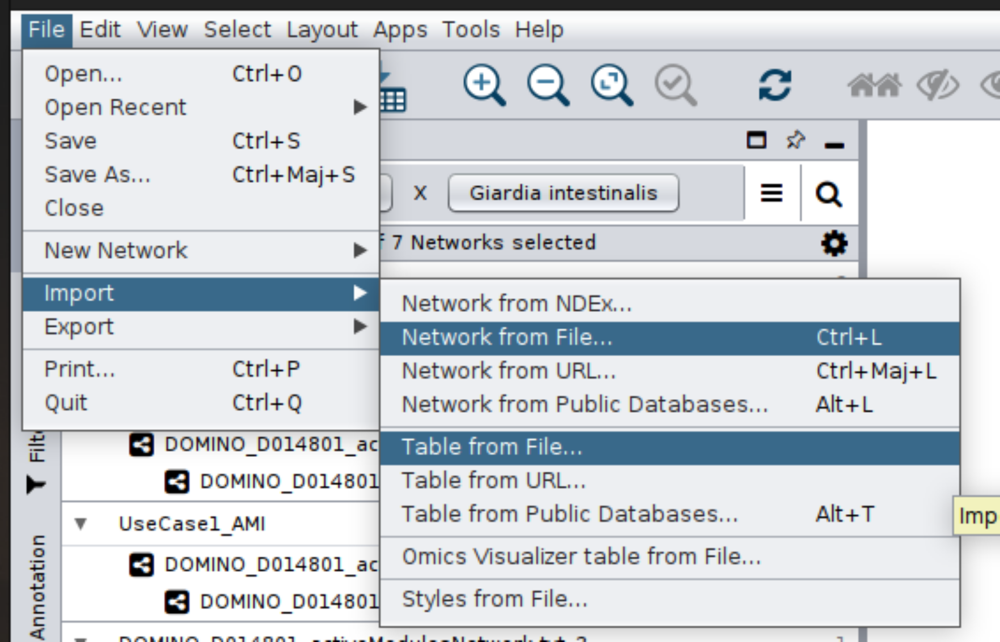
```

- **Import Network** from File: `*_W_edgeList.txt` and define:
    - column 1 as Source node
    - column 2 as Target node
    - column 3 as Edge attributes
- **Import Table** from File: `*_metadata.txt` *(Import Data as Node Table Columns)*

#### Network style

```{r, echo = FALSE, fig.align = "center", out.width = "50%", fig.cap = "Step 2 - Change the network style"}
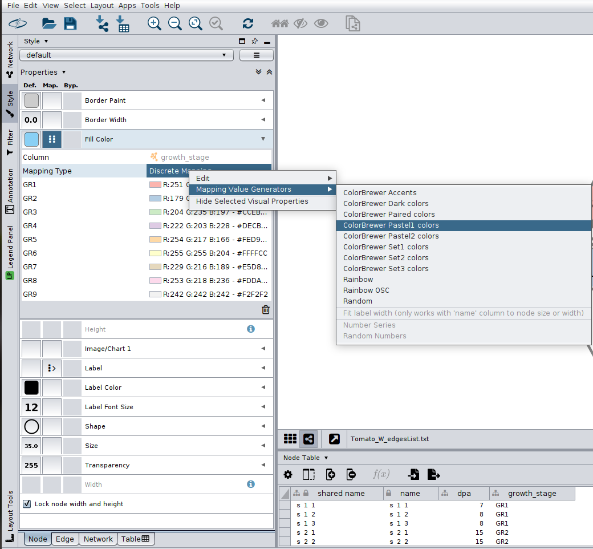
```

In the **Style** tab:

- Fill Color 
    - `select a column` from the metadata. Here it's *growth_stage* from the tomato dataset
    - you can automatically fill the color by right click on `Mapping Type` tab
- Shape = `Ellipse`
- `Lock node width and height`

#### Network layout

```{r, echo = FALSE, fig.align = "center"}
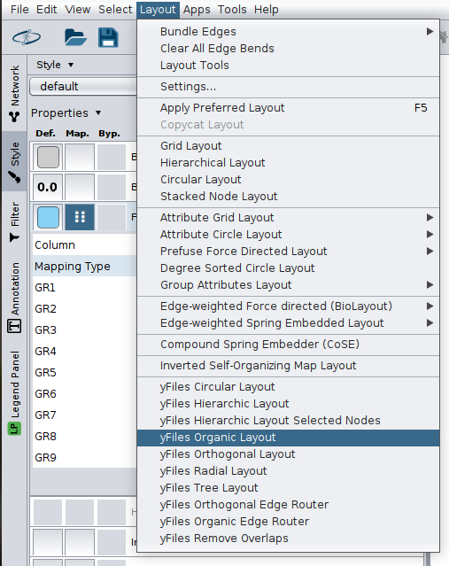
```

Apply your favorite layout. For this step, we recommend to try at least `yFiles Organic Layout`. 

### Practice

<div class="boxed">
**Practice and questions:**

  1. Create the fused similarity network with the fused similarity matrix.
  2. Save the network into a file.
  3. Visualize the fused similarity network in Cytoscape.
  4. How many nodes do you have? How many edges do you have?
  5. Why the edges number in the network is not the same as the number of values in the matrix?
  6. Try different layouts. 
  7. What do you think about this network?
</div>

# Threshold selection

## In summary 

In Cytoscape, you see that the fused similarity network is **fully connected**. Indeed, each sample is connected to all other samples. Remember, connections between samples are **weighted**: this weight represents the **similarity** between samples. A **high weight** value means a **strong similarity** between two samples whereas a low weight value means a weak similarity between two samples. 

For a better visualization, we can **select a threshold** to decide which connections to keep, based on this weight value.

How to choose the good threshold? It's an **open question**. There are some possibilities:

- choose an arbitrary threshold (e.g. nearest neighbors)
- choose a threshold based on basic metrics (e.g. median, quantiles)
- choose a threshold using methods based on network topology
- ...

## Select an arbitrary threshold 

In this example, we select a threshold **based on the weight** distribution of the fused similarity network. 

First, we extract edges from the network object. Indeed, the network object doesn't contains duplicate edges, neither self loops unlike the corresponding fused similarity matrix W. 

For instance, we extract weight values from the Tara Ocean fused similarity network. This network contains ``r length(igraph::edge.attributes(tara_W_net)$weight)`` connections in total.
```{r threshold-arbitraryEdges}
weights <- edge.attributes(tara_W_net)$weight
```

Then, we display the corresponding weight histogram in the Figure \@ref(fig:threshold-arbitrary) (left). You can see a large number of small weight values. We can remove values between `0` and `0.01` where the majority of the small values seem to be. With the `0.01` threshold, ``r length(weights[weights > 0.01])`` connections are kept.

In the Figure \@ref(fig:threshold-arbitrary) (right), we log-transform weights. The weight distribution is binomial and we would like to cut the distribution into two parts. With the threshold `0.001 (log(0.001, 10) = -3)`, ``r length(weights[weights > 0.001])`` connections are kept.  

```{r threshold-arbitrary, fig.show = "hold", fig.align = "center", fig.cap = "Weight distribution of the fused similarity network. On the left the weight distribution of the fused similarity network. On the right the log-transformed weight distribution of the fused similarity network.", out.width = "50%"}
## Raw weights
hist(weights, nclass = 100, main = "Fused similarity network weight distribution", xlab = "weights")
abline(v = 0.01, col = "red", lwd = 3)
## log10 weights
hist(log(weights, 10), nclass = 100, main = "Fused similarity network weight distribution", xlab = "log10(weights)")
abline(v = -3.1, col = "red", lwd = 3)
```

| **Advantages**       | **Drawbacks**                                          |
|----------------------|--------------------------------------------------------|
| 1. Easy to implement | 1. Arbitrary                                           |
| 2. Fast              | 2. Doesn't take account of the topology of the network |
| 3. Visual            |                                                        |

## Select the threshold using quantiles

As example for this part, we select the **median** and the **third quantile** values as thresholds. We calculate the median and the third quantile of the weight values. 

```{r threshold-metricsCalculation}
W_median <- median(x = weights)
W_q75 <- quantile(x = weights, 0.75)
```

The weight distribution and the log-transformed weight distribution are displayed in the Figure \@ref(fig:threshold-metrics), respectively left and right. 

```{r threshold-metrics, fig.show = "hold", fig.align = "center", fig.cap = "Weight distribution of the fused similarity network. On the left the weight distribution of the fused similarity network. On the right the log-transformed weight distribution of the fused similarity network.", out.width = "50%"}
## Raw weights
hist(weights, nclass = 100, main = "Fused similarity network weight distribution", xlab = "weights")
abline(v = W_median, col = "blue", lwd = 3)
text(W_median, 2000, pos = 4, "Median", col = "blue", cex = 1)
## log10 weights
hist(log(weights, 10), nclass = 100, main = "Fused similarity network weight distribution", xlab = "log10(weights)")
abline(v = log(W_median, 10), col = "blue", lwd = 3)
text(log(W_median, 10), 400, pos = 2, "Median", col = "blue", cex = 1)
abline(v = log(W_q75, 10), col = "purple", lwd = 3)
text(log(W_q75, 10), 350, pos = 4, "quantile 75%", col = "purple", cex = 1)
```

The **median** is the value that splits data into two groups with the same number of data. With this value (``r W_median``), we selected ``r length(weights[weights > W_median])`` connections.

The values above the **third quantile** value (``r W_q75``) are in the top of 25% highest weights. We selected ``r length(weights[weights > W_q75])`` connections.

| **Advantages**        | **Drawbacks**                                          |
|-----------------------|--------------------------------------------------------|
| 1. Easy to implement  | 1. Arbitrary (but fitted to the data)                  |
| 2. Fast               | 2. Doesn't take account of the topology of the network |
| 3. Fitted to the data |                                                        |

## Threshold based on network topology

In the Zahoranszky-Kohalmi *et al.* paper, authors propose a method to determine the best threshold according to the topology of the network. This method calculates the **Average Clustering Coefficient** (ACC) for a whole network. The ACC represents a global parameter that characterizes the overall **network topology**. 

As an Elbow approach, an ACC value is calculated for a range of thresholds. The obtained values are displayed and we choose the threshold that seems the best! 

### Functions 

To help, we created two functions to calculate these ACC values and choos           e the best threshold based on the topology:

- ``CCCalculation()``: this function calculates the Clustering Coefficient (CC) for each node
- ``ACCCalculation()``; this function averages the CC for a network, in order to obtain the ACC

```{r threshold-ACCcalculationFunctions}
## CC calculation function
CCCalculation <- function(node, graph){
    #' Clustering Coefficient (CC) calculation
    #'
    #' Calculate the Clustering Coefficient (CC) for each node in a network
    #' 
    #' @param node str.
    #' @param graph igraph. Network object (e.g. the fused network object)
    #'  
    #' @return Return the corresponding CC value
    
  degNode <- degree(graph = graph, v = node, loops = FALSE)
  if(degNode > 1){
    neighborNames <- neighbors(graph = graph, v = node)
    graph_s <- subgraph(graph = graph, vids = neighborNames)
    neighborNb <- sum(degree(graph_s, loops = FALSE))
    CC <- neighborNb / (degNode * (degNode-1))
  }else{CC <- 0}
  return(CC)
}

## ACC calculation function
ACCCalculation <- function(graph){
    #' Average Clustering Coefficient (ACC) calculation
    #'
    #' It average the Clustering Coefficient (CC) of a network
    #' 
    #' @param graph igraph. Network object (e.g. the fused network object)
    #'  
    #' @return Return the corresponding ACC value
    
  nodes <- V(graph)
  ACC <- do.call(sum, lapply(nodes, CCCalculation, graph)) / length(nodes)
  return(ACC)
}
```

### Range of thresholds

First, we determine a range of thresholds. The ACC precision increases with the number of chosen thresholds (choose at least 100). 

```{r threshold-range}
summary(weights)
thresholds <- seq(0, 0.1, 0.0005)
```

### Calculate the ACC values

Calculate the ACC values for each selected threshold.

```{r threshold-ACCcalculation}
ACC_W <- do.call(rbind, lapply(thresholds, function(t, net){
  net_sub <- subgraph_from_edges(net, E(net)[weight >= t])
  df <- data.frame("ACC" = ACCCalculation(net_sub), "thresholds" = t, "EN" = length(E(net_sub)))
  return(df)
}, tara_W_net))
```

The ACC values are displayed in the Figure \@ref(fig:threshold-ACCcalculationPlot) (left). The number of network edges for each threshold is displayed in the Figure \@ref(fig:threshold-ACCcalculationPlot) (right).
```{r threshold-ACCcalculationPlot, fig.show = "hold", out.width = "50%", fig.cap = "**Left**: Average Clustering Coeeficient (ACC) values for each threshold - **Right**: Number of edges on network  for each threshold", fig.align = "center"}
plot(x = ACC_W$thresholds, y = ACC_W$ACC, xlab = "thresholds", ylab = "ACC", main = "ACC calculation of the Fused network W", type = "o")
points(x = ACC_W$thresholds[1], y = ACC_W$ACC[1], col = "red", pch = 16, cex = 1.2)
points(x = ACC_W$thresholds[21], y = ACC_W$ACC[21], col = "pink", pch = 16, cex = 1.2)
points(x = ACC_W$thresholds[29], y = ACC_W$ACC[29], col = "purple", pch = 16, cex = 1.2)
abline(v = ACC_W$thresholds[29], col = "purple")
text(ACC_W$thresholds[29], 0.7, pos = 4, paste0("Threshold = ",  ACC_W$thresholds[29]), col = "purple")
text(ACC_W$thresholds[29], 0.6, pos = 4, paste0("ACCmax = ",  round(ACC_W$ACC[29], 2)), col = "purple")
plot(x = ACC_W$thresholds, y = ACC_W$EN, xlab = "thresholds", ylab = "number of edges", main = "EN of the Fused network W", type = "o")
abline(v = ACC_W$thresholds[29], col = "purple")
text(ACC_W$thresholds[29], 2800, pos = 4, paste0("Threshold = ",  ACC_W$thresholds[29]), col = "purple")
text(ACC_W$thresholds[29], 2000, pos = 4, paste0("ACCmax = ",  round(ACC_W$ACC[29], 2)), col = "purple")
text(ACC_W$thresholds[29], 1200, pos = 4, paste0("EN = ",  ACC_W[29, "EN"]), col = "purple")
```

On the Figure \@ref(fig:threshold-ACCcalculationPlot) you can see a peak that stands out in comparison with the others.  

- Red dot: no filter, every sample is connected to each other
- Pink dot: the smallest value before the peak
- Purple dot: the **local maxima** of ACC (we want this one)

| **Advantages**                                 | **Drawbacks**                                      |
|------------------------------------------------|----------------------------------------------------|
| 1. Take account of the topology of the network | 1. Might be time consuming                         |
|                                                | 2. Interpretation (need to be used to this method) |
|                                                | 3. Sometimes, no peak ...                          |

## Visualize this threshold in Cytoscape

The **fused similarity network** is already imported in Cytoscape. You already changed the network style and the network layout. If it is not, you can go to the previous [Cytoscape section](#cytoscape1). 

We have a **fully connected network**. To select edges based on their weights, use the following steps:

### Filter column

```{r, echo = FALSE, fig.align = "center", out.width = "70%", fig.cap = "Filter edge weight using the determined threshold."}
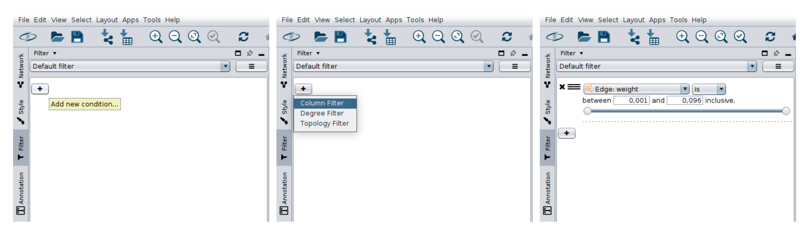
```

In the **Filter** tab: 

- Add a new condition
- Select `Column Filter`
- Choose the `Edge: weight` column name
- Put your threshold in the range

### Create a new network visualization {#cytoscape2}

```{r, echo = FALSE, fig.align = "center", out.width = "80%", fig.cap = "Create new network visualization according the determined threshold"}
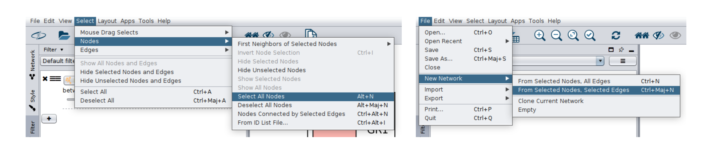
```

- Select All Nodes
- Create a New Network from `Selected Nodes, Selected Edges`
- Apply your favorite layer on this new network

## Practice 

Now, it's your turn to find the best threshold!! 

<div class="boxed">
**Practice and questions:**

  1. Determine the threshold:
  
      1.1. Select a threshold based on the weight distribution.
      
      1.2. Use the median as threshold.
      
      1.3. Determine the threshold based on the topology of the network.
      
  2. Visualize these thresholds in Cytoscape.
  3. Determine for each network that are in Cytoscape:
  
      3.1. Number of edges and nodes.
      
      3.2. Number of isolated samples.
      
  4. For you, which threshold is better?
  5. For each data type:
    
      5.1. Create a network from the similarity matrix
      
      5.2. Do the 1-4 steps
</div>

<br>
*Keep in mind that you can change this threshold in Cytoscape anytime.*

# Downstream analysis

You integrated your data and created the corresponding fused similarity network: **CONGRATULATIONS**!!

This fused similarity network can be use for downstream analysis based on network's algorithms such as clustering, retrieval or classification. You can also visualize the network and add some external data. 

In this hands-on, we give you two examples to illustrate what you can do with the fused similarity network: **clustering** and **visualization** using Cytoscape. 

## Clustering

In the SNF paper, authors propose a clustering method called `spectralClustering()`. This function takes in input three parameters:

- `affinity`: fused similarity matrix W
- `K`: number of clusters we want
- `type`: the variants of spectral clustering to use (default 3)

Samples are clustered together according to their **similarity**. The number of clusters needs to be defined. Obviously, this cluster number can be chosen using an Elbow approach, which would be less arbitrary. 

First, define the number of clusters. Here, we define **four clusters**. 

```{r clustering4-init}
C <- 4
```

Then, perform the clustering. Results are stored into the `group` variable.

```{r clustering4-run}
group <- data.frame(Groups = spectralClustering(tara_W, C)) 
row.names(group) <- colnames(tara_W)
```

Next, merge the clustering results with the metadata.

```{r clustering4-merge}
dataGroups <- merge(metadata, group, by = 0) 
head(dataGroups)
```

Finally, save the merged data into a file.

```{r clustering4-save, eval = FALSE}
write.table(dataGroups, "TARAOcean_4clusters.txt", quote = FALSE, col.names = TRUE, row.names = FALSE, sep = "\t") 
```

<div class="boxed">
**Practice and questions:**

  1. Choose three cluster numbers (e.g. two, three and nine)
  2. Perform the clustering. 
  3. Save results into file.
</div>

<br>
*You might merge clustering results to create on result file using `merge()` function.*

## Visualization on Cytoscape {#cytoscape3}

As a reminder:

1. How to import files and change network visualization style, see section \@ref(cytoscape1)
2. How to apply a threshold on edges, see section \@ref(cytoscape2)

You already loaded the **fused similarity network** in Cytoscape. And you also removed the weak edges. To visualize the clustering results follow the steps:

```{r, echo = FALSE, fig.align = "center", fig.cap = "Import table to the Network Collection."}
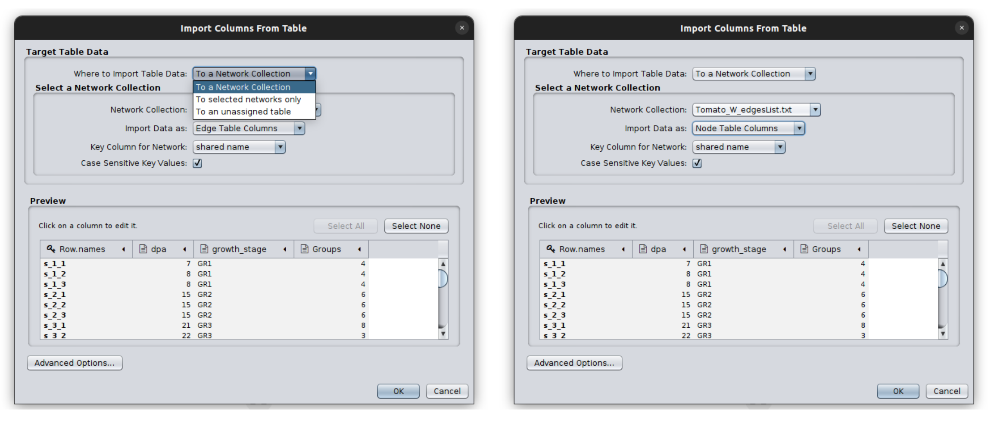
```

- Import Table from File: `*_clusters.txt` to the Network Collection *(information will be add to every network in the collection)*
- Color the nodes according to their cluster
- Create the corresponding legend using the Legend Panel tab
    - First, `Scan Network`
    - Then, modify the title and the subtitle
    - Finally, `Refresh Legend`
- To move legend elements, click on the T icon 

```{r, echo = FALSE, fig.align = "center", fig.cap = "Create a legend using the Legend Panel.", out.height = "50%"}
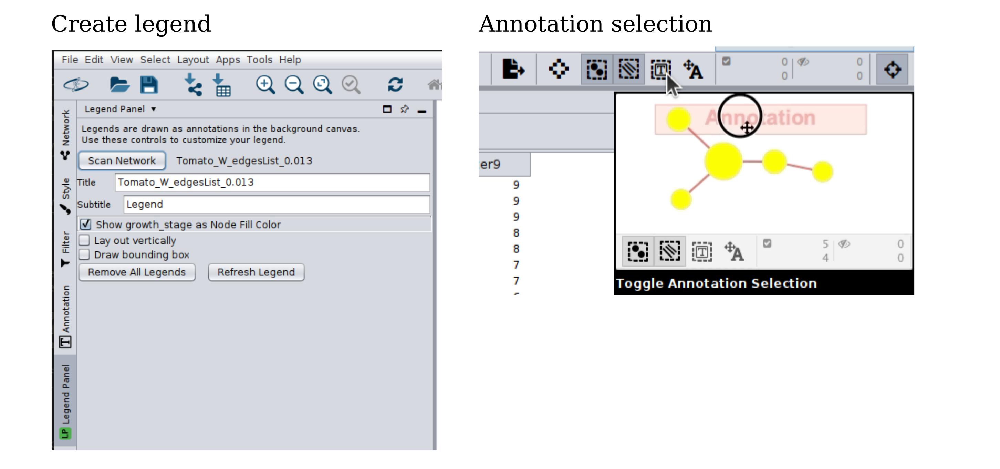
```

This is a network visualization example for each dataset:

```{r cyto-ex-fusedNetwork, echo = FALSE, fig.align = "center", fig.cap = "Example of fused similarity network visualization using Cytoscape for each dataset."}
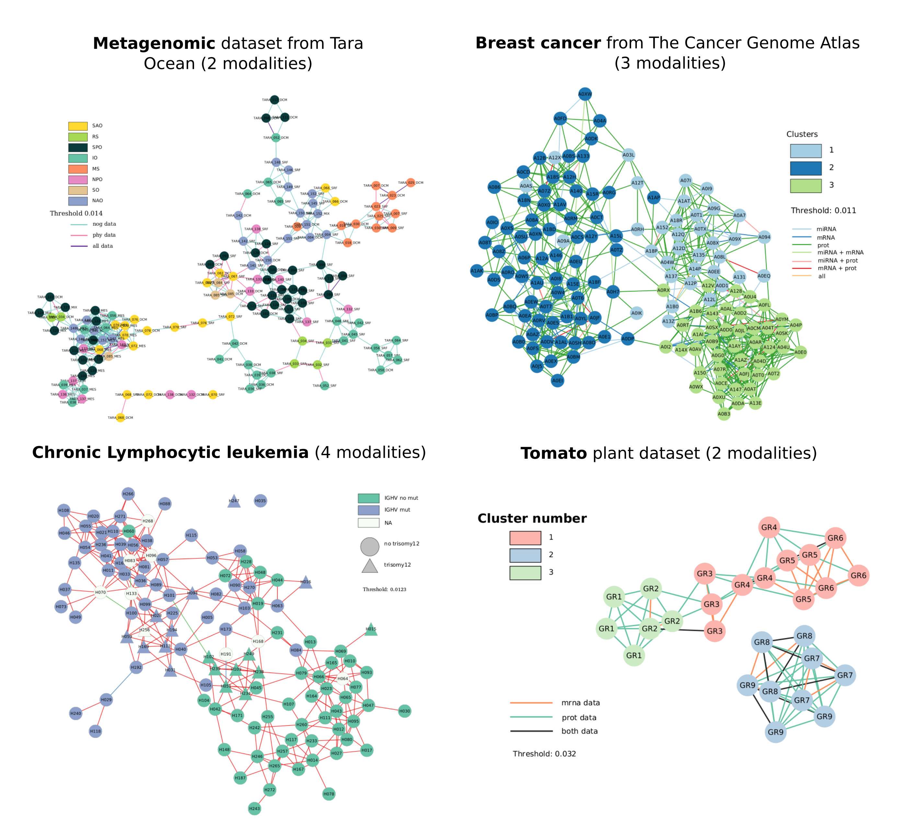
```

<div class="boxed">
**Practice and questions:**

  1. Import the clustering results file.
  2. Change the style of the network.
  3. Try to have a similar network as you can see in the figure.
  4. How can you interpret the results?
  5. Play with the colors, change the metadata used and do what you want with Cytoscape!
</div>

# Go further

Now, you know how to integrate different type of data using the Similarity Network Fusion (SNF) method. 

You're aware of the important steps such as the **preprocessing** of the data (e.g. normalization and scaling, data shape), the **similarity network** creation and the **fusion**. 

You also see how to perform clustering on the fused similarity network and how to visualize results. 

This part is to go further in your analysis and your interpretation of the results.

## Normalization and distance calculation

At the beginning of the hands-on, we assumed that data have been already well normalized. We also used only the euclidean distance, whatever the types of data. 

It could be interesting to try different normalization and distance calculation to choose the most-adapted preprocessing of the data. 

For instance, the two main adapted normalization methods for the Tara Ocean data are: 

- Centered log ratio method (CLR)
- Total sum-scaling (TSS)

Moreover, other distance distances exist and are more appropriate for ecological data than Euclidean distance:

- Bray-Curtis distance
- Hellinger distance

*These functions could help you: ``distance()``, ``tss()`` or ``clr()``. They are available in the `ecodist`, `hilldiv` and `compositions` packages.*

<div class="boxed">
**Practice and questions:**

  1. Try another normalization method.
  2. Try another distance calculation or correlation.
  3. Run a new SNF analysis.
  4. Interpret the results.
</div>

## Data type contribution {.tabset} 

Did you notice the **edge colors** in the Figure \@ref(fig:cyto-ex-fusedNetwork)? Colors represent the **contribution** of each data type in each **sample association**.

In the SNF paper, authors did like this:

1. The edge is considered supported by a **single data** if its weight in that data type’s network is more than 10% higher than the weight of the same edge in the other data type’s networks.
2. If the difference between two highest edge weights from the corresponding data types is less than 10%, the edge is considered supported by those **2 data types**.
3. If the difference is less than 10% between all data type, the edge is supported by **all data types**.

Depending of the number of the integrated data type, we suggest two workflows:

### Data type contribution: with **2 data types**

Transform similarity network into data frames (to transform similarity matrix into similarity network see section \@ref(net)).
```{r source2-init}
tara_W_df <- as_data_frame(tara_W_net)
tara_nog_df <- as_data_frame(tara_nog_net)
tara_phy_df <- as_data_frame(tara_phy_net)
```

Merge data frames into one data frame:
```{r source2-merge}
tmp <- merge(tara_nog_df, tara_phy_df, by = c(1,2), suffixes = c("_tara_nog", "_tara_phy"))
weights_df <- merge(tmp, tara_W_df, by = c(1,2))
head(weights_df)
```

Determine data type contribution on each edge:
```{r source2-run}
sources_df <- as.data.frame(do.call(rbind, apply(weights_df, 1, function(s){
  sources <- as.numeric(s[c(3,4)])
  ## Initiate keep vector with FALSE value
  keep <- c(rep(FALSE, length(sources)))
  ## Where is the max value ?
  max_ind <- which.max(sources)
  ## Keep it 
  max <- max(sources)
  keep[max_ind] <- TRUE
  
  ## Retrieved indices of all non max value
  tmp <- seq(1, length(sources))
  tmp <- tmp[!tmp %in% max_ind]
  ## If max weight < 10% of other weight, put it to TRUE
  for(i in tmp){
    w <- as.numeric(sources[i])
    if(max > w+(w*10/100)){keep[i] <- FALSE}
    else{keep[i] <- TRUE}
  }
  ## Select all the TRUE weights
  ## Compare them by pairs
  ## If w1 - w2 is > 10%, they are not selected anymore
  ## Except if one of them is the max value
  keep_df <- as.data.frame(table(keep))
  if(keep_df[keep_df$keep == TRUE, "Freq"] > 1){
    ind <- which(keep == TRUE)
    ind_comb <- combn(x = ind, m = 2)
    for(i in seq(1:ncol(ind_comb))){
      vector <- ind_comb[,i]
      v1 <- as.numeric(sources[vector[1]])
      v2 <- as.numeric(sources[vector[2]])
      if(abs(v1 - v2) < (v1*10/100) && abs(v1 - v2) < (v2*10/100)){
        keep[vector[1]] <- TRUE
        keep[vector[2]] <- TRUE
      }else{
        keep[vector[1]] <- FALSE
        keep[vector[2]] <- FALSE
        keep[max_ind] <- TRUE
      }
    }
  }
  names(keep) <- names(s[c(3,4)])
  final <- c(s[1], s[2], keep)
  return(final)
}, simplify = FALSE)))
```

Encode data type contribution to help the visualization: 

- data1 (tara_nog) = 1
- data2 (tara_phy) = 2
- data1 + data2 = 3

```{r source2-encode, eval = FALSE}
sources_df$tara_nog <- ifelse(sources_df$tara_nog == TRUE, 1, 0)
sources_df$tara_phy <- ifelse(sources_df$tara_phy == TRUE, 2, 0)
sources_df$sum <- apply(sources_df[,c(3,4)], 1, sum)
```

Write results into a file:
```{r source2-save, eval = FALSE}
tara_W_df_withSource <- (merge(W_df, sources_df, by = c(1,2)))
write.table(tara_W_df_withSource, "TaraOcean_W_edgeList_withSource.txt", quote = FALSE, col.names = TRUE, row.names = FALSE, sep = "\t")
```

Counts number of each combination of data:
```{r source2-table, eval = FALSE}
as.data.frame(table(sources_df$sum))
```

Finally, load this file into Cytoscape and change the edge colors (see section \@ref(cytoscape1) to import files and change node color).

### Data type contribution: with **3 data types**

Transform similarity network into data frames (to transform similarity matrix into similarity network see section \@ref(net)).
```{r source3-init}
tcga_W_df <- as_data_frame(tcga_W_net)
tcga_mirna_df <- as_data_frame(tcga_mirna_net)
tcga_mrna_df <- as_data_frame(tcga_mrna_net)
tcga_prot_df <- as_data_frame(tcga_prot_net)
```

Merge data frames into one data frame:
```{r source3-merge}
tmp1 <- merge(tcga_mirna_df, tcga_mrna_df, by = c(1,2), suffixes = c("_tcga_miRNA", "_tcga_mRNA"))
tmp2 <- merge(tcga_prot_df, tcga_W_df, by = c(1, 2), suffixes = c("_tcga_prot", "")) 
weights_df <- merge(tmp1, tmp2, by = c(1,2))
head(weights_df)
```

Determine data type contribution for each edge:
```{r source3-run}
sources_df <- as.data.frame(do.call(rbind, apply(weights_df, 1, function(s){
  sources <- as.numeric(s[c(3,4,5)])
  ## Initiate keep vector with FALSE value
  keep <- c(rep(FALSE, length(sources)))
  ## Where is the max value ?
  max_ind <- which.max(sources)
  ## Keep it 
  max <- max(sources)
  keep[max_ind] <- TRUE
  
  ## Retrieved indices of all non max value
  tmp <- seq(1, length(sources))
  tmp <- tmp[!tmp %in% max_ind]
  ## If max weight < 10% of other weight, put it to TRUE
  for(i in tmp){
    w <- as.numeric(sources[i])
    if(max > w+(w*10/100)){keep[i] <- FALSE}
    else{keep[i] <- TRUE}
  }
  ## Select all the TRUE weights
  ## Compare them by pairs
  ## If w1 - w2 is > 10%, they are not selected anymore
  ## Except if one of them is the max valye
  keep_df <- as.data.frame(table(keep))
  if(keep_df[keep_df$keep == TRUE, "Freq"] > 1){
    ind <- which(keep == TRUE)
    ind_comb <- combn(x = ind, m = 2)
    for(i in seq(1:ncol(ind_comb))){
      vector <- ind_comb[,i]
      v1 <- as.numeric(sources[vector[1]])
      v2 <- as.numeric(sources[vector[2]])
      if(abs(v1 - v2) < (v1*10/100) && abs(v1 - v2) < (v2*10/100)){
        keep[vector[1]] <- TRUE
        keep[vector[2]] <- TRUE
      }else{
        keep[vector[1]] <- FALSE
        keep[vector[2]] <- FALSE
        keep[max_ind] <- TRUE
      }
    }
  }
  names(keep) <- names(s[c(3,4,5)])
  final <- c(s[1], s[2], keep)
  return(final)
}, simplify = FALSE)))
```

Encode data type contribution to help the visualization: 

- data1 (tcga_mirna) = 1
- data2 (tcga_mrna) = 2
- data3 (tcga_prot) = 4
- data1 + data2 = 3
- data1 + data3 = 5
- data2 + data3 = 6
- data1 + data2 + data3 = 7

```{r source3-encode}
sources_df$weight_tcga_miRNA <- ifelse(sources_df$weight_tcga_miRNA == TRUE, 1, 0)
sources_df$weight_tcga_mRNA <- ifelse(sources_df$weight_tcga_mRNA == TRUE, 2, 0)
sources_df$weight_tcga_prot <- ifelse(sources_df$weight_tcga_prot == TRUE, 4, 0)
sources_df$sum <- apply(sources_df[,c(3,4,5)], 1, sum)
```

Write results into a file:
```{r source3-save, eval = FALSE}
W_df_withSource <- (merge(tcga_W_df, sources_df, by = c(1,2)))
write.table(W_df_withSource, "TCGA_W_edgeList_withSource.txt", quote = FALSE, col.names = TRUE, row.names = FALSE, sep = "\t") 
```

Counts number of each combination of data:
```{r source3-table}
as.data.frame(table(sources_df$sum))
```

Finally, load this file into Cytoscape and change the edge colors (see section \@ref(cytoscape1) to import files and change node color).

## {-}

<div class="boxed">
**Practice and questions:**

  1. Determine the data type contribution for each edge.
  2. How many each data type support edges?
  3. Save the results into a file.
  4. Load this file into Cytoscape.
  5. Change the edge style.
  6. What do you notice in the network?
</div>

