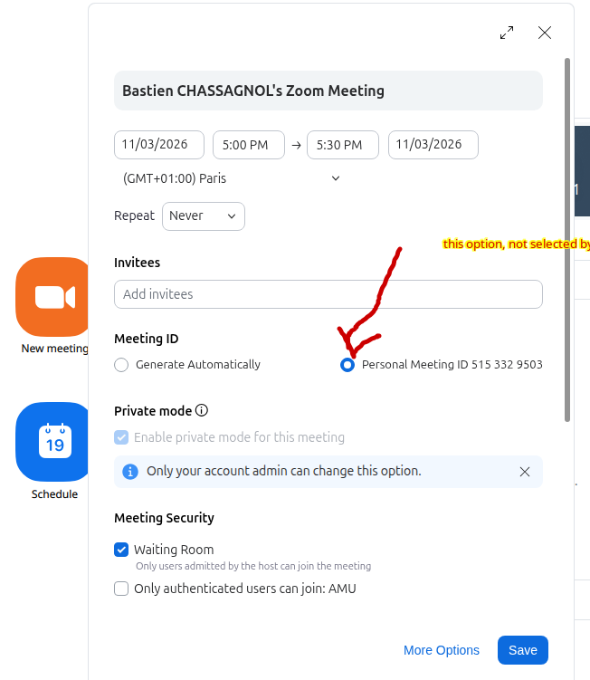
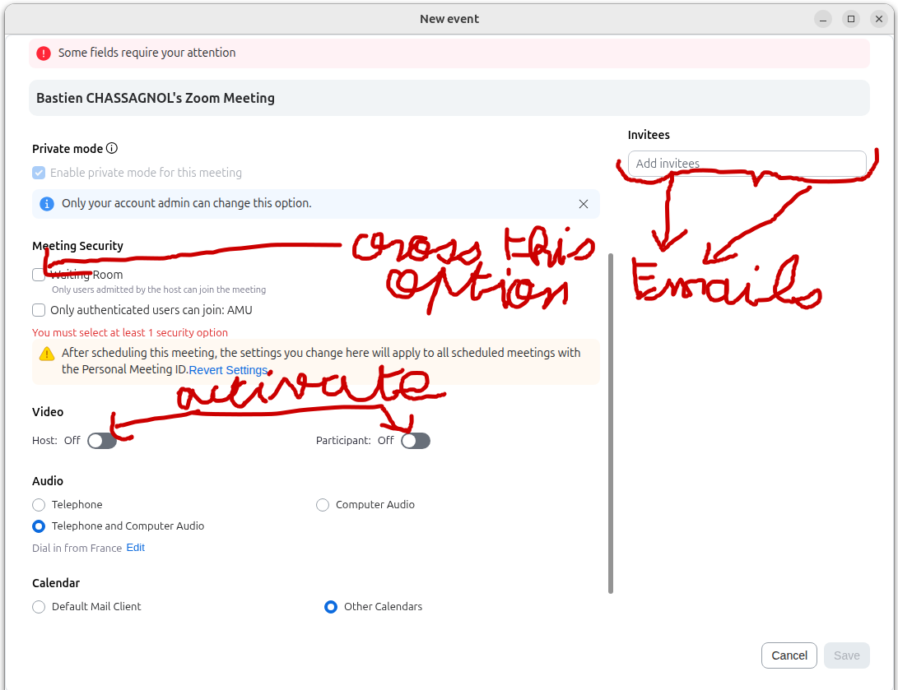
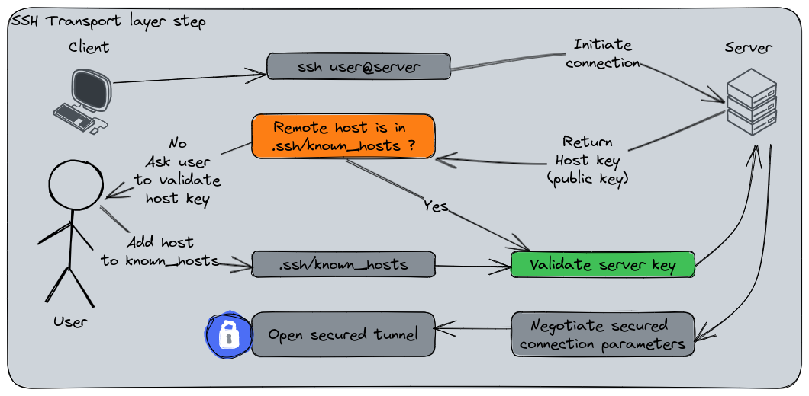

## Core numerical tools provided by AMU {#sec-amu-tools}

List of [numerical tools used at AMU](https://www.univ-amu.fr/fr/public/les-outils-numeriques-damu).

### AMU VPN (GlobalProtect) {#sec-amu-vpn}

Staff and students often need the AMU VPN to reach internal services
(clusters, library resources, some web apps) from outside the campus
network. Official documentation:

-   [AMU VPN overview (DUD)](https://dud.univ-amu.fr/fr/connexion-reseau-prive-virtuel-vpn-damu)
-   [Strong authentication (2FA)](https://dud.univ-amu.fr/fr/authentification-forte?check_logged_in=1)
    — enrol / confirm your second factor **before** relying on VPN from
    home

AMU currently ships **Palo Alto GlobalProtect**. On Linux, prefer the
**graphical UI** package rather than the CLI-only build suggested in some
internal notes: the tray icon makes connect / disconnect and portal URL
errors much easier to diagnose.

1.  Download the latest Linux archive from the shared AMU folder
    ([GlobalProtect Linux builds on
    AMUbox](https://amubox.univ-amu.fr/s/eppLBPxfdqoLarj?dir=/)).
    Filenames look like `PanGPLinux-6.3.3-c22.tgz` — always take the
    **newest** release available there.

2.  Extract it locally:

    ```{#lst-amu-vpn-extract .bash lst-cap="Extract GlobalProtect Linux archive"}
    tar -xfv PanGPLinux-*.tgz
    cd PanGPLinux-*   ## adjust to the extracted directory name
    ls *.deb          ## you should see both CLI and UI packages
    ```

3.  Install the **UI** `.deb` with `apt` so dependencies resolve cleanly
    (replace the version string with the file you downloaded):

    ```{#lst-amu-vpn-install .bash lst-cap="Install GlobalProtect UI .deb"}
    sudo apt install ./GlobalProtect_UI_deb-*.deb
    ```

    ::: {.callout-tip collapse="true" title="If apt cannot find local dependencies"}
    Fall back to `sudo dpkg -i ./GlobalProtect_UI_deb-*.deb` then
    `sudo apt -f install` to finish broken dependencies.
    :::

4.  Log out and back in (or reboot) if the panel icons do not appear.
    You should then see the GlobalProtect indicator(s) in the top bar.
    Open the UI, set the AMU portal / gateway as documented by DUD, and
    authenticate with your university account **plus** strong
    authentication when prompted.

5.  Smoke-test by opening an internal URL that is blocked off-campus
    without VPN. If connection fails, check 2FA enrolment first, then
    reinstall / update from the AMUbox archive (versions move quickly).

### AMUZoom {#sec-amuzoom}

1.  Retrieve the latest version, choosing the proper Linux distribution
    and OS architecture under [Zoom
    downloads](https://zoom.us/download?os=linux). Also available
    [online](https://univ-amu-fr.zoom.us/). It is strongly recommended to
    install Zoom locally.
2.  Run `sudo apt install ./zoom_amd64.deb`.
3.  **Log in with your university email address using SSO.** The account
    provides unlimited meetings by default; use the domain
    `univ-amu-fr`.[^amu-1]

[^amu-1]: Alternatively, use the web version available
    [here](https://univ-amu-fr.zoom.us/meeting#/upcoming).

Two settings matter when creating a Zoom meeting so that any external
user with the password can log in and share their screen (see
@fig-zoom):

::: {#fig-zoom layout-ncol="2"}




Be careful to select the second, non-default option if you want to allow
external users without an AMU email address to join your Zoom session.
:::

Further resources:

-   [Guidelines for Zoom meeting creation and
    management](https://dud.univ-amu.fr/fr/amuzoom-animer-reunion-classe-virtuelle#section-1.1)
-   [Video
    tutorial](https://amupod.univ-amu.fr/video/6375-expresso-cipe-016-webinaire-que-pouvez-vous-faire-avec-zoom/)
-   [Guidelines for
    students](https://dud.univ-amu.fr/se-connecter-classe-virtuelle-amu-zoom-etudiants?check_logged_in=1)

### WooClap for QCMs {#sec-wooclap}

Go to [WooClap](https://www.wooclap.com/) and use your **institutional
email address** for single sign-on across platforms.

## Working with a remote server {#sec-remote-server}

Prefer **Cursor** or **VS Code** with the Remote SSH extension for
everyday remote development: the editor runs locally while the terminal,
language servers, and compute run on the cluster. Avoid relying on
hosted desktop IDEs or notebook servers on the cluster for routine
work.[^amu-2]

[^amu-2]: A practical split is: develop and test on small examples
    locally in Cursor, then scale on the server via Remote SSH or the
    command line.

::: {.callout-note collapse="true" title="Retrieve your identity on the server"}
```{#lst-server-id .bash lst-cap="server id"}
id ${USER}
# Example (local-style groups):
# uid=1001(bastien) gid=1001(bastien) groups=1001(bastien),4(adm),...
#
# Example on the MMG cluster (project group):
# uid=1007(<your-username>) gid=1007(<your-username>) groups=1007(<your-username>),1043(<project-group>)
```

Identity on a Linux server is defined by the combination of username,
`UID` (user ID), and `GID` (group ID), plus membership of project
groups. More detail is in the embedded [Server Management
handbook](amu/Server_Management.pdf) below (@sec-mmg).
:::

### SSH configuration {#sec-ssh-config}

The dual aim is to avoid typing your password on every connection and to
keep a safe, reusable list of remote hosts.

1.  Set up SSH remote access (key-based authentication). The remote
    machine needs `openssh-server`:

```{#lst-openssh-server .bash lst-cap="openssh server"}
## remote server must have openssh-server installed
sudo apt install openssh-server
```

2.  Generate an Ed25519 public–private key pair on your **local**
    machine:[^amu-3]

[^amu-3]: A passphrase is not compulsory, but it is safer if the disk is
    copied or stolen.

```{#lst-ssh-keygen .bash lst-cap="ssh keygen"}
ssh-keygen -t ed25519 -C "your_email@example.com"
```

This creates:

-   `~/.ssh/id_ed25519` (private key)
-   `~/.ssh/id_ed25519.pub` (public key)

3.  Copy your public key to the server with
    `ssh-copy-id username@server_ip`. After that, password login is no
    longer required for that host.

4.  (Optional) Keep a `~/.ssh/config` entry per cluster. Aliases such as
    `ssh ifb-core` then suffice, and the same file is what Cursor / VS
    Code Remote SSH uses to list hosts. Example:

```{#lst-ssh-config .bash lst-cap="ssh config"}
## Alias for the host connection: either "ifb-core" or "ifb"
Host ifb-core ifb

  ## The real hostname (or IP) of the remote server
  HostName core.cluster.france-bioinformatique.fr

  ## Username used on the remote machine
  User <your-ifb-username>

  ## Path to your private SSH key
  IdentityFile ~/.ssh/id_ed25519

  ## Force SSH to use ONLY the key above
  IdentitiesOnly yes

  ## Authentication order: key, then keyboard-interactive, then password
  PreferredAuthentications publickey,keyboard-interactive,password

  ## Add this key to ssh-agent when used
  AddKeysToAgent yes

# Host configuration for the MMG cluster
Host mmg-sb-05 new-mmg-cluster
  HostName <mmg-server-hostname-or-ip>
  Port <non-default-ssh-port>  # prefer a non-22 port when the cluster provides one
  User <your-mmg-username>
  IdentityFile ~/.ssh/id_ed25519
  IdentitiesOnly yes
  PubkeyAuthentication yes
  PreferredAuthentications publickey,keyboard-interactive,password
  AddKeysToAgent yes
  ForwardX11 yes
  ForwardX11Trusted yes
```

A fuller host configuration (including default X11 forwarding) is
available under
[config-ssh](../Config/ssh-hosts/.ssh/config).

::: {.callout-tip collapse="true" title="SSH configuration recommendations"}
On older Ubuntu setups, `ssh-agent` / `ssh-add` may not start by
default. Enable the user service with
`systemctl --user enable --now ssh-agent`.

See @tbl-ssh-guidelines and @fig-ssh-connection for a concise checklist
and an overview of the first connection.

| Practice | Why |
|----------------------------|--------------------------------------------|
| Prefer Ed25519 keys | Small, fast, modern default. |
| Use a passphrase on the key | Protects the key if the disk is copied or stolen. |
| `~/.ssh/config` per host | Aliases and login options in one place. |
| Never commit private keys | Keep `id_*` out of Git and cloud-synced folders. |
| `ssh-copy-id` once per host | Standard way to populate `authorized_keys`. |

: SSH recommended practices {#tbl-ssh-guidelines}

{#fig-ssh-connection}

| Option | Purpose | Effect on X11 |
|------------------|------------------|------------------------------------|
| `-X` | X11 forwarding (untrusted) | Runs GUI apps remotely |
| `-Y` | X11 forwarding (trusted) | Runs all GUI apps remotely |
| `-C` | Compression | Reduces network usage; can help GUI over slow links |

: Main options for a customised `ssh` connection {#tbl-ssh-connexion}
:::

### MMG cluster and recommendations for project management {#sec-mmg}

As soon as collaboration is involved:

-   Initialise `git` and GitHub at the real start of the project.
-   Keep long-lived work under `/mnt/<cluster-name>/projects/` (home is
    for quick tests only).
-   Set group/user permissions carefully when creating a project.
-   Keep a root `README.md` with one short line per project directory.

The lab’s server handbook (creating projects, permissions, shared
storage) is embedded below.

::: {.content-visible when-format="html"}

:::

::: {.content-visible when-format="pdf"}

:::
