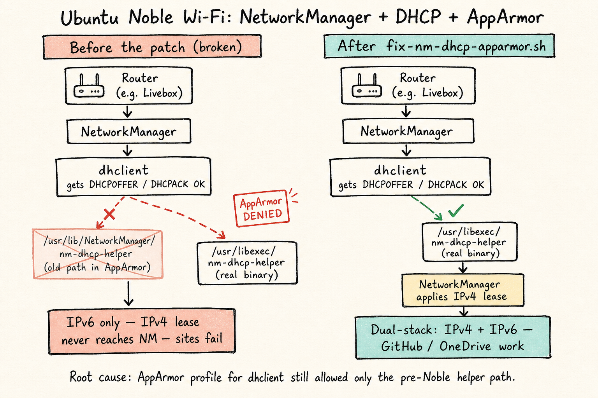

## Overview {#sec-network-overview}

-   Two IP protocols for Wi-Fi: `IPv4` versus `IPv6`.

::: {.callout-tip title="The two Internet protocols, namely IPv4 vs IPv6"}
IPv4 is older, but still prevailing in many websites, such as GitHub, or OneDrive:

-   Uses 32-bit addresses (e.g. `192.168.1.10`)
-   Used by **most websites**, CDNs, VPNs, corporate services
-   But the 32-bit limitation hinders the number of available IP addresses.

IPv6 is newer, but not universally supported:

-   Uses 128-bit addresses (e.g. `2a01:cb14:86a7::1`)
-   Supported by modern ISPs and operating systems
-   Some networks provide **IPv6-only**, with no IPv4 fallback. Especially the case with Microsoft services, governmental or academic websites.
:::

### Symptom: Wi-Fi connects, but some websites fail

On Ubuntu **24.04 (Noble)**, NetworkManager may show the link as connected while `ip` lists **only IPv6** addresses. Sites that need IPv4 (or that resolve poorly without it) then fail — e.g. `curl https://github.com` or `curl https://onedrive.live.com` hang or return *Cannot connect*. Eduroam or a phone hotspot often work; some home routers (e.g. Orange Livebox) expose the bug clearly.

**Root cause (not “IPv6-only router”):** under Noble, NetworkManager’s DHCP helper lives at `/usr/libexec/nm-dhcp-helper`, but the stock AppArmor profile for `dhclient` still allows only the old path `/usr/lib/NetworkManager/nm-dhcp-helper`. `dhclient` obtains a lease (`DHCPOFFER` / `DHCPACK`), then AppArmor **denies** the helper → NetworkManager never applies IPv4^[See @fig-nm-dhcp-apparmor and Launchpad bugs [#2083017](https://bugs.launchpad.net/ubuntu/+source/apparmor/+bug/2083017), [#2116733](https://bugs.launchpad.net/ubuntu/+source/network-manager/+bug/2116733).]


{#fig-nm-dhcp-apparmor}

### Permanent fix

1.  Run @lst-run-fix-nm-dhcp. The script in @lst-fix-nm-dhcp-apparmor (file: [`ubuntu/fix-nm-dhcp-apparmor.sh`](ubuntu/fix-nm-dhcp-apparmor.sh)) patches `/etc/apparmor.d/sbin.dhclient` for `/usr/libexec/nm-dhcp-helper`, sets NetworkManager to `dhcp=dhclient`, softens Wi-Fi powersave, reloads AppArmor, and restarts NetworkManager.

```{#lst-run-fix-nm-dhcp .bash lst-cap="Make the AppArmor DHCP fix executable and run it"}
chmod +x ubuntu/fix-nm-dhcp-apparmor.sh
sudo ./ubuntu/fix-nm-dhcp-apparmor.sh
```

```{#lst-fix-nm-dhcp-apparmor .bash include="ubuntu/fix-nm-dhcp-apparmor.sh" lst-cap="fix-nm-dhcp-apparmor.sh — allow /usr/libexec/nm-dhcp-helper under AppArmor"}
```

1.  Reconnect to the Wi-Fi network using the GUI, then check the success of the patch:

```bash
ip -br addr show <wifi-network-name> # e.g. wlp2s0f0
ping -4 -c 2 1.1.1.1 # should return "64 bytes from 1.1.1.1: icmp_seq=1 ttl=55 time=1.24 ms"
curl -4 -sI --max-time 8 https://github.com | head -3 # should return "HTTP/2 200"
```
