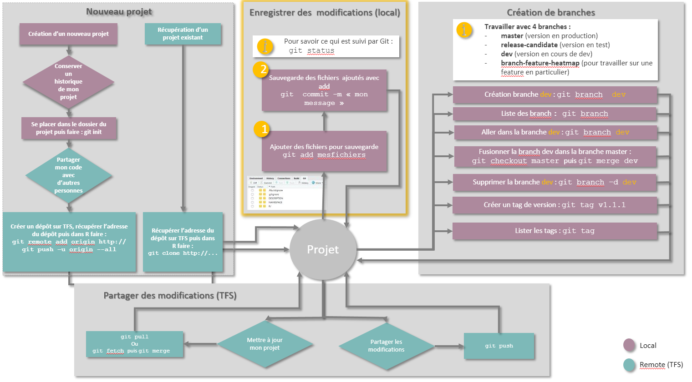
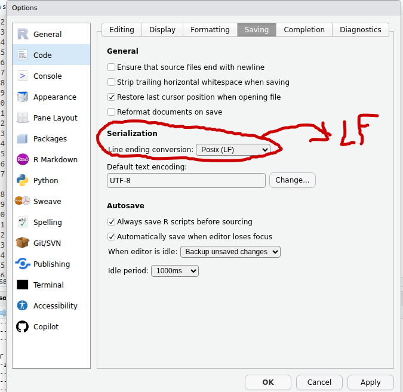
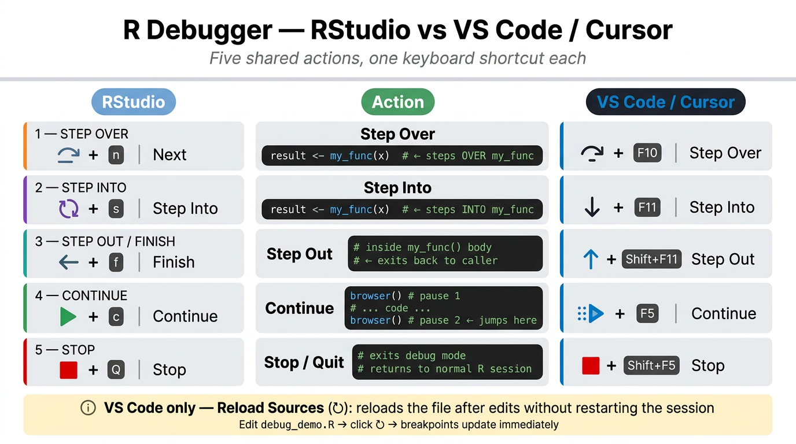
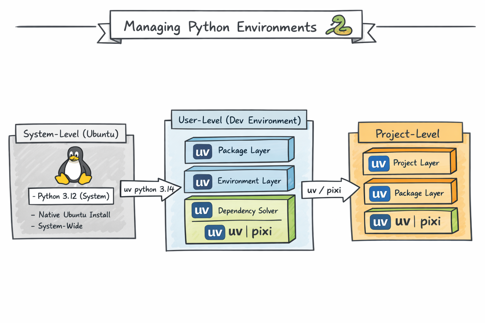

> **General recommendation**: avoid using ChatGPT for installation steps.
> Instructions are often deprecated and/or do not follow Ubuntu best
> practice.

::: {#nte-software-installation .callout-note title="Install software on Ubuntu: guidelines" collapse="true"}
Three recommended methods, depending on Ubuntu's support:

1.  If supported by Ubuntu, prefer `apt install` for system software[^soft-1]:

    -   *Automatic updates* and security patches — **the only method
        that provides this systematically**.
    -   Easiest installation method.
    -   Signed and verified packages.
    -   Recommended for *core system*, long-term software.
    -   If **not directly available** in Ubuntu’s native package
        manager, or if the back end uses `snap`, switch to a pre-built
        tarball[^soft-2], or add a repository (only if **trusted**) to
        the `apt` keyrings. Examples: Docker (@sec-docker), or the
        [custom Zotero installation
        script](https://github.com/retorquere/zotero-deb/blob/master/install.sh).
    -   **`.deb` files** target Debian-derived distributions (Ubuntu,
        Linux Mint, etc.); **`.rpm` files** target Red Hat–based systems
        (Fedora, CentOS, RHEL) and openSUSE:

        -   No auto-updates from the vendor archive alone.
        -   Potential dependency issues.
        -   **Always install with `sudo apt install ./package.deb`,
            rather than `sudo dpkg -i`,** to resolve dependencies, fix
            broken installs, and keep the system consistent.

------------------------------------------------------------------------

2.  `AppImages` are standalone executable files that bundle the
    application and most of its dependencies:

    -   Recommended for *desktop applications* installed only for the
        current user — usually no `sudo` rights required.
    -   Portable.
    -   Store them under `~/Applications` and add a desktop entry if
        you want them in the application menu. Prefer AppImages over
        `Snap` for most desktop apps.

------------------------------------------------------------------------

3.  Pre-built tarball (`.tar.gz` / `.tar.xz`) archives:

    -   Stronger customisation.
    -   Work without distribution packages.
    -   Require manual handling and have no automatic updates.
    -   **Only recommended for developers, or when nothing else
        exists**.

------------------------------------------------------------------------

Least recommended options:

-   `snap` stores pre-compiled tools, but is less suitable than
    `sudo apt install` for most core software.
-   `Flatpak` + Flathub (acceptable when no better option exists; see
    Bitwarden, @sec-bitwarden).

------------------------------------------------------------------------

{#fig-ubuntu-install-guidelines}

------------------------------------------------------------------------

Portable versus non-portable: portable installs are easier to remove
(fewer leftovers in the core system) but usually lack automatic updates.
Non-portable applications are often better for daily or intensive use,
but are not sandboxed and are harder to remove cleanly.
:::

[^soft-1]: `apt-get` works similarly, but is now considered legacy for
    interactive use; prefer `apt`.

[^soft-2]: Fetch the latest stable archive, extract it, and add
    executables to your `PATH`; see @sec-zotero.

## Git and GitHub configuration {#sec-git-config}

{#fig-github-best-practices}

1.  GitHub often requires two-factor authentication; set it under
    <https://github.com/settings/security> (see also
    @fig-github-best-practices). Prefer a *passkey* if your device
    supports it (Linux often does not), or an authenticator app such as
    Microsoft Authenticator. **Avoid SMS + mobile phone as the sole
    second factor**.

2.  Configure your access to GitHub:

    <!-- -->

    i.  Choose either SSH or HTTPS.
    ii. For HTTPS, create one token per device under
        <https://github.com/settings/tokens>. Name the token after your
        laptop, its configuration, and owner. Assign at least the
        `repo` and related read scopes. Copy it once — **it will not be
        shown again**.

    <!-- -->

3.  General options to configure:

    <!-- -->

    i.  Use the command line (this also creates `~/.gitconfig`):

        ```{#lst-git-identity .bash lst-cap="Set global Git identity"}
        git config --global user.name "<your-github-username>"
        git config --global user.email "<your.email@example.org>"
        ```

    ii. Or edit `~/.gitconfig` directly (more prone to indentation
        errors). A default configuration is shown in @lst-gitconfig;
        for a fuller description of options, see
        [Formation Git 2024, a tutorial by
        Benjamin](../Git/formation_git_2024.pdf):

        ```{#lst-gitconfig .gitconfig lst-cap="Example ~/.gitconfig"}
        [user]
          name = <your-github-username>
          email = <your.email@example.org>
        ## modern default git options
        [init]
          defaultBranch = main

        ## simplifying solving git conflicts + troubleshoot solving
        [merge]
          conflictstyle = zdiff3
        [rerere]
          enabled = true

        ## tolerate distinct end of lines
        [core]
          autocrlf = input

        ## visualisation
        [tag]
          sort = version:refname
        [branch]
          sort = -committerdate
        [credential]
          helper = store
        ```

    <!-- -->

4.  Avoid typing your password for every login:

    <!-- -->

    i.  For HTTPS + personal access token (PAT), use
        `git config --global credential.helper store` for **permanent**
        storage of the credential (consider whether the on-disk store
        should be encrypted), or
        `git config --global credential.helper 'cache --timeout=3600'`
        for temporary access[^soft-3].
    ii. Or define an SSH key and use the SSH remote URL.

    <!-- -->

[^soft-3]: Time-out units are seconds; `3600` is one hour.

## PDF management {#sec-pdf}

### Sioyek as PDF viewer {#sec-sioyek}

[`Sioyek`](https://sioyek.info/) is an open-source PDF viewer aimed at
technical papers with mathematical formulae. Typical uses include
coloured *highlights* (`h`), smart jumps to figures by clicking them,
and bookmarks (`b`).

1.  Choose a portable build or a standard distribution from the
    [Sioyek releases](https://github.com/ahrm/sioyek/releases).
2.  Unzip the archive and make the binary executable with `chmod +x`.
3.  Run it.

::: {.callout-note collapse="true" title="From archive to PATH and Start menu: a step-by-step Ubuntu example"}
To turn an executable into a **desktop application** on Ubuntu GNOME,
follow these steps (paths follow Sioyek; other packages may differ):

1.  Relocate files under **`/opt/sioyek`**[^soft-4].

```{#lst-sioyek-install .bash lst-cap="Install Sioyek from archive"}
## create required folders
sudo mkdir -p /opt/sioyek
sudo mkdir -p /etc/sioyek
sudo mkdir -p /usr/share/sioyek

## relocate, if not already done, the sioyek builds

### core executables
sudo cp ~/sioyek/build/sioyek /opt/sioyek/
sudo chmod +x /opt/sioyek/sioyek

### configuration files
sudo cp ~/sioyek/build/prefs.config /etc/sioyek/
sudo cp ~/sioyek/build/keys.config  /etc/sioyek/
sudo cp -r ~/sioyek/build/shaders /usr/share/sioyek/
sudo cp ~/sioyek/build/tutorial.pdf /usr/share/sioyek/
```

2.  Add an icon and a GNOME launcher entry:

```{#lst-sioyek-desktop .bash lst-cap="Sioyek desktop entry"}
sudo mkdir -p /usr/share/icons/hicolor/256x256/apps
## place sioyek.png in that folder (downloaded from the web)

sudo tee /usr/share/applications/sioyek.desktop > /dev/null <<'EOF'
[Desktop Entry]
Version=1.0
Type=Application
Name=Sioyek
GenericName=PDF Viewer
Comment=Fast keyboard-driven PDF viewer
Exec=/opt/sioyek/sioyek %f
Icon=sioyek
Terminal=false
Categories=Office;Viewer;
MimeType=application/pdf;
StartupNotify=true
EOF

## Refresh desktop database
sudo update-desktop-database
```

3.  (Optional) Make Sioyek the default **PDF viewer**, using either:

    a.  GUI method:
        1.  Right-click any PDF.
        2.  **Properties → Open With**.
        3.  Select **Sioyek**.
        4.  Click **Set as default**.
    b.  Or the command line:

```{#lst-sioyek-default-pdf .bash lst-cap="Set Sioyek as default PDF viewer"}
xdg-mime default sioyek.desktop application/pdf

## to check default
xdg-mime query default application/pdf
```

4.  Add Sioyek to the `PATH` via a symbolic link:

```{#lst-sioyek-symlink .bash lst-cap="Symlink Sioyek into PATH"}
sudo ln -s /opt/sioyek/sioyek /usr/local/bin/sioyek
```
:::

[^soft-4]: `/opt` is the usual location for third-party apps, which
    helps avoid conflicts with distribution packages.

### Sejda for interactive PDF editing {#sec-sejda}

-   [Web version](https://www.sejda.com/pdf-editor)
-   [Sejda *add-on* for
    Chrome](https://workspace.google.com/marketplace/app/sejda_pdf_editor/8721525582)

### PDFtk {#sec-pdftk}

-   Use PDFtk if you prefer editing PDFs from the command line
    (`sudo apt install pdftk` when available).

## Image editors (to replace Paint on Windows) {#sec-image-editors}

Sorted from closest experience to Paint, to most generalist:

1.  [`Drawing`](https://en.ubunlog.com/drawing-alternative-microsoft-paint-ubuntu/)

    <!-- -->

    i.  Add Drawing to the `apt` repository:
        `sudo add-apt-repository ppa:cartes/drawing`
    ii. Install with `sudo apt install drawing`

    <!-- -->

2.  LibreOffice Draw
3.  GIMP (closer equivalent to Photoshop):

    ```{#lst-gimp-install .bash lst-cap="Install GIMP"}
    sudo apt install gimp
    sudo apt install gimp-plugin-registry ## add extensions
    ```

4.  Inkscape for **vector** graphics and fully editable icons:

    ```{#lst-inkscape-install .bash lst-cap="Install Inkscape"}
    sudo apt update
    sudo apt install inkscape
    ```

## LibreOffice {#sec-libreoffice}

1.  Install the main suite (Writer, Calc, …) with:

    ```{#lst-libreoffice-install .bash lst-cap="Install LibreOffice"}
    sudo apt install libreoffice libreoffice-gtk3
    ```

2.  Useful extensions (add via **Tools → Extensions**):

    i.  Rotate images in Writer with the [*Rotate*
        extension](https://extensions.libreoffice.org/en/extensions/show/writerrotationtool).

    ii. Install dictionaries and grammar tools
        ([Grammalecte and
        LanguageTool](https://doc.ubuntu-fr.org/correction_grammaticale)).
        *Check whether LanguageTool is still worth the resource cost;
        it is AI-based and can be heavy.* You may configure the Java
        version under **Tools → Options → Advanced**. Also install the
        French localisation package:

        ```{#lst-libreoffice-fr .bash lst-cap="French dictionary for LibreOffice"}
        ## French dictionary / hyphenation
        sudo apt update
        sudo apt install libreoffice-l10n-fr
        ```

    iii. Install the [TeXMaths LaTeX
         extension](https://extensions.libreoffice.org/en/extensions/show/texmaths-1).

3.  Font customisation:

    i.  Install core Windows fonts:

        ```{#lst-mscorefonts .bash lst-cap="Install Microsoft core fonts"}
        sudo apt update
        sudo apt install ttf-mscorefonts-installer ## Microsoft core fonts
        fc-cache -f -v ## rebuild font cache so fonts appear in LibreOffice
        ```

    ii. Extra fonts (or use the native Fonts manager under GNOME). Many
        popular fonts are available under the [Every-Font GitHub
        repository](https://github.com/serendipious/every-font/):

        ```{#lst-extra-fonts .bash lst-cap="Install extra fonts"}
        mkdir -p ~/.local/share/fonts ## ensure personal fonts folder exists
        wget -P ~/.local/share/fonts \
          "https://raw.githubusercontent.com/serendipious/every-font/master/CenturyGothic-Italic%20-%20Century%20Gothic%20-%20Italic.ttf"
        fc-cache -f -v ## update font cache
        ```

::: {.callout-caution collapse="true" title="Core typographic options"}
The main stylistic variants of fonts you can control are:

1.  Weight (Light, Regular, Bold, …)
2.  Angle or shape (regular versus italic)
3.  Width
4.  Serif versus sans-serif. This property is structural to a typeface;
    for example, Times New Roman is serif, and Century Gothic is
    sans-serif. **For data visualisations or presentations, sans-serif
    typefaces are usually preferred; the reverse often holds for printed
    documents.**
5.  Advanced options (ligatures, etc.) under
    **LibreOffice → Format → Character → Features** (see
    @fig-typographic-options).

Make sure, if available, to download at least the regular, bold, italic,
and bold-italic versions of each font.

------------------------------------------------------------------------

{#fig-typographic-options}
:::

## Docker {#sec-docker}

1.  Download dependencies, configuration files, and add the Docker
    repository to `apt` for automatic updates (@lst-docker-repo):

```{#lst-docker-repo .bash lst-cap="Add Docker APT repository"}
sudo apt update
sudo apt install ca-certificates curl

## Part I: create, download and make Docker apt key readable
sudo install -m 0755 -d /etc/apt/keyrings
sudo curl -fsSL https://download.docker.com/linux/ubuntu/gpg \
  -o /etc/apt/keyrings/docker.asc
sudo chmod a+r /etc/apt/keyrings/docker.asc

## Part II: define where and which Docker packages to install
sudo tee /etc/apt/sources.list.d/docker.sources <<EOF
Types: deb
URIs: https://download.docker.com/linux/ubuntu
Suites: $(. /etc/os-release && echo "${UBUNTU_CODENAME:-$VERSION_CODENAME}")
Components: stable
Signed-By: /etc/apt/keyrings/docker.asc
EOF

## Part III: refresh package lists
sudo apt update
```

2.  Install the Docker toolkit:

```{#lst-docker-install .bash lst-cap="Install Docker Engine"}
sudo apt install docker-ce docker-ce-cli containerd.io \
  docker-buildx-plugin docker-compose-plugin
```

3.  Run Docker without `sudo` for your main laptop user
    (@lst-docker-usermod):

```{#lst-docker-usermod .bash lst-cap="Allow Docker without sudo"}
# create a Unix group allowing Docker without admin rights
sudo groupadd docker
# add the current user to it
sudo usermod -aG docker $USER
```

4.  Check the installation with `sudo docker run hello-world`. If Docker
    does not start on login, enable it with
    `sudo systemctl enable --now docker`. More detail is in the
    [official Ubuntu install
    guide](https://docs.docker.com/engine/install/ubuntu/#upgrade-docker-engine).

Useful Docker tutorials:

-   [Benjamin’s
    presentation](https://docs.google.com/presentation/d/1v6JjkoY2ozFO0RaCBMIVRX5Hy7UW6CuhBgORrlM5pHQ/edit?slide=id.g2b840ea5086_0_12#slide=id.g2b840ea5086_0_12)
-   [VS Code, R and Docker with
    Dev Containers](https://github.com/RamiKrispin/vscode-r)
-   [VS Code, Python and Docker with
    Dev Containers](https://github.com/RamiKrispin/vscode-python)
-   [Dev Containers, from INRIA
    trainings](https://gitlab.lis-lab.fr/sicomp/and_devcontainers)


## Web browsers {#sec-browsers}

### Firefox {#sec-firefox}

> **Avoid `sudo apt install firefox` without first configuring Mozilla’s
> APT source** — the default Ubuntu package may pull in `snapd` and a
> Snap-based Firefox.

1.  Import and add the Mozilla APT signing key (@lst-firefox-apt):

```{#lst-firefox-apt .bash lst-cap="Add Mozilla Firefox APT key"}
## Download APT key
wget -q https://packages.mozilla.org/apt/repo-signing-key.gpg -O- \
  | sudo tee /etc/apt/keyrings/packages.mozilla.org.asc > /dev/null

## Add it to the Apt registry
cat <<EOF | sudo tee /etc/apt/sources.list.d/mozilla.sources
Types: deb
URIs: https://packages.mozilla.org/apt
Suites: mozilla
Components: main
Signed-By: /etc/apt/keyrings/packages.mozilla.org.asc
EOF

## Prefer Mozilla Firefox over Snap packaging
echo '
Package: *
Pin: origin packages.mozilla.org
Pin-Priority: 1000
' | sudo tee /etc/apt/preferences.d/mozilla
```

2.  Install Firefox from Mozilla:

```{#lst-firefox-install .bash lst-cap="Install Firefox from Mozilla APT"}
sudo apt update
sudo apt install firefox

which firefox ## should not report a snap path
apt policy firefox
```

### Google Chrome {#sec-chrome}

1.  Download [the `.deb` archive](https://www.google.com/chrome/), then
    install it:

```{#lst-chrome-deb .bash lst-cap="Download Google Chrome .deb"}
sudo apt install ./google-chrome-stable_current_amd64.deb
```

2.  Add Google’s APT signing key for automatic updates
    (@lst-chrome-apt):

```{#lst-chrome-apt .bash lst-cap="Install Google Chrome"}
## Download APT key
wget -q -O - https://dl.google.com/linux/linux_signing_key.pub \
  | sudo gpg --dearmor -o /usr/share/keyrings/google-linux-signing-key.gpg

## Add it to the Apt registry
echo "deb [arch=amd64 signed-by=/usr/share/keyrings/google-linux-signing-key.gpg] http://dl.google.com/linux/chrome/deb/ stable main" \
  | sudo tee /etc/apt/sources.list.d/google-chrome.list

## Update package lists
sudo apt update
```

3.  Optionally add the [*Grammarly* Chrome
    plug-in](https://chromewebstore.google.com/detail/grammarly-ai-writing-assi/kbfnbcaeplbcioakkpcpgfkobkghlhen?hl=en)
    for spelling and grammar checks (pick one regional English variety
    and stick to it — British English for this course).

## Slack {#sec-slack}

1.  Download the [Slack
    application](https://slack.com/downloads/instructions/linux?ddl=1&build=deb).
2.  Install with
    `sudo apt install ./slack-desktop-4.47.69-amd64.deb` (adjust the
    version string to match the file you downloaded).
3.  Update later with:

```{#lst-slack-upgrade .bash lst-cap="Upgrade Slack"}
sudo apt-get update
sudo apt-get upgrade slack-desktop
```

## Zulip {#sec-zulip}

1.  Install from Zulip’s APT repository (@lst-zulip-install):

```{#lst-zulip-install .bash lst-cap="Install Zulip desktop"}
sudo apt install curl ## if not already installed
sudo curl -fL -o /etc/apt/trusted.gpg.d/zulip-desktop.asc \
    https://download.zulip.com/desktop/apt/zulip-desktop.asc
echo "deb https://download.zulip.com/desktop/apt stable main" \
  | sudo tee /etc/apt/sources.list.d/zulip-desktop.list
sudo apt update
sudo apt install zulip
```

2.  Log in (GitHub profile is convenient) on each organisation or
    channel you need, so you stay notified of new posts.

## Cytoscape {#sec-cytoscape}

> Major caveat: Cytoscape is only supported on Java 17 (not on newer
> stable Java versions).

1.  Install Java 17 with `sudo apt install openjdk-17-jdk`[^soft-7].
2.  Install Cytoscape from the vendor installer (not Docker):

[^soft-7]: On many Ubuntu installs a newer Java (e.g. 21) is already
    present; keep Java 17 available for Cytoscape.

    <!-- -->

    i.  Retrieve the [latest
        version](http://www.cytoscape.org/download.html).
    ii. Make the installer executable with `chmod u+x <filename.sh>`.
    iii. Run with `bash <filename.sh>`.
    iv. Launch with `Cytoscape &`.

    <!-- -->

## Zotero {#sec-zotero}

1.  Install Java support for the LibreOffice plug-in:

```{#lst-zotero-java .bash lst-cap="Ensure Java for Zotero"}
sudo apt install libreoffice-java-common -y
```

2.  Retrieve the latest stable build from
    <https://www.zotero.org/download/>[^soft-8].

3.  Extract and link the executable (@lst-zotero-install), then install
    the Zotero Connector in your browser:

[^soft-8]: Alternatively, download the archive with `curl`.

```{#lst-zotero-install .bash lst-cap="Extract and link Zotero"}
#!/bin/bash

## part I: extract archive
sudo tar -xjf zotero.tar.bz2 -C /opt
sudo mv /opt/Zotero_linux-x86_64 /opt/zotero

## Part II: add the executable to PATH
sudo ln -s /opt/zotero/zotero /usr/local/bin/zotero
```

4.  (Optional) Create a desktop launcher at
    `~/.local/share/applications/zotero.desktop` with the content in
    @lst-zotero-desktop, then make it executable:
    `chmod +x ~/.local/share/applications/zotero.desktop`.

```{#lst-zotero-desktop .ini lst-cap="Zotero desktop entry"}
[Desktop Entry]
Name=Zotero
Exec=/usr/local/bin/zotero
Icon=/opt/zotero/icons/icon128.png
StartupWMClass=Zotero
Type=Application
Terminal=false
Categories=Office;
MimeType=text/plain;x-scheme-handler/zotero;application/x-research-info-systems;text/x-research-info-systems;text/ris;application/x-endnote-refer;application/x-inst-for-Scientific-info;application/mods+xml;application/rdf+xml;application/x-bibtex;text/x-bibtex;application/marc;application/vnd.citationstyles.style+xml
X-GNOME-SingleWindow=true
```

5.  Inspired by the [Zotero hacks
    tutorial](https://habr.com/en/articles/443798/), keep article files
    synced across machines while controlling what Zotero stores in the
    cloud:

    <!-- -->

    i.  Add the plug-ins **Better BibTeX** (needed for exporting a clean
        `.bib` file) and **Zotmoov** (replaces the older ZotFile
        extension for filing PDFs by author name).
    ii. Edit Zotero preferences[^soft-9]:
        -   Uncheck automatic web-page snapshots (reduces clutter from
            many small files).
        -   Uncheck full-text sync.
        -   Under **Edit → Settings → Advanced**, keep separate:
            -   the **base directory** (the folder synced by your file
                sharing software), and
            -   a **custom data directory** in a different location,
                managed by Zotero itself (@fig-zotero-advanced).

[^soft-9]: Uniformity across platforms matters more than any single
    absolute path.

{#fig-zotero-advanced}

    iii. Configure **Better BibTeX** citation keys the same way on every
         machine (for example
         `[auth:lower][year][journal:lower:abbr]`).

    <!-- -->

## Quarto, R and Cursor {#sec-r-quarto-cursor}

### R and recommended packages {#sec-r}

1.  To get recent R builds, add the CRAN signing key and repository
    (@lst-r-repo). Adjust the Ubuntu codename (`jammy`, `noble`, …) to
    match your release:

```{#lst-r-repo .bash lst-cap="Add CRAN APT repository for R"}
sudo mkdir -p /etc/apt/keyrings
sudo wget -O /etc/apt/keyrings/cran.gpg \
  https://cloud.r-project.org/bin/linux/ubuntu/marutter_pubkey.asc
echo "deb [signed-by=/etc/apt/keyrings/cran.gpg] https://cloud.r-project.org/bin/linux/ubuntu jammy-cran40/" \
  | sudo tee /etc/apt/sources.list.d/cran.list
```

2.  Install R:

    <!-- -->

    i.  Install base packages:

```{#lst-r-base .bash lst-cap="Install R base"}
sudo apt update
sudo apt install r-base r-base-dev -y
R --version
```

    ii. Install recommended Ubuntu system libraries for scientific
        computing and network/plotting support (@lst-r-syslibs):

```{#lst-r-syslibs .bash lst-cap="System libraries for R packages"}
## Compilation tools
sudo apt install cmake

## Network, imaging, and plotting libraries
sudo apt install \
  build-essential \
  libpng-dev \
  libjpeg-dev \
  libtiff-dev \
  libcairo2-dev \
  libcurl4-openssl-dev \
  libssl-dev \
  libxml2-dev \
  zlib1g-dev

## Scientific libraries
sudo apt install \
  build-essential \
  gfortran \
  libblas-dev \
  liblapack-dev \
  libgsl-dev
```

    <!-- -->

3.  Configure a default CRAN mirror:

    <!-- -->

    i.  The official mirror <https://cloud.r-project.org> is the most
        up to date.
    ii. On Ubuntu, the **Posit Package Manager** mirror is often much
        faster because it serves prebuilt Linux binaries. Pin it in
        `~/.Rprofile` (@lst-rprofile-ppm), replacing
        `<ubuntu-version>` with your release (e.g. `noble`):

```{#lst-rprofile-ppm .bash lst-cap="Posit Package Manager in ~/.Rprofile"}
echo 'options(repos = c(CRAN = "https://packagemanager.posit.co/cran/__linux__/<ubuntu-version>/latest"))' \
  >> ~/.Rprofile
```

    <!-- -->

4.  Install packages in a reproducible way (project lockfiles, `renv`,
    or a curated meta-package). Stephen Turner’s tidyverse-oriented
    stack is a useful starting set for many bioinformatics pipelines:
    `remotes::install_github("stephenturner/Tverse", upgrade = TRUE)`.

5.  Install [Air](https://posit-dev.github.io/air/), the recommended fast
    formatter for R, as a user-level CLI tool via `uv` (@lst-air-install).
    Configure Cursor (or your editor) to call `air` on save; see the
    Air documentation for editor integration.

```{#lst-air-install .bash lst-cap="Install Air formatter via uv"}
uv tool install air-formatter
```

### Quarto {#sec-quarto}

Install Quarto from the official site:
<https://quarto.org/docs/get-started/>. Example local `.deb` install
(@lst-quarto-install):

```{#lst-quarto-install .bash lst-cap="Install Quarto"}
sudo apt install ./quarto-1.3.496-linux-amd64.deb
quarto check
```

A minimal inline maths check:

$$
a = 10
$$

### Cursor with R {#sec-cursor-r}

1.  Install the following R packages for language support, rendering,
    and debugging (@lst-r-cursor-pkgs):

```{#lst-r-cursor-pkgs .r lst-cap="R packages for Cursor debugging"}
install.packages(c(
  "remotes",
  "languageserver",
  "rmarkdown",
  "httpgd"
))
remotes::install_github("ManuelHentschel/vscDebugger")
```

2.  (Optional but recommended) Use `radian` as an enhanced R terminal:

```{#lst-radian-install .bash lst-cap="Install radian via uv"}
uv tool install radian
```

3.  Install the `vscDebugger` / R debugger extension in Cursor, then run
    the [debug demo](R/debug_demo.R) script to test it
    (@fig-debugger-r).

{#fig-debugger-r}

## Python {#sec-python}

> From **PEP 668**, on modern Debian/Ubuntu with a system Python of 3.11
> or newer, `pip` is blocked from modifying the **system Python** so
> that it cannot break `apt`-managed packages.

> **This section evolves quickly.** Prefer the `uv`-centric workflow
> below; treat older `pip` / Poetry / Conda advice as legacy unless you
> are constrained by an HPC site.

### Modern Python guidelines {#sec-python-guidelines}

::: {.callout-tip collapse="false" title="Modern Python development guidelines"}
1.  Recent Ubuntu releases (including Noble) strongly discourage
    installing extra system-wide Python interpreters. Avoid
    `sudo apt install python3.14-full` and Deadsnakes PPAs for day-to-day
    work.
2.  **`uv` replaces** a cluster of slower, single-purpose tools (`pip`,
    `poetry` for many workflows, `virtualenv`, `pipx`, …) with a faster
    unified CLI — see @fig-uv-development and @fig-python-layers.
    Poetry may still be preferable for some package-publishing edge
    cases; `pip` remains the legacy default on older HPC images.
3.  For **multi-language** environments, `pixi` has largely superseded
    Conda/Mamba. Use **`uv` for Python-centric projects**; use `pixi`
    when you need non-Python dependencies in the same lockfile. Note
    that `uv` enforces virtual environments when running project
    scripts — see @tbl-python-tools.
4.  The ecosystem moves fast: reassess tooling yearly.

| Feature                 | uv           | Poetry  | Pixi      |
|-------------------------|--------------|---------|-----------|
| Speed                   | ⭐⭐⭐⭐     | ⭐⭐    | ⭐⭐⭐    |
| Dependency management   | ✓            | ✓       | ✓         |
| Virtual environments    | ✓            | ✓       | ✓         |
| Python version install  | ✓            | ✗       | ✓         |
| Package publishing      | ⚠ Acceptable | ⭐ Best | ⚠ Limited |
| Non-Python dependencies | ✗            | ✗       | ✓         |
| CI performance          | ⭐⭐⭐⭐     | ⭐⭐    | ⭐⭐⭐    |
| Maturity                | Medium       | High    | Medium    |

: Comparison of Python environment and dependency management tools {#tbl-python-tools}
:::

::: {#fig-python-layers layout="[[1,1], [1]]"}
{#fig-python-layers-a}

{#fig-python-layers-b}

{#fig-python-layers-c}

Comparison of Python managers and environment layers.
:::

::: {#fig-uv-development layout-ncol="3"}
{#fig-uv-cheatsheet}

{#fig-uv-dustbin}

{#fig-uv-decision}

`uv` as the default Python tooling layer.
:::

### One tool to bind them: a `uv` workflow {#sec-uv}

The steps below install a recent Python (example: 3.14) **without**
replacing the system interpreter Ubuntu depends on.

1.  Install `uv`:

```{#lst-uv-install .bash lst-cap="Install uv"}
curl -LsSf https://astral.sh/uv/install.sh | sh
```

2.  Install a managed Python with `uv`:

```{#lst-uv-python-install .bash lst-cap="Install a Python version with uv"}
uv python install 3.14
```

3.  Pin the Python version at one of two levels:

    <!-- -->

    i.  Project level: `uv python pin 3.14`.
    ii. User level:

```{#lst-uv-python-user .bash lst-cap="User-level Python with uv"}
cd ~
echo "3.14" > ~/.python-version
```

    <!-- -->

4.  Prefer `uv tool install` (instead of `pipx`) for CLI utilities —
    formatters, notebook tools, hooks, and so on. As with `pipx`, these
    tools are added to the user `PATH` (@lst-uv-tools):

```{#lst-uv-tools .bash lst-cap="Install CLI tools with uv tool"}
uv tool install ruff
uv tool install "dvc[ssh]"   # data versioning when Git LFS is not enough
uv tool install black
uv tool install marimo       # preferred notebook / reactive Python UI
uv tool install ipython
uv tool install pre-commit
uv tool install cookiecutter # project templates for packaging
## optional legacy / niche tools:
# uv tool install jupyterlab
# uv tool install poetry
```

::: {.callout-tip collapse="false" title="Python version management: core checks"}
-   Check the system Python:

```{#lst-check-system-python .bash lst-cap="Inspect system Python"}
ls /usr/bin/python* ## typically a single 3.12 on modern Ubuntu
```

-   Check versions managed by `uv`:

```{#lst-check-uv-python .bash lst-cap="Inspect uv-managed Python"}
ls -la ~/.local/share/uv/python*
## paths should live under your HOME directory
```

------------------------------------------------------------------------

Checking which Python is active:

-   From the terminal (system-wide), `ls -d /usr/lib/python3.*` or
    `which -a python` should point at the OS Python only when you intend
    to use it.
-   From a Python shell (or Marimo / optional Jupyter):

```{#lst-python-sysinfo .python lst-cap="Python environment summary"}
import sys
print(sys.version)
print(sys.executable)
print(sys.path)
```

------------------------------------------------------------------------

Useful reading:

-   [From Pip to Lightning: How `uv` Opened My Eyes to Better Python
    Workflows](https://viveksinghpathania.medium.com/from-pip-to-lightning-how-uv-opened-my-eyes-to-better-python-workflows-dfa50e8a5893)
-   [LinkedIn post on Python dependency
    managers](https://www.linkedin.com/posts/basilemarchand_pythongestionnaire-activity-7432314684441047040-u53A)
:::

### Marimo (preferred over Jupyter Lab) {#sec-marimo}

[Marimo](https://marimo.io/) is the recommended interactive notebook
tool for this course: notebooks are plain Python files, reactive, and
easy to version-control. Jupyter Lab remains available as an optional
`uv tool` if a collaborator requires it.

1.  Install Marimo with commonly used extras (DuckDB SQL cells, Polars /
    PyArrow, Ruff, Vegafusion charts):

```{#lst-marimo-install .bash lst-cap="Install Marimo via uv"}
uv tool install "marimo[recommended]"

# Verify
marimo --version
```

2.  Add the Cursor / VS Code extension:

```{#lst-marimo-extension .bash lst-cap="Install Marimo Cursor extension"}
cursor --install-extension marimo-team.vscode-marimo
```

3.  Suggested keybindings (add to `keybindings.json`):

```{#lst-marimo-keybindings .json lst-cap="Suggested Marimo keybindings"}
// --- Marimo ---
// Open current .py file as a marimo notebook in the editor
{
  "key": "ctrl+alt+m",
  "command": "marimo.openNotebook",
  "when": "resourceExtname == '.py'"
},
// Create a new sandboxed marimo notebook via terminal
{
  "key": "ctrl+alt+shift+m",
  "command": "workbench.action.terminal.sendSequence",
  "args": { "text": "uvx marimo edit --sandbox \n" }
},
// Run current marimo notebook as a read-only app
{
  "key": "ctrl+alt+r",
  "command": "workbench.action.terminal.sendSequence",
  "when": "resourceExtname == '.py'",
  "args": { "text": "uvx marimo run '${file}'\n" }
}
```

4.  An interactive example is provided in
    [demo.py](marimo/demo.py).

## Nextflow {#sec-nextflow}

Install Nextflow as a standalone, self-updating binary. Confirm that
Java **≥ 17** is available first (see @sec-cytoscape):

```{#lst-nextflow-install .bash lst-cap="Install Nextflow"}
curl -s https://get.nextflow.io | bash
chmod +x nextflow

# move nextflow onto the user PATH
mkdir -p "$HOME/.local/bin"
mv nextflow "$HOME/.local/bin/"
```

## LaTeX {#sec-latex}

```{#lst-latex-install .bash lst-cap="Install TeX Live packages"}
sudo apt install texlive-full -y
## commonly used extras (often already covered by texlive-full)
sudo apt install texlive-latex-extra texlive-fonts-recommended \
  texlive-science biber latexmk -y
```

## Cursor {#sec-cursor}

1.  Download the [`.deb` package](https://cursor.com/download).
2.  Install it (@lst-cursor-install):

```{#lst-cursor-install .bash lst-cap="Install Cursor"}
sudo apt install ./cursor_2.0.77_amd64.deb
```

3.  Sync your Cursor configuration across devices — see
    @tip-cursor-export.

::: {#tip-cursor-export .callout-tip title="Export Cursor settings"}
1.  Export the core settings:

    <!-- -->

    i.  Open the Command Palette (`Ctrl/Cmd + Shift + P`), then search
        for **Preferences: Open Settings (JSON)**.
    ii. Copy that file onto the new device.
    iii. Default Linux path: `~/.config/Cursor/User/settings.json`.

    <!-- -->

2.  Export keyboard shortcuts:

    <!-- -->

    i.  Open **Preferences: Open Keyboard Shortcuts (JSON)**.
    ii. Copy `keybindings.json` to
        `~/.config/Cursor/User/keybindings.json` on the new machine.

    <!-- -->

3.  (**Main difference from VS Code**.) Export the extension list
    manually:

    <!-- -->

    i.  List extensions with
        `cursor --list-extensions > extensions.txt`. To also record each
        extension’s version, use
        `cursor --list-extensions --show-versions > extensions.txt`.
    ii. Reinstall them with @lst-cursor-extensions:

```{#lst-cursor-extensions .bash lst-cap="Reinstall Cursor extensions"}
grep -v '^\s*#' ~/.config/Cursor/User/extensions.txt \
  | grep -v '^\s*$' \
  | xargs -I{} cursor --install-extension {}
```

    <!-- -->

More detail (including symlink automation) is in
[*Sync Cursor Settings the Dotfiles
Way*](https://dev.to/0916dhkim/sync-cursor-settings-the-dotfiles-way-20c9).

For syncing configuration across many users, see also Benjamin’s notes
and
[Cursor Config Sync](https://open-vsx.org/extension/KushalCodes/cursor-config-sync).
:::

## Password manager: Bitwarden {#sec-bitwarden}

Bitwarden is the recommended password manager on Linux for most teaching
and research setups: it is largely free, works with major browsers
(Firefox, Chrome, …), syncs across many devices, and stores more than
passwords (passkeys, SSH secrets, payment cards). Lightweight mobile
apps exist for iPhone and Android. It also covers Windows and Linux,
which goes well beyond the local GNOME **Passwords and Keys** tool.

One limitation: it does not automatically flag duplicate entries as
thoroughly as some commercial managers.

Follow the steps in @lst-bitwarden-install[^soft-10].

[^soft-10]: Contrary to the preference for `apt` in
    @nte-software-installation, only Flatpak and Snap installs are
    practical for Bitwarden on Ubuntu — so you do not get the same
    native `apt` update story.

```{#lst-bitwarden-install .bash lst-cap="Install Bitwarden via Flatpak"}
## Install Flatpak and the GNOME Flatpak plugin
sudo apt install flatpak
sudo apt install gnome-software-plugin-flatpak

## Add the Flathub repository
flatpak remote-add --if-not-exists flathub \
  https://dl.flathub.org/repo/flathub.flatpakrepo

## Install and run Bitwarden locally
flatpak install flathub com.bitwarden.desktop
flatpak run com.bitwarden.desktop

## Install the browser add-on (Chrome example), then pin it:
## https://chromewebstore.google.com/detail/bitwarden-password-manage/nngceckbapebfimnlniiiahkandclblb?hl=en

## Export, then import your password database from other browsers
```

In the **Auto-fill** settings, leave **Do not auto-fill on page load**
unticked, and set **Default URI matching** to **Exact** to reduce
ambiguous fills. Counter-intuitively, use the
[Bitwarden Web Vault](https://vault.bitwarden.com/) for bulk deletion of
entries; that workflow is not fully exposed in the desktop app.
