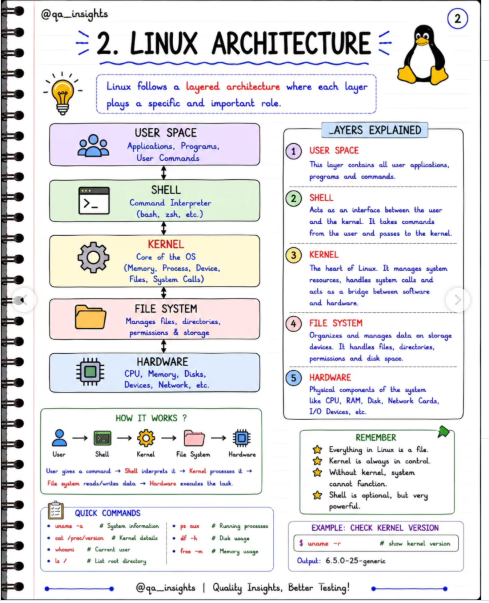
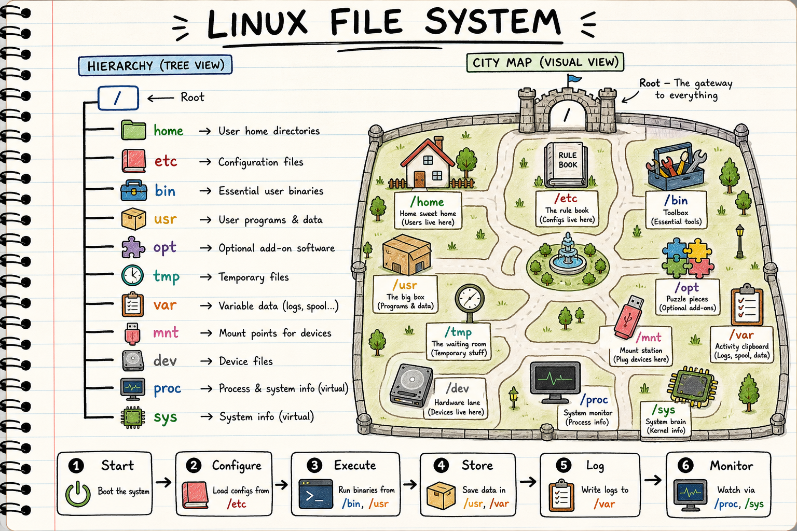

-   `dpkg --print-architecture`: retrieve architecture, for package installation[^ubu-1].
-    in **Gnome**, aka File Management, to list hidden files

[^ubu-1]: Returns `amd64` in my case

## Preamble: recommended system libraries to install

```{#lst-system-libs .bash lst-cap="Install recommended system libraries"}
# Install system libs
sudo apt-get update
sudo apt-get install -y \
    apt-transport-https \
    build-essential \
    ca-certificates \
    cloud-guest-utils \
    curl \
    default-jre \
    f2c \
    gdebi-core \
    gnupg \
    libbz2-dev \
    libcurl4-openssl-dev \
    libffi-dev \
    libfontconfig1-dev \
    libfribidi-dev \
    libgsl0-dev \
    libgtextutils-dev \
    libharfbuzz-dev \
    libicu-dev \
    liblzma-dev \
    libncurses5-dev \
    libncursesw5-dev \
    libpcre3 \
    libpcre3-dev \
    libperl-dev \
    libreadline-dev \
    libssl-dev \
    libtiff-dev \
    libxml2-dev \
    locales \
    ncftp \
    pandoc \
    parallel \
    pkg-config \
    readline-doc \
    sudo \
    tcl \
    tk \
    tk-dev \
    tk-table \
    tmux \
    tzdata \
    unzip \
    vim \
    && sleep 1
```

## Ubuntu file and package structure

### System-wide location (for core programs)

System-wide locations affect all users. Software is installed with `sudo`, on the root of the system.

| Location | Purpose |
|-----------------------------|-------------------------------------------|
| `/usr/bin` | System executables (APT) |
| `/etc` | System-wide configuration (example: define repositories for `apt`) |
| `/opt` | Vendor (external) apps |
| `/usr/local/bin` | Admin-installed software |
| `/var` | Logs, caches, databases |

: Main system-wide software locations {#tbl-system-wide-locations}

-   `/opt` for third-party application bundles, **self-contained**, while `/usr/local` is for third-party **binaries**. Besides, `/opt` is not in the path by default.

### User-specific locations

The user does not require root.

| Location | Purpose |
|-----------------------------|-------------------------------------------|
| `~/Applications` | AppImages |
| `~/.local/bin` | User executables |
| `~/scripts/tools` | Custom bash executables |
| `~/.local/share` | User app data, notably `~/.local/share/applications` storing desktop icons |
| `~/.config` | User configuration |

: Main user-based software locations, to be compared with @tbl-system-wide-locations {#tbl-user-based-locations}

------------------------------------------------------------------------

::::: {#fig-linux-os-map layout="[1,1]"}
::: {}

:::

::: {}

:::

Linux at a glance. **Left:** how a shell command travels through OS layers (user space → shell → kernel → file system → hardware). **Right:** a single combined view of the filesystem hierarchy and directory roles (city-style icons). Illustrations inspired by [@qa_insights (Quality Insights) on Instagram](https://www.instagram.com/p/DaepEm0j_hb/?utm_source=ig_web_copy_link&igsh=NTc4MTIwNjQ2YQ%3D%3D&img_index=4). For fundamentals, see also the [Filesystem Hierarchy Standard (FHS)](https://refspecs.linuxfoundation.org/FHS_3.0/fhs/index.html), the [XDG Base Directory Specification](https://specifications.freedesktop.org/basedir/latest/), and the [Linux Documentation Project](https://tldp.org/).
:::::

::: {.callout-note collapse="true" title="Main folders and path roles"}
Everything under Linux hangs from the **root** `/` (a forward slash — paths are case-sensitive). Think of the tree as a city map: each top-level directory has a fixed job (@fig-linux-os-map).

**Core hierarchy**

| Path | Role |
|------------------|----------------------------------|
| `/` | Root of the tree; all absolute paths start here. |
| `/home` | Per-user homes (e.g. `/home/<user>`); your documents and configs live here. |
| `/root` | Home directory of the `root` administrator (not the same as `/`). |
| `/etc` | System-wide configuration (`apt` sources, network, services). |
| `/bin`, `/sbin` | Essential command binaries (user vs admin-oriented). On modern Ubuntu many of these are merged into `/usr`. |
| `/usr` | Read-only applications, libraries, and shared data installed by the distribution. |
| `/opt` | Optional / third-party self-contained application bundles (often **not** on `$PATH` until you add a symlink). |
| `/var` | Variable data that grows over time: logs, caches, databases, spools. |
| `/tmp` | Temporary files; often cleared on reboot. |
| `/mnt`, `/media` | Mount points for disks, USB drives, and other external storage. |
| `/dev` | Device nodes (hardware exposed as files). |
| `/proc`, `/sys` | Live kernel / process / hardware interfaces (virtual filesystems). |
| `/lib`, `/lib64` | Shared libraries needed by core programs. |
| `/boot` | Kernel and bootloader files. |
| `/run` | Runtime state (PID files, sockets such as `ssh-agent`). |
| `/lost+found` | Recovered fragments after filesystem checks. |

**`/usr` versus `/var`**

-   `/usr` is meant for *mostly read-only* executables and shared assets shipped by packages.
-   `/var` is written continuously:

    -   `/var/lib`: state databases (e.g. `dpkg`, `apt`)
    -   `/var/cache`: downloadable / rebuildable caches
    -   `/var/log`: service and system logs (first stop when an app misbehaves)

**Custom builds and per-user tools**

-   `/usr/local/` (system-wide, needs `sudo`) and `$HOME/.local` (user-only) hold software built with `make` / `qmake` or installed outside APT:

    -   `bin`, `sbin` — executables
    -   `share` — icons (`icons/`), desktop entries, docs (`doc/`)
    -   `lib` — extensions (R packages, Python modules, shared objects)
    -   User layout follows the [XDG Base Directory Specification](https://specifications.freedesktop.org/basedir/latest/) (`~/.config`, `~/.local/share`, `~/.cache`, …)

**Runtime and background services**

-   `/tmp` — scratch space; do not store lasting work there.
-   `/run` — sockets and ephemeral service state (e.g. `ssh-agent`).
-   `~/.config/systemd` — user units that keep running after login (Cursor updates, OneDrive sync, …).

**Memory aid**

```{mermaid}
%%| label: fig-linux-path-flow
%%| fig-cap: "Mental model for navigating the Linux filesystem hierarchy"
%%{init: {'theme': 'neutral', 'themeVariables': { 'primaryColor': '#e8f4fc', 'primaryTextColor': '#1a1a1a', 'lineColor': '#334155', 'background': 'transparent'}}}%%
flowchart LR
  A["Start `/`"] --> B["Configure `/etc`"]
  B --> C["Execute `/bin` · `/usr`"]
  C --> D["Store `/usr` · `/opt`"]
  D --> E["Log `/var`"]
  E --> F["Monitor `/proc` · `/sys`"]
```
:::

## Recommended updating policy of Ubuntu

1.  Use the maintained helper script
    [`ubuntu/update_os.sh`](ubuntu/update_os.sh). It runs the usual
    `apt` update / upgrade / cleanup path, but **refuses kernel package
    changes when any installed DKMS module is missing or broken** for the
    running (or newest) kernel — so a partial upgrade cannot leave you
    without drivers such as webcam relays, NVIDIA, or VirtualBox.

2.  Make it executable and run it with admin rights:

    ```{#lst-update-script .bash lst-cap="Run the Ubuntu update helper"}
    chmod +x ubuntu/update_os.sh
    sudo ./ubuntu/update_os.sh
    ```

    To force a kernel upgrade anyway (only if you accept a broken DKMS
    stack): `sudo FORCE_KERNEL_UPGRADE=1 ./ubuntu/update_os.sh`.

3.  Reboot the system with `reboot` when a new kernel was installed.

::: {.callout-caution collapse="true" title="Ubuntu partial updates"}
> Partial updates breaking key driver components occur more often with Ubuntu compared to Microsoft, since Linux tends to provide lots of separate, modular packages while Windows ships large and standalone bundles — **Consequence: more issues with updates, especially if the network connection dropped, and the newest versions of the packages were not fully installed.**

------------------------------------------------------------------------

> General recommendations:

``` bash
# to be run daily
sudo apt update
sudo apt upgrade

# to be run monthly
sudo apt full-upgrade

## clean deprecated dependencies
sudo apt autoremove
sudo apt autoclean
```

------------------------------------------------------------------------

> Deal with driver issues

``` bash
## Check for Broken Packages
sudo dpkg --configure -a
## Install missing dependencies
sudo apt -f install

## List all Hardware Driver Errors
dmesg -l err,crit,alert,emerg
```
:::

## Monitor processes running in the background, and on startup

-   `systemctl list-unit-files --type=service --state=running --user` to list all processes running in the background, even after rebooting, restrained to the user-level.

    -   Alternatively, processes at the system-level are stored under `/lib/systemd/system/`

-   `systemctl status <service>` retrieves current status

## Network protocols and connection troubleshoots {#sec-network}

Detailed IPv4 / IPv6 guidance and the Ubuntu Noble AppArmor DHCP fix live in the appendix
[Network protocols and Wi-Fi troubleshooting](network-troubleshooting.qmd).

## Pimp your shell: switch from boring Bash to fancy `Zsh`

1.  Installation script:

```{#lst-zsh-install .bash lst-cap="Install Zsh, set it as default shell, and install Oh My Zsh"}
sudo apt update
sudo apt install zsh

## change the default shell shebang
chsh -s $(which zsh) ## modify /etc/passwd repository
reboot # required log out for effective changes

## check if zsh is used by default (also the theme is modified)
getent passwd "$USER" # returns "/home/bastien:/usr/bin/zsh"

## Install advanced customisation of the shell with Oh My Zsh addon
sh -c "$(curl -fsSL https://raw.githubusercontent.com/ohmyzsh/ohmyzsh/master/tools/install.sh)" # create automatically the ~/.zshrc configuration file
```

> **You should keep the original ~/.bashrc as a fallback for Bash**.

2.  Install the modern alternative to `ls`, namely `eza`

```{#lst-eza-install .bash lst-cap="Install eza from the community APT repository"}
# install the gpg command
sudo apt update
sudo apt install -y gpg

# install eza
wget -qO- https://raw.githubusercontent.com/eza-community/eza/main/deb.asc | sudo gpg --dearmor -o /etc/apt/keyrings/gierens.gpg
echo "deb [signed-by=/etc/apt/keyrings/gierens.gpg] http://deb.gierens.de stable main" | sudo tee /etc/apt/sources.list.d/gierens.list
sudo chmod 644 /etc/apt/keyrings/gierens.gpg /etc/apt/sources.list.d/gierens.list
sudo apt update
sudo apt install -y eza
```

3.  Change the behaviour of the shell:

-   **System-wide**: all executables installed under `/usr` folder can be called directly from the `$PATH`. For third-party apps stored under `/opt`, you must **add a symlink** redirecting to your local folder: `sudo ln -s /opt/<appName> /usr/local/bin/<appName>`.

-   **User-level**: customise `.bashrc` (and `.zshrc` if using the `.zsh` fancy shebang) — **Only affects the current user**, see my own [`.zshrc` configuration file](../Config/zsh/.zshrc), and below `ls` output @fig-bash-ls.

::: {#fig-bash-ls layout-nrow="2"}


Visual representation of my customised `ls` commands to display the content of a folder from a Bash terminal.
:::

> Useful resources:

-   [shell shortcuts](https://blog.hofstede.it/shell-tricks-that-actually-make-life-easier-and-save-your-sanity/)
