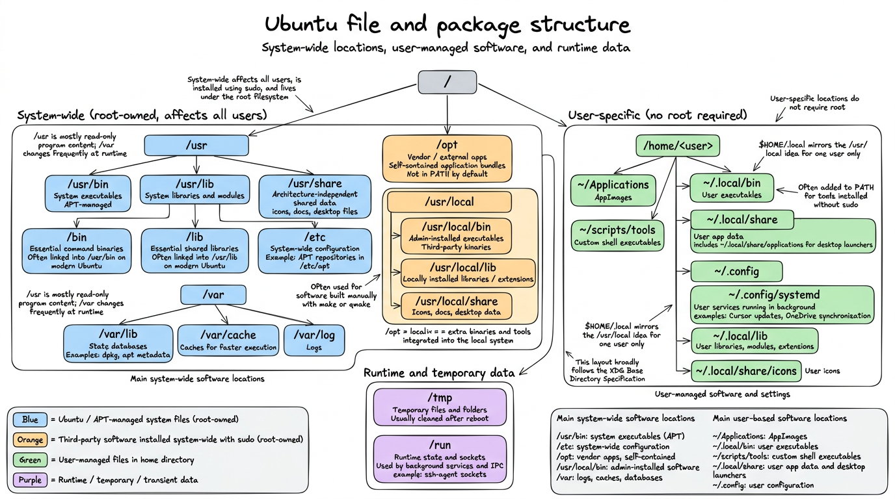

-   `dpkg --print-architecture`: retrieve architecture, for package installation[^ubu-1].
-    in **Gnome**, aka File Management, to list hidden files

[^ubu-1]: Returns `amd64` in my case

## Recommended system libraries to install

```{#lst-system-libs .bash lst-cap="Install recommended system libraries"}
# Install system libs
sudo apt-get update
sudo apt-get install -y \
    apt-transport-https \
    build-essential \
    ca-certificates \
    cloud-guest-utils \
    curl \
    default-jre \
    f2c \
    gdebi-core \
    gnupg \
    libbz2-dev \
    libcurl4-openssl-dev \
    libffi-dev \
    libfontconfig1-dev \
    libfribidi-dev \
    libgsl0-dev \
    libgtextutils-dev \
    libharfbuzz-dev \
    libicu-dev \
    liblzma-dev \
    libncurses5-dev \
    libncursesw5-dev \
    libpcre3 \
    libpcre3-dev \
    libperl-dev \
    libreadline-dev \
    libssl-dev \
    libtiff-dev \
    libxml2-dev \
    locales \
    ncftp \
    pandoc \
    parallel \
    pkg-config \
    readline-doc \
    sudo \
    tcl \
    tk \
    tk-dev \
    tk-table \
    tmux \
    tzdata \
    unzip \
    vim \
    && sleep 1
```

## Ubuntu file and package structure

### System-wide location (for core programs)

System-wide locations affect all users. Software is installed with `sudo`, on the root of the system.

| Location | Purpose |
|-----------------------------|-------------------------------------------|
| `/usr/bin` | System executables (APT) |
| `/etc` | System-wide configuration (example: define repositories for `apt`) |
| `/opt` | Vendor (external) apps |
| `/usr/local/bin` | Admin-installed software |
| `/var` | Logs, caches, databases |

: Main system-wide software locations {#tbl-system-wide-locations}

-   `/opt` for third-party application bundles, **self-contained**, while `/usr/local` is for third-party **binaries**. Besides, `/opt` is not in the path by default.

### User-specific locations

The user does not require root.

| Location | Purpose |
|-----------------------------|-------------------------------------------|
| `~/Applications` | AppImages |
| `~/.local/bin` | User executables |
| `~/scripts/tools` | Custom bash executables |
| `~/.local/share` | User app data, notably `~/.local/share/applications` storing desktop icons |
| `~/.config` | User configuration |

: Main user-based software locations, to be compared with @tbl-system-wide-locations {#tbl-user-based-locations}

------------------------------------------------------------------------

{#fig-ubuntu-package-structure}

::: {.callout-note collapse="true" title="Specific folders"}
-   `usr` folder stores *read-only* executables, while `/var` is regularly written upon changes:

    -   `/var/lib`: apt and dpkg databases, for instance, respectively stored under `dpkg`, and `/apt`
    -   `/var/cache`: metadata caches for faster execution

-   `/usr/local/`, or `$HOME/.local` stores executables that require custom compilation with `make`, or `qmake`, rendered from manual archives:

    -   `bin`, `sbin` for executables
    -   `share` for icons (under subfolder `icons`) and desktop configuration, documentation under `/doc`
    -   `lib` for extensions of a given executable (such as packages in R, or modules in Python)
    -   This folder hierarchy follows the [XDG Base Directory Specification](https://specifications.freedesktop.org/basedir/latest/)

-   `/tmp` for temporary folders, cleaned after `reboot`

-   `/run` for sockets, namely used for controlling all the protocols running in the background for connecting to a server, such as the `ssh-agent`

-   `~/.config/systemd`: lists all processes that keep on running in the background, such as Cursor updates, or OneDrive synchronisations.
:::

## Recommended updating policy of Ubuntu

1.  Use the maintained helper script
    [`ubuntu/update_os.sh`](ubuntu/update_os.sh). It runs the usual
    `apt` update / upgrade / cleanup path, but **refuses kernel package
    changes when any installed DKMS module is missing or broken** for the
    running (or newest) kernel — so a partial upgrade cannot leave you
    without drivers such as webcam relays, NVIDIA, or VirtualBox.

2.  Make it executable and run it with admin rights:

    ```{#lst-update-script .bash lst-cap="Run the Ubuntu update helper"}
    chmod +x ubuntu/update_os.sh
    sudo ./ubuntu/update_os.sh
    ```

    To force a kernel upgrade anyway (only if you accept a broken DKMS
    stack): `sudo FORCE_KERNEL_UPGRADE=1 ./ubuntu/update_os.sh`.

3.  Reboot the system with `reboot` when a new kernel was installed.

::: {.callout-caution collapse="true" title="Ubuntu partial updates"}
> Partial updates breaking key driver components occur more often with Ubuntu compared to Microsoft, since Linux tends to provide lots of separate, modular packages while Windows ships large and standalone bundles — **Consequence: more issues with updates, especially if the network connection dropped, and the newest versions of the packages were not fully installed.**

------------------------------------------------------------------------

> General recommendations:

``` bash
# to be run daily
sudo apt update
sudo apt upgrade

# to be run monthly
sudo apt full-upgrade

## clean deprecated dependencies
sudo apt autoremove
sudo apt autoclean
```

------------------------------------------------------------------------

> Deal with driver issues

``` bash
## Check for Broken Packages
sudo dpkg --configure -a
## Install missing dependencies
sudo apt -f install

## List all Hardware Driver Errors
dmesg -l err,crit,alert,emerg
```
:::

## Monitor processes running in the background, and on startup

-   `systemctl list-unit-files --type=service --state=running --user` to list all processes running in the background, even after rebooting, restrained to the user-level.

    -   Alternatively, processes at the system-level are stored under `/lib/systemd/system/`

-   `systemctl status <service>` retrieves current status

## Network protocols, and connection troubleshoots

-   Two IP protocols for Wi-Fi: `IPv4` versus `IPv6`.

::: {.callout-tip title="The two Internet protocols, namely IPv4 vs IPv6"}
IPv4 is older, but still prevailing in many websites, such as GitHub, or OneDrive:

-   Uses 32-bit addresses (e.g. `192.168.1.10`)
-   Used by **most websites**, CDNs, VPNs, corporate services
-   But the 32-bit limitation hinders the number of available IP addresses.

IPv6 is newer, but not universally supported:

-   Uses 128-bit addresses (e.g. `2a01:cb14:86a7::1`)
-   Supported by modern ISPs and operating systems
-   Some networks provide **IPv6-only**, with no IPv4 fallback. Especially the case with Microsoft services, governmental or academic websites.
:::

-   You can test if this is the issue to connect to some websites with `curl <webdomain>`, such as `curl https://onedrive.live.com`, returning *Cannot connect*

-   Recent modern routers return only IPv6 — while Windows is able to auto-fall back to IPv4, this is not the case of IPv6.

    -   *Temporary fix*: by running the following instructions, you solve this issue by automatically configuring an IPv4 upon failure. *Recommended only for short-term debugging*.

    ``` bash
    # install dhclient
    sudo dhclient -4 wlp2s0f0 <Wifi-name> ## in my case, wlp2s0f0
    ```
## Eduroam connection

0.  **Ensure to delete beforehand any pre-existing installation: `rm -rf $HOME/.config/cat_installer`**.
1.  Go to <https://cat.eduroam.org/>, the website usually provides with the version fitting your OS distribution.
2.  On Linux, download the Python script, choosing AMU university.
3.  Run Python script with `python3 eduroam-linux-AUA.py`
4.  As `userid`, provide your academic mail address, and as password, your `ENT password`.

## Pimp your shell: switch from boring Bash to fancy `Zsh`

1.  Installation script:

```{#lst-zsh-install .bash lst-cap="Install Zsh, set it as default shell, and install Oh My Zsh"}
sudo apt update
sudo apt install zsh

## change the default shell shebang
chsh -s $(which zsh) ## modify /etc/passwd repository
reboot # required log out for effective changes

## check if zsh is used by default (also the theme is modified)
getent passwd "$USER" # returns "/home/bastien:/usr/bin/zsh"

## Install advanced customisation of the shell with Oh My Zsh addon
sh -c "$(curl -fsSL https://raw.githubusercontent.com/ohmyzsh/ohmyzsh/master/tools/install.sh)" # create automatically the ~/.zshrc configuration file
```

> **You should keep the original ~/.bashrc as a fallback for Bash**.

2.  Install the modern alternative to `ls`, namely `eza`

```{#lst-eza-install .bash lst-cap="Install eza from the community APT repository"}
# install the gpg command
sudo apt update
sudo apt install -y gpg

# install eza
wget -qO- https://raw.githubusercontent.com/eza-community/eza/main/deb.asc | sudo gpg --dearmor -o /etc/apt/keyrings/gierens.gpg
echo "deb [signed-by=/etc/apt/keyrings/gierens.gpg] http://deb.gierens.de stable main" | sudo tee /etc/apt/sources.list.d/gierens.list
sudo chmod 644 /etc/apt/keyrings/gierens.gpg /etc/apt/sources.list.d/gierens.list
sudo apt update
sudo apt install -y eza
```

3.  Change the behaviour of the shell:

-   **System-wide**: all executables installed under `/usr` folder can be called directly from the `$PATH`. For third-party apps stored under `/opt`, you must **add a symlink** redirecting to your local folder: `sudo ln -s /opt/<appName> /usr/local/bin/<appName>`.

-   **User-level**: customise `.bashrc` (and `.zshrc` if using the `.zsh` fancy shebang) — **Only affects the current user**, see my own [`.zshrc` configuration file](../Config/zsh/.zshrc), and below `ls` output @fig-bash-ls.

::: {#fig-bash-ls layout-nrow="2"}


Visual representation of my customised `ls` commands to display the content of a folder from a Bash terminal.
:::

> Useful resources:

-   [shell shortcuts](https://blog.hofstede.it/shell-tricks-that-actually-make-life-easier-and-save-your-sanity/)
